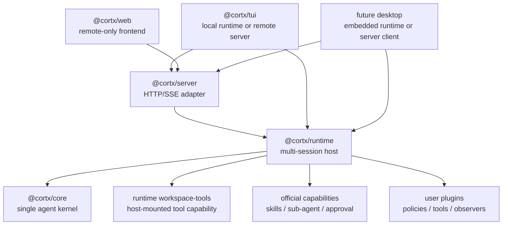
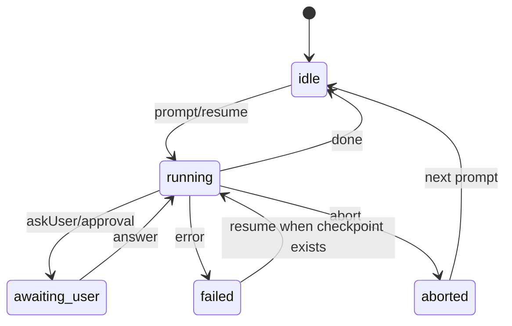

# Cortx Core + Runtime 总体蓝图

本文档是 Cortx 后续架构演进的稳定入口。
它把已经确认的方向收敛成一份可执行、可评审、可长期维护的设计口径：

> `@cortx/core` 是单 agent 执行内核，`@cortx/runtime` 是多 session agent host，`@cortx/server` 是 runtime 的网络适配层，TUI/Web/Desktop 都是 thin frontend。

这个设计的目标不是让 core 变得无所不包，而是让 core 足够小、足够强、足够稳定；让所有产品形态通过 runtime、server、官方 capability 和前端适配组合出来。

## 核心判断

Cortx 未来需要同时服务两类完全不同的 agent：

- 很小的 agent：只有一份提示词、少量工具、几个策略，仍然可以复用同一个底层核心。
- 很大的 agent 产品：类似 Codex 或 Claude Code，包含多 session、多目录、Web/TUI/Desktop、审批、恢复、事件回放、后台 agent，也仍然复用同一套底层核心。

因此，架构上必须避免两个极端：

- 把所有能力都塞进 `core`，导致 core 成为产品宿主层，之后任何 UI、权限、workspace、工具默认值变化都会污染内核。
- 让每个前端自己实现 agent 运行语义，导致 TUI、Web、Desktop、server 各自拥有一套 session manager、工具装配和事件模型。

正确分层是：

- `core` 只处理所有 agent 都绕不开的单 agent 执行语义。
- `runtime` 处理真实产品运行时需要的 session、workspace、工具、安全、默认能力和事件缓存。
- `server` 把 runtime 暴露给远程客户端。
- `tui`、`web`、未来 `desktop` 只控制和展示 runtime session。

## 总体分层



## 包职责边界

| 包 | 应该负责 | 不应该负责 |
| --- | --- | --- |
| `@cortx/core` | 单 agent loop、model streaming、tool pipeline、policy/transform/observer/error recovery、AbortSignal、timeout、checkpoint primitive、`AgentEvent` | 多 session map、workspace root、HTTP/SSE、TUI/Web/Desktop 状态、默认 coding 工具集、产品级审批 UX |
| `@cortx/runtime` | session 生命周期、多目录、多 agent、workspace 验证、工具挂载、默认 capability、event history、prompt/steer/follow-up/answer/abort/resume | UI 渲染、HTTP 认证细节、终端快捷键、浏览器状态 |
| `@cortx/server` | REST/SSE、认证、CORS、短期 SSE token、HTTP 错误格式化、日志脱敏 | 自己维护 session manager、自己 new `Cortx`、自己决定 workspace 策略、自己挂载工具 |
| `@cortx/tui` | Ink UI、本地输入体验、历史消息、快捷键、local/remote adapter、审批表现 | 复制 server/runtime session manager、绕开 runtime 装配工具 |
| `@cortx/web` | React UI、server client、SSE 消费、session 状态展示 | 浏览器内运行 local agent、访问本地 filesystem、导入 core/runtime/workspace-tools 执行本地能力 |
| `@cortx/sdk` | 插件作者和工具作者使用的稳定类型、helper、extension point 常量 | 产品默认行为、运行时宿主策略 |

## 三条线必须同时交付

这次重构不是单独新增一个包，而是三条线一起成立才算完整。

### 1. Runtime Host 成为权威

`@cortx/runtime` 是所有 session 的唯一 host 层，负责：

- 创建、查询、删除 session。
- 同时运行多个 session。
- 每个 session 独立绑定 working directory、model/profile、tool mode、approval mode、metadata 和 event stream。
- 统一处理 `prompt`、`steer`、`follow-up`、`answer`、`abort`、`resume`。
- 保存 bounded event history，让 Web/TUI/Desktop 可以迟到订阅或断线重连。
- 验证 workspace root，并挂载 workspace tools。
- 挂载默认 capability，例如 skills bridge、sub-agent、workspace-tools capability、approval policy。

### 2. Server 与前端薄化

`@cortx/server` 不再拥有自己的 agent 编排语义，只做 runtime 的 HTTP/SSE adapter。

TUI、Web、Desktop 不应该再各自理解“agent 如何运行”，它们只理解同一套 session action 和 event stream：

- Web：remote-only，只连接 server。
- TUI：local mode 内嵌 runtime，remote mode 连接 server。
- Desktop：未来可内嵌 runtime，也可连接 server，不重新实现 agent host。

### 3. Core 边界收敛

`@cortx/core` 继续保留最底层 agent 能力，但不再吸收 host 层职责。

core 可以提供 extension hooks、tool pipeline、checkpoint primitive 和事件事实；但 skills discovery、默认 sub-agent、workspace-tools capability、approval UX、multi-session orchestration 都应该由 runtime 或官方 capability 挂载。

## Runtime Host Contract

runtime 对外暴露的是稳定 host actions：

```ts
interface CortxRuntimeHost {
  createSession(request: CreateSessionRequest): Promise<RuntimeSessionInfo>;
  listSessions(): RuntimeSessionInfo[];
  getSession(sessionId: string): RuntimeSessionInfo;
  deleteSession(sessionId: string): Promise<void>;

  prompt(sessionId: string, input: PromptRequest): Promise<void>;
  steer(sessionId: string, input: SteerRequest): Promise<void>;
  followUp(sessionId: string, input: FollowUpRequest): Promise<void>;
  resume(sessionId: string): Promise<void>;
  answer(sessionId: string, input: AnswerRequest): Promise<void>;
  abort(sessionId: string): Promise<void>;

  subscribe(
    sessionId: string,
    listener: (event: AgentEvent) => void,
    options?: { replay?: boolean },
  ): () => void;
}
```

runtime session 至少包含：

- `sessionId`
- `workingDirectory`
- `model` 或 `profile`
- `toolMode`
- `approvalMode`
- `status`
- `usage`
- `lastActiveAt`
- bounded event history

## Session 生命周期



runtime 必须保证：

- 同一个 session 同一时间只能有一个主 run。
- `steer` 和 `follow-up` 进入当前 run 的 controller，不创建第二个 run。
- `answer` 只回答当前 session 的 pending question 或 approval request。
- `abort` 必须释放 running gate，并拒绝 pending questions。
- late subscriber 可以通过 bounded event history 恢复视图。
- 删除 session 时释放订阅者、timer、pending question 和底层 run。

## Workspace 与工具安全

workspace 安全不应该由 UI 约定保证，而应该由 runtime 的 workspace-tools capability 共同保证。该 capability 现在内置在 runtime 中，未来可以再抽成官方插件或可安装 tool pack；不再保留独立 `code` 包。

第一版要求：

- runtime 创建 session 时验证 `workingDirectory` 位于 allowed workspace roots 内。
- 路径校验同时包含 lexical containment 和 realpath/symlink containment。
- workspace tools 以 session workspace 为根执行。
- 工具不能读写 sibling workspace 或 allowed root 外路径。
- write/destructive 工具默认接入 approval policy。
- 没有审批通道时，write/destructive 默认拒绝。
- workspace-tools 作为 runtime-hosted capability，被 server、TUI local 和未来 Desktop 通过 runtime 间接复用；frontend 不直接装配这些工具。

建议 tool mode：

| 模式 | 语义 |
| --- | --- |
| `none` | 不挂载 workspace tools |
| `read-only` | 只挂载 read/list/grep/find 等读工具 |
| `coding` | 挂载常用读写编辑工具，write/destructive 仍受 approval 约束 |
| `all` | 挂载完整工具集，仍受 policy/approval 约束 |

## 默认 Approval 行为

Cortx 开箱行为应该偏安全：

- read 工具默认允许。
- write 工具默认需要确认。
- destructive 工具默认需要确认。
- 没有可用 UI/server 审批通道时，write/destructive 默认拒绝。
- policy 可以进一步收紧，例如只读模式、禁止 bash、限制 sub-agent 数量。

TUI/Web 的确认弹窗或确认行只是表现层；是否允许执行应该由 runtime/core policy 链路决定。

## Server API

server 是 runtime 的网络 adapter，至少覆盖：

- `POST /sessions`
- `GET /sessions`
- `GET /sessions/:id`
- `POST /sessions/:id/prompt`
- `POST /sessions/:id/steer`
- `POST /sessions/:id/follow-up`
- `POST /sessions/:id/resume`
- `POST /sessions/:id/answer`
- `POST /sessions/:id/abort`
- `GET /sessions/:id/events`
- `DELETE /sessions/:id`

server 负责：

- API key / token 验证。
- CORS。
- 短期 SSE token。
- HTTP status 与错误体格式化。
- 连接中断、重连、日志脱敏。

server 不负责：

- 自己维护 session manager。
- 自己决定 workspace 是否允许。
- 自己挂载 workspace tools。
- 自己定义一套与 runtime 不一致的 session/action/event contract。

错误格式建议：

| Runtime error kind | HTTP status | 说明 |
| --- | ---: | --- |
| `invalid_workspace` | 400 | 工作目录非法、越界或 symlink escape |
| `permission_denied` | 403 | policy/approval 拒绝 |
| `session_not_found` | 404 | session 不存在或已过期 |
| `session_busy` | 409 | 当前 session 已有主 run |
| `capacity_exceeded` | 429 | session 数量达到上限 |
| `invalid_request` | 400 | 请求体缺失或格式错误 |
| `runtime_failure` | 500 | 未预期 runtime 错误 |

## 前端形态

### TUI

TUI 是终端体验层，但不拥有 agent host 语义。

TUI 支持两种模式：

- local mode：内嵌 `@cortx/runtime`，适合本机终端、本地 repo、低延迟。
- remote mode：连接 `@cortx/server`，适合操控远程 session、后台 session、多机器场景。

TUI UI/store 不应该关心事件来自 local runtime 还是 remote SSE。
差异应该封装在 adapter：

```ts
interface TuiSessionAdapter {
  getSession(): RuntimeSessionInfo;
  subscribe(listener: (event: AgentEvent) => void): () => void;
  prompt(text: string): Promise<void>;
  steer(text: string): Promise<void>;
  followUp(text: string): Promise<void>;
  answer(toolCallId: string, response: string): Promise<void>;
  abort(): Promise<void>;
  resume(): Promise<void>;
}
```

### Web

Web 保持 remote-only：

- 只连接 server。
- 只消费 REST/SSE。
- 不导入 core、runtime 或 runtime workspace-tools 来运行本地 agent。
- 不获得浏览器本地文件系统权限。
- 可以展示多个 session、切换 session、发送 prompt/steer/follow-up/answer/abort/resume。

### Desktop

未来桌面端有两种合理形态：

- embedded runtime：类似本地 IDE/桌面 agent，直接内嵌 runtime。
- server client：类似远程控制台，连接已有 server。

无论选择哪种，都复用同一套 session/action/event contract。

## Core 扩展点与 Runtime Capability 的关系

扩展系统需要分清两层：

- core extension point：改变单 agent loop 的语义，例如 message transform、tool policy、event observer、error recovery。
- runtime-mounted capability：把某类产品能力装配到 session 上，例如 workspace tools、skills bridge、sub-agent、approval channel。

判断标准：

| 问题 | 更可能属于 |
| --- | --- |
| 是否影响任意 agent 的单轮推理或工具 pipeline？ | core |
| 是否依赖 workspace、session、UI、用户配置、默认工具集？ | runtime 或 frontend |
| 是否是某个官方功能包，可以被开启/关闭/替换？ | runtime capability 或 plugin |
| 是否只是展示方式、快捷键、面板、输入法？ | TUI/Web/Desktop |

### Skills

Skills 仍然是带 frontmatter、`SKILL.md` 和 companion files 的文件系统资产。
skill 作者不应该为了写一份 skill 被迫写 JavaScript plugin。

更合理的边界是：

- skill 文件格式和资产本身保持轻量。
- skill discovery、加载路径、启用策略、转 prompt/tool bridge 的过程属于 runtime-mounted capability。
- core 可以提供必要的 message/tool primitive，但不应该长期拥有产品级 skill discovery 策略。

### Sub-agent

sub-agent 能力应该是可选官方 capability，而不是 core 永久默认工具。

第一版可以保留现有行为，但必须通过 runtime capability toggles 控制：

- TUI local 默认可以启用。
- server profile 可以选择启用。
- 小型 agent 可以完全关闭。
- core boundary tests 防止 sub-agent product behavior 继续向 core 回流。

## 小 Agent 如何复用这套核心

一个很小的 agent 不需要复制大型产品架构，只要复用 core/runtime 的最小组合：

```ts
import { CortxRuntime } from '@cortx/runtime';

const runtime = new CortxRuntime({
  workspaceRoots: [process.cwd()],
  defaultModel: 'small-agent-model',
  defaultToolMode: 'none',
  defaultCapabilities: {
    skills: 'disabled',
    subAgents: 'disabled',
  },
});

const session = await runtime.createSession({
  workingDirectory: process.cwd(),
  metadata: { agent: 'tiny-support-agent' },
});

await runtime.prompt(session.sessionId, {
  message: '根据这份提示词完成一次轻量任务。',
});
```

也就是说，小 agent 可以完全不启用 workspace tools、skills、sub-agent、Web、TUI。
但它仍然复用相同的 session、event、abort、resume 和 tool pipeline。

## 大 Agent 产品如何复用这套核心

一个完整产品可以用同一套 runtime 做多入口：

- Server 启动 `createServerRuntime()`，提供远程 API。
- TUI local 直接内嵌 runtime。
- TUI remote 连接 server。
- Web 连接 server。
- Desktop 未来选择内嵌 runtime 或连接 server。
- 官方 capability 提供 workspace tools、skills、sub-agent、approval。

产品复杂度集中在 runtime capability 和 frontend experience，不回流到 core。

## 验收标准

第一版架构成立，需要满足：

- runtime 可以创建多个不同 workspace 的 session，并保证工具边界不串。
- server 委托 runtime，不再拥有独立 session manager。
- TUI local 和 remote 使用同一套 UI action adapter。
- Web remote-only，不导入 core、runtime 或 runtime workspace-tools 执行本地能力。
- core 不导入 runtime/server/tui/web，也不拥有 workspace root 和 multi-session host。
- write/destructive 工具默认受 approval/policy 控制。
- invalid workspace、permission denied、session busy、session missing 等错误可被前端区分。
- 有 conformance/boundary tests 防止职责重新混杂。

## 后续演进顺序

当前架构不追求一步到 10 分，目标是稳定到 9.5 分左右，让 core 后续尽量不改也能支撑不同 agent 产品。

建议顺序：

1. 保持 runtime/server/TUI/Web 的 contract 稳定，先补真实交互 smoke。
2. 把 skills bridge 从 core 内部特殊路径进一步迁为 runtime-mounted official capability。
3. 把 sub-agent tool 从 core 默认能力进一步迁为官方 capability module。
4. 完善 approval UX，让 TUI/Web 都能接入同一套 policy decision。
5. 继续扩充 conformance tests，覆盖多 session、取消、恢复、审批、事件回放、工具边界。
6. 再考虑 AgentSpec、skill marketplace、desktop shell、分布式调度、多用户权限等更上层产品能力。

## 与现有文档的关系

- 本文档是总体蓝图和长期判断口径。
- `docs/brainstorms/2026-07-04-cortx-runtime-host-requirements.md` 记录需求来源和详细需求拆解。
- `docs/plans/2026-07-04-001-feat-cortx-runtime-host-architecture-plan.md` 记录可执行实施计划。
- `docs/progress/2026-07-04-runtime-host-progress.md` 记录当前实现进度、验证结果和剩余工作。
- `docs/architecture/runtime-host.md` 是 runtime host 方向的结构化架构说明，可作为本文档的子集和实现参考。
