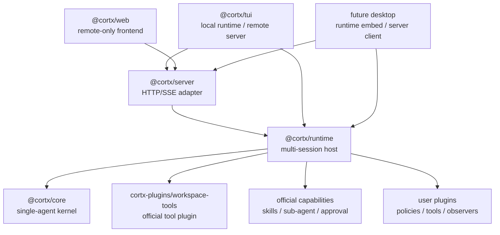
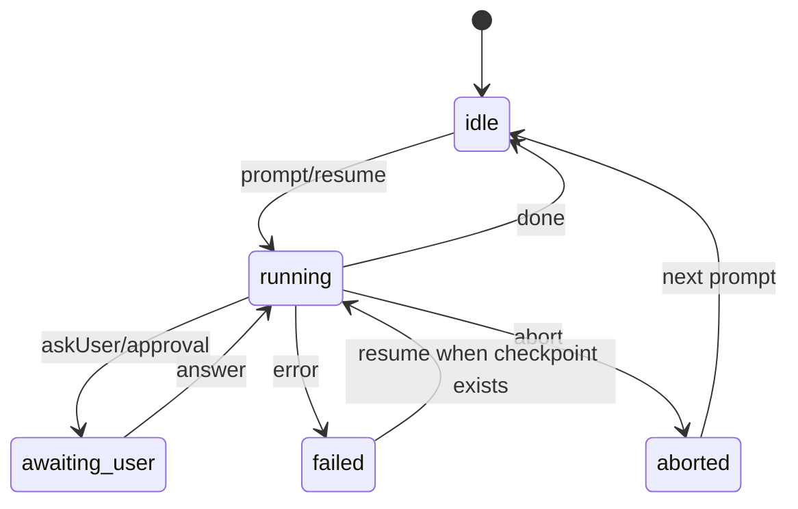

# Cortx Core + Runtime Host 最终设计文档

本文档记录 2026-07-04 这一轮讨论后的稳定设计口径。

结论是：Cortx 不应该把所有能力塞进 `@cortx/core`，也不应该让 TUI、Web、Server、未来 Desktop 各自实现一套 agent host。正确方向是：

> `@cortx/core` 做单 agent 执行内核，`@cortx/runtime` 做多 session / 多目录 / 多 agent 的运行承载层，`@cortx/server` 做 runtime 的 HTTP/SSE adapter，TUI/Web/Desktop 都做 thin frontend。

这个分层的目标不是为了“包更多”，而是为了让 Cortx 未来既能支撑很小的 agent，也能支撑类似 Codex、Claude Code 这种复杂产品，同时尽量不再频繁修改 core 的基础结构。

## 一句话目标

Cortx 要成为一套可以被任意 agent 场景复用的底座：

- 小场景：只有一份提示词、几个工具、少量策略，也能复用同一个 core/runtime。
- 大场景：多窗口、多目录、多线程、多 agent、远程 Web、TUI、Desktop、审批、恢复、事件回放，也复用同一套 core/runtime。
- 长期维护：新增产品功能优先扩展 runtime、official capability、server adapter 或 frontend adapter，而不是直接改 core。

## 最终分层



## 三件事必须同时成立

这次架构调整不能只交付其中一个部分。三件事必须同时成立，整体才是自洽的。

### 1. `@cortx/runtime` 成为唯一 agent host

runtime 是真正使用 agent 能力的宿主层。

它负责：

- 多 session 生命周期。
- 多 working directory。
- 多 agent 同时运行。
- session action：`prompt`、`steer`、`follow-up`、`answer`、`abort`、`resume`。
- bounded event history。
- workspace root 校验。
- workspace tools 挂载。
- 默认 capability 挂载。
- runtime-level error normalization。

它不负责：

- HTTP 鉴权细节。
- React/Ink/桌面 UI。
- 浏览器状态。
- 终端快捷键。

### 2. `@cortx/server` 只是 runtime 的支撑端

server 是 runtime 的网络适配层，不再自己实现 session manager。

server 负责：

- REST API。
- SSE event stream。
- API key / token / short-lived SSE token。
- CORS。
- HTTP status 和 error body 格式化。
- 连接断开、重连、日志脱敏。

server 不负责：

- 自己 new `Cortx`。
- 自己维护 session map。
- 自己决定 workspace 是否安全。
- 自己装配 tools。
- 自己定义一套和 runtime 不一致的 action/event contract。

这意味着 Web、远程 TUI、未来 Desktop 都只要接入 server，就能操控同一套 runtime 能力。

### 3. TUI / Web / Desktop 都是 thin frontend

前端只负责操控和表现，不拥有 agent host 语义。

TUI：

- 支持 local mode：本地内嵌 runtime。
- 支持 remote mode：连接 server。
- 负责终端输入、历史、快捷键、消息排版、审批展示。
- 不复制 runtime/server session manager。

Web：

- remote-only。
- 通过 server 控制 runtime session。
- 不在浏览器里运行 local agent。
- 不导入 core、runtime 或 workspace tool 插件执行本地文件工具。

未来 Desktop：

- 可以内嵌 runtime，适合本地桌面产品。
- 也可以连接 server，适合远程 agent 产品。
- 不重新实现 agent host。

## 包职责边界

| 包 | 应该负责 | 不应该负责 |
| --- | --- | --- |
| `@cortx/core` | 单 agent loop、model streaming、tool pipeline、policy/transform/observer/error recovery、AbortSignal、timeout、checkpoint primitive、`AgentEvent` | 多 session、workspace root、HTTP/SSE、UI 状态、默认 coding tool pack、产品级审批 UX |
| `@cortx/runtime` | session 生命周期、多目录、多 agent、workspace 验证、工具挂载、默认 capability、event history、host action、运行错误归一化 | UI 渲染、HTTP 鉴权细节、终端快捷键、浏览器状态 |
| `@cortx/server` | REST/SSE、认证、CORS、短 token、HTTP 错误格式化、日志脱敏 | 独立 session manager、独立 workspace policy、独立 agent loop 语义 |
| `@cortx/tui` | Ink UI、local/remote adapter、输入历史、快捷键、审批表现、终端渲染 | 绕过 runtime 装配工具、复制 server session manager |
| `@cortx/web` | React UI、server client、SSE 消费、session 状态展示 | 浏览器内运行本地 agent、本地 filesystem 工具、导入 core/runtime/workspace-tools 执行本地能力 |
| `@cortx/sdk` | 插件作者和工具作者使用的稳定类型、helper、extension point 常量 | 产品默认行为、运行时宿主策略 |

## Core 的稳定边界

`@cortx/core` 的目标是接近“以后基本不改基础结构也能支撑任意 agent”。

core 应该稳定提供：

- 单 agent turn loop。
- provider/model request。
- streaming response 处理。
- tool call prepare / execute / result pipeline。
- policy、message transform、system transform、observer、error recovery。
- `AbortSignal` 传递。
- turn/tool timeout。
- terminal error normalization。
- checkpoint/resume primitive。
- `AgentEvent` 事件事实。

core 不应该继续吸收：

- 多 session orchestration。
- workspace root allowlist。
- HTTP/SSE。
- TUI/Web/Desktop 状态。
- 产品默认工具集。
- skill 安装和 discovery 路径策略。
- sub-agent 是否默认开启、如何授权、如何展示。

判断一个新需求是否应该进入 core：

- 如果没有它，任何 agent 都无法正确进行一次推理、工具调用、取消、恢复或事件输出，它可能属于 core。
- 如果它依赖产品形态、workspace、权限边界、UI、用户配置或默认工具集，优先属于 runtime、server、frontend 或 official capability。

## Runtime Host Contract

runtime 对外暴露稳定 action contract。

```ts
interface CortxRuntimeHost {
  createSession(request: CreateSessionRequest): Promise<RuntimeSessionInfo>;
  listSessions(): RuntimeSessionInfo[];
  getSession(sessionId: string): RuntimeSessionInfo;
  deleteSession(sessionId: string): Promise<void>;

  prompt(sessionId: string, input: PromptRequest): Promise<void>;
  steer(sessionId: string, input: SteerRequest): Promise<void>;
  followUp(sessionId: string, input: FollowUpRequest): Promise<void>;
  resume(sessionId: string): Promise<void>;
  answer(sessionId: string, input: AnswerRequest): Promise<void>;
  abort(sessionId: string): Promise<void>;

  subscribe(
    sessionId: string,
    listener: (event: AgentEvent) => void,
    options?: { replay?: boolean },
  ): () => void;

  subscribeEnvelopes(
    sessionId: string,
    listener: (event: RuntimeAgentEventEnvelope) => void,
    options?: { replay?: boolean },
  ): () => void;
}
```

runtime session 至少包含：

- `sessionId`
- `workingDirectory`
- `model` 或 `profile`
- `toolMode`
- `approvalMode`
- `status`
- `usage`
- `lastActiveAt`
- bounded event history
- bounded event envelope history

## Event Envelope Contract

Core 继续只产生 `AgentEvent` 事实，runtime 负责补齐 host metadata。
`RuntimeAgentEventEnvelope` 是所有远程/多前端场景推荐消费的事件形态：

- `sequence`：session 内单调递增。
- `timestamp`：runtime 广播时间。
- `sessionId`：session 稳定身份。
- `runId`：当前 run generation。
- `event`：原始 `AgentEvent`。
- `parent`：child lifecycle event 的 parent session/run/toolCall attribution。

Server SSE 支持 `GET /sessions/:id/events?format=envelope`，并使用 envelope sequence 作为 SSE id。
TUI/Web/store 仍可按需 unwrap 成 plain event，但 replay、断线重连、child run attribution 应优先基于 envelope。

## Durable Runtime Contract

Runtime durable 语义以 `sessionId + runId` 为中心：

- `sessionId` 稳定绑定 session。
- `runId` 在每次 `prompt` / `resume` 时递增，abort 时也推进 generation，避免旧 run completion 覆盖新状态。
- Core 写 checkpoint primitive，runtime 注入 durable store。
- Resume 只从 non-terminal checkpoint 恢复。
- unsupported checkpoint schema 会发出 typed `client_error` event。
- bounded in-memory event history 只服务近期 replay；更深恢复依赖 durable checkpoint/event store。

## AgentSpec 与 Skill Pack

Runtime v1 支持把小 agent 和能力包作为数据资产启动：

- `AgentSpec` 描述 prompt、system、model、workingDirectory、toolMode、approvalMode、capabilities、skillPaths、skillPacks 和 metadata。
- `SkillPack` 解析本地 bundle 中的 `skills/`、`.cortx/skills/` 和 `agents/`。
- `launchAgentSpec()` 将数据资产映射为普通 runtime session，不引入第二条 runner，也不要求 asset 作者写 JavaScript plugin。

## Session 状态机



runtime 必须保证：

- 同一个 session 同时只能有一个主 run。
- `steer` 和 `follow-up` 进入当前 run controller，不创建第二个 run。
- `answer` 只回答当前 session 的 pending question 或 approval request。
- `abort` 必须释放 running gate，并拒绝 pending questions。
- late subscriber 可以通过 bounded event history 恢复视图。
- 删除 session 时释放订阅者、timer、pending question 和底层 run。

## 多线程、多目录、多 agent 的语义

这里的“多线程”不是要求直接暴露 OS thread，而是产品语义上的并发 session/run。

runtime 应该支持：

- 同一个进程内多个 session 并行运行。
- 不同 session 绑定不同 working directory。
- 不同 session 使用不同 model/profile。
- 同一个 workspace 下多个 session 同时工作。
- 不同 workspace 下多个 session 同时工作。
- 未来 background agent / sub-agent 可以归属到 parent session 或 parent run。

runtime 不应该假设：

- 只有一个 cwd。
- 只有一个当前 session。
- 所有 UI 都和 agent 在同一台机器。
- 所有工具都可以由 frontend 直接执行。

## Workspace 与工具安全

workspace 安全不依赖 UI 约定，而由 runtime 的 workspace 验证和官方 `@cortx-ai/workspace-tools` 插件共同保证。工具实现不再位于 runtime 内部，也不再作为独立 `code` 包存在。

第一版必须满足：

- runtime 创建 session 时验证 `workingDirectory` 位于 allowed workspace roots 内。
- 路径校验同时包含 lexical containment 和 realpath/symlink containment。
- workspace tools 以 session workspace 为根执行。
- 工具不能读写 sibling workspace 或 allowed root 外路径。
- write/destructive 工具默认接入 approval policy。
- 没有审批通道时，write/destructive 默认拒绝。
- workspace-tools 作为官方插件，被 server、TUI local 和未来 Desktop 通过 runtime 间接挂载；frontend 不直接装配这些工具。

建议 tool mode：

| 模式 | 语义 |
| --- | --- |
| `none` | 不挂载 workspace tools |
| `read-only` | 只挂载 read/list/grep/find 等读工具 |
| `coding` | 挂载常用读写编辑工具，write/destructive 仍受 approval 约束 |
| `all` | 挂载完整工具集，仍受 policy/approval 约束 |

## Approval 默认行为

Cortx 的开箱行为应该偏保护。

默认建议：

- read 工具默认允许。
- write 工具默认需要确认。
- destructive 工具默认需要确认。
- 没有 UI/server 审批通道时，write/destructive 默认拒绝。
- policy 可以进一步收紧，例如只读模式、禁止 bash、限制子 agent 数量。

TUI/Web 的确认弹窗或确认行只是表现层；是否允许执行应由 runtime/core policy 链路决定。

## Skills 和 Sub-agent 的位置

Skills 本质上是文件系统资产，不应该要求写 JavaScript plugin code 才能使用。

长期设计：

- skill 文件仍是可安装、可复制、可扫描的资产。
- runtime 或 official capability 负责选择哪些 skill 对当前 session 可见。
- core 只消费已经注入进来的提示词、工具、上下文或能力，不负责产品级安装路径策略。

Sub-agent 长期设计：

- core 可以保留 sub-agent 执行所需的最小 primitive。
- 是否启用、如何限制、如何显示、如何授权，属于 runtime/official capability。
- parent-child run id、事件归属、取消、恢复、checkpoint，应该由 runtime 建立稳定语义。

当前允许的过渡状态：

- core 中仍可保留 skill bridge / sub-agent bridge。
- 但必须通过 capability toggle 由 runtime 显式开启或关闭。
- 后续再逐步迁移成 runtime-mounted official capability。

## Server API

server 是 runtime 的网络 adapter，至少提供：

- `POST /auth/token`
- `POST /sessions`
- `GET /sessions`
- `GET /sessions/:id`
- `POST /sessions/:id/prompt`
- `POST /sessions/:id/steer`
- `POST /sessions/:id/follow-up`
- `POST /sessions/:id/resume`
- `POST /sessions/:id/answer`
- `POST /sessions/:id/abort`
- `GET /sessions/:id/events`
- `DELETE /sessions/:id`

server error body 应该保持稳定：

```json
{
  "error": {
    "kind": "invalid_workspace",
    "message": "Working directory is outside allowed workspace roots."
  }
}
```

建议错误映射：

| Runtime error kind | HTTP status | 说明 |
| --- | ---: | --- |
| `invalid_request` | 400 | 请求体、字段或 action 不合法 |
| `invalid_workspace` | 400 | 工作目录非法、越界或 symlink escape |
| `unauthorized` | 401 | 缺少或错误认证 |
| `permission_denied` | 403 | policy/approval 拒绝 |
| `session_not_found` | 404 | session 不存在 |
| `session_busy` | 409 | 当前 session 已有主 run |
| `runtime_error` | 500 | 未归类运行时错误 |

## Frontend Contract

TUI、Web、Desktop 应该共享同一套 session/action/event 语义。

前端 adapter 需要做：

- `createSession`
- `getSession`
- `prompt`
- `steer`
- `followUp`
- `resume`
- `answer`
- `abort`
- `subscribeEvents`

前端不应该做：

- 自己装配 workspace tools。
- 自己扫描远端 workspace 的本地文件系统。
- 自己实现 runtime session 状态机。
- 自己处理 core checkpoint schema。

## 需要持续守住的架构测试

为了防止架构回退，建议长期保留 conformance / boundary tests。

必须覆盖：

- core 不导入 runtime/server/tui/web。
- server 不再出现自有 session manager。
- server 不直接 new `Cortx` 绕过 runtime。
- server 不直接导入或实现 workspace-tools，所有工具挂载都通过 runtime。
- web 不导入 core、runtime 或 workspace tool 插件。
- TUI remote mode 不扫描本地 skill/workspace。
- workspace tool path safety 覆盖 lexical、realpath、symlink escape。
- write/destructive 无审批通道时默认拒绝。
- SSE replay id 稳定递增。
- short-lived token 不跨 server/runtime 实例串用。

## 验收标准

这套设计达到 95% 以上完成度时，应满足：

- `@cortx/runtime` 已作为多 session host 工作。
- server 所有 session action 都委托 runtime。
- TUI local/remote 通过同一抽象操控 session。
- Web remote-only，不导入本地 agent 执行包。
- workspace tools 由 `cortx-plugins/workspace-tools` 提供实现，并由 runtime 按 session 挂载，不由 UI 复制。
- core 不再包含 skills/sub-agent/default approval 产品默认能力，宿主能力由 runtime official capabilities 控制。
- runtime event envelope 提供 sequence、timestamp、sessionId、runId 和 child lifecycle parent attribution。
- AgentSpec/SkillPack v1 可作为数据资产启动 session。
- 全量 lint/build/test 通过。
- HTTP/SSE smoke 通过。
- Web dev proxy smoke 通过。
- TUI local/remote smoke 通过。
- 边界测试能阻止 core/server/frontend 职责重新混杂。

达到 100% 时，额外需要：

- durable resume 增加 file-backed / external-backed adapter，并完成真实进程崩溃恢复 smoke。
- background agent 的 checkpoint、取消、恢复和事件归属模型继续加深。
- frontend approval UX 更完整地展示 structured user request。
- AgentSpec/SkillPack 增加版本化、migration 和本地安装/发现策略。

## 后续开发原则

新增需求优先按这个顺序定位：

1. 是否属于单 agent 必需语义？是，才考虑 core。
2. 是否属于多 session、多目录、默认能力、安全边界？优先 runtime。
3. 是否只是网络访问和认证？server。
4. 是否只是展示、输入、快捷键、布局？TUI/Web/Desktop。
5. 是否是可选工具、策略、观察器、行业能力？official/user plugin 或 capability。

这个原则的价值是：未来即使增加新的 agent 产品形态，也不需要推翻 core；只需要复用 core/runtime，再增加新的 adapter 或 capability。
