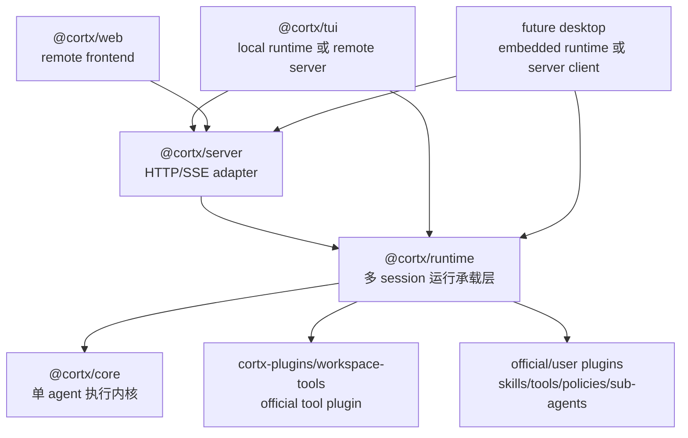
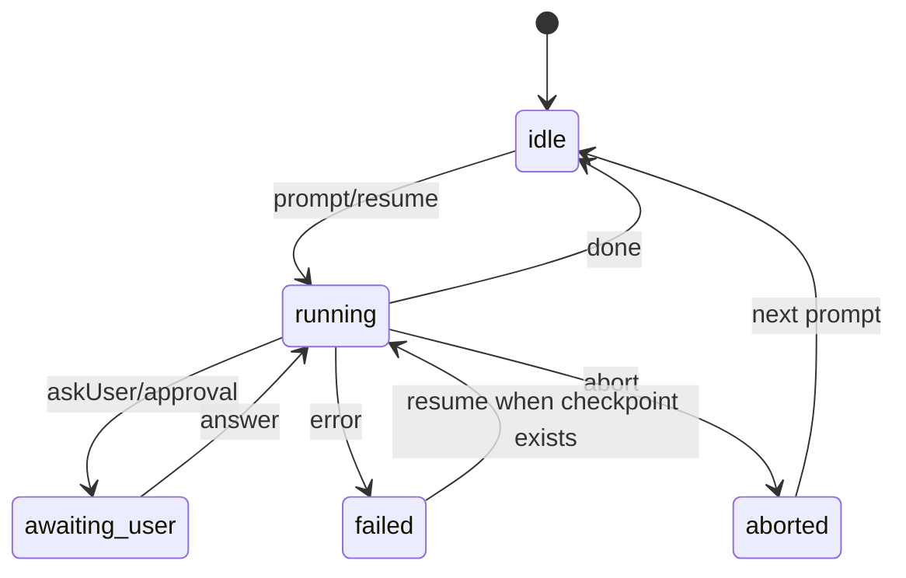

# Cortx Runtime Host 架构说明

> 阅读提示（2026-07-26）：当前最高层架构入口是 `docs/architecture/cortx-core-runtime-blueprint.md`。本文保留为 runtime host contract 的聚焦说明，用来补充 session/action/event/workspace 边界。

本文档定义 Cortx 后续的核心分层：`core + runtime + thin frontends`。
目标是让 `@cortx/core` 成为足够稳定、简洁、可复用的单 agent 执行内核，让 `@cortx/runtime` 承担多 session、多目录、多 agent 的运行承载，让 TUI、Web 和未来 Desktop 都只是操控同一套 runtime contract 的前端。

## 目标

Cortx 要服务两类场景：

- 很小的 agent：只有一份提示词、少量工具或几个策略，也能直接复用同一个 core。
- 很大的 agent 产品：TUI、Web、Server、Desktop、多工作区、多后台 agent、审批、恢复、事件回放，也不需要把产品宿主逻辑塞回 core。

因此架构目标不是“让 core 什么都支持”，而是“让 core 只支持所有 agent 都绕不开的底层语义，其余能力通过 runtime、官方 capability、插件和前端宿主组合出来”。

## 总体分层



核心原则：

- `core` 是 kernel，不是产品宿主。
- `runtime` 是 agent host，负责把 core 运行在真实项目、真实 session 和真实权限边界里。
- `server` 是 runtime 的网络 adapter，不重新拥有 session 编排语义。
- `tui`、`web`、`desktop` 是 thin frontends，只做展示、输入、连接、状态呈现和少量宿主能力。
- workspace tools、skills、sub-agent、approval、policy 等可组合能力应该由 runtime 或官方插件挂载，而不是每个前端复制实现。

## 包职责边界

| 包               | 应该负责                                                                                                                                      | 不应该负责                                                                                |
| ---------------- | --------------------------------------------------------------------------------------------------------------------------------------------- | ----------------------------------------------------------------------------------------- |
| `@cortx/core`    | 单 agent loop、模型流、工具执行 pipeline、extension hooks、event emission、checkpoint/resume primitive、控制信号                              | 多 session map、HTTP/SSE、TUI/Web 状态、多工作区选择、workspace root 策略、产品默认工具集 |
| `@cortx/runtime` | session 生命周期、多目录 workspace 验证、插件挂载策略、默认 capability、event history、prompt/steer/follow-up/answer/abort/resume、运行错误归一化 | 具体 workspace 工具实现、UI 渲染、HTTP 认证细节、浏览器状态、terminal keybinding          |
| `@cortx/server`  | 暴露 runtime REST/SSE API、认证、CORS、短期 SSE token、HTTP 错误格式化                                                                        | 自己创建和管理 `Cortx` session、绕过 runtime 验证 workspace、维护独立 agent 语义          |
| `@cortx/tui`     | Ink UI、终端输入、历史消息、快捷键、local/remote runtime adapter、审批交互                                                                    | 直接复制 server session manager、绕过 runtime 运行 workspace tools                        |
| `@cortx/web`     | React UI、server client、SSE event 消费、会话状态展示                                                                                         | 浏览器内运行 local agent、访问本地文件系统、导入 core/runtime/workspace-tools 执行本地能力                     |
| `@cortx/sdk`     | 插件和工具作者使用的稳定类型、helper、extension point 常量                                                                                    | 具体产品默认行为、运行时宿主策略                                                          |

## Core 的稳定目标

`@cortx/core` 要尽量接近“以后基本不改也能支撑任意 agent”的状态。

core 应该稳定提供：

- 单 agent turn loop。
- provider/model request 与 streaming response 处理。
- tool call prepare/execute/result pipeline。
- policy、transform、observer、error recovery 等 agent 语义扩展点。
- `AbortSignal` 传播、turn/tool timeout、结构化 terminal error。
- checkpoint schema 和 durable resume primitive。
- `AgentEvent` 作为 UI、server、runtime 共享事件事实。

core 不应该继续吸收：

- 多 session orchestration。
- 多目录 workspace 管理。
- TUI/Web/Desktop 的展示或交互逻辑。
- 产品默认工具集。
- skill 安装、skill discovery 的宿主策略。
- sub-agent 是否默认开启、如何展示、如何授权等产品策略。

判断一个新需求是否应该进 core，可以用这个规则：

- 如果没有它，任何 agent 都无法正确执行单轮推理、工具调用、恢复或取消，它可能属于 core。
- 如果它是“这个产品/这个宿主/这个 workspace/这个 UI 想要的能力”，优先放 runtime、server、frontend 或官方插件。

## Runtime Host Contract

`@cortx/runtime` 是长期的 agent host 层。它既能被 server 使用，也能被 TUI local mode 或未来 desktop 直接嵌入。

runtime 对外暴露的核心动作：

```ts
interface CortxRuntimeHost {
  createSession(request: CreateSessionRequest): Promise<RuntimeSessionInfo>;
  listSessions(): RuntimeSessionInfo[];
  getSession(sessionId: string): RuntimeSessionInfo;
  deleteSession(sessionId: string): Promise<void>;

  prompt(sessionId: string, input: PromptRequest): Promise<void>;
  steer(sessionId: string, input: SteerRequest): Promise<void>;
  followUp(sessionId: string, input: FollowUpRequest): Promise<void>;
  resume(sessionId: string): Promise<void>;
  answer(sessionId: string, input: AnswerRequest): Promise<void>;
  abort(sessionId: string): Promise<void>;

  subscribe(sessionId: string, listener: (event: AgentEvent) => void, options?: { replay?: boolean }): () => void;
}
```

runtime session 至少包含：

- `sessionId`
- `workingDirectory`
- `model` 或 `profile`
- `toolMode`
- `approvalMode`
- `running/idle/awaiting_user/failed/aborted` 等状态
- token usage
- 最近活动时间
- bounded event history

### Session 生命周期



runtime 需要保证：

- 同一个 session 同一时间只能有一个主 run。
- `steer` 和 `follow-up` 进入当前 run 的 controller，不创建第二个 run。
- `abort` 必须释放 running gate，并拒绝 pending questions。
- late subscriber 可以从 bounded event history 恢复视图。
- 删除 session 要释放订阅者、timer、pending question 和底层 run。

## Workspace 与工具安全

workspace 安全属于 runtime/tool pack 边界，不属于 UI 约定。

第一版必须满足：

- runtime 创建 session 时验证 `workingDirectory` 在 allowed workspace roots 内。
- 验证同时包含 lexical containment 和 realpath/symlink containment。
- 工具执行时仍以 session workspace 为根，不能读写 sibling workspace 或 root 外路径。
- write/destructive 工具默认接入 approval policy。
- 没有审批通道时默认拒绝 write/destructive，而不是静默执行。
- workspace-tools 是官方插件 `@cortx-ai/workspace-tools`；runtime 只按 session workspace 和 `toolMode` 选择插件贡献的 `runtime.toolProfile`，再生成插件 contribution 配置。TUI local、server runtime、未来 desktop 都通过 runtime 复用同一套挂载语义。

官方 workspace-tools 当前提供的工具 profile：

| toolMode    | 能力                                       |
| ----------- | ------------------------------------------ |
| `none`      | 不挂载 workspace tools                     |
| `read-only` | 只允许 read/list/grep/find 等读工具        |
| `coding`    | 挂载常用读写编辑工具，destructive 仍需审批 |
| `all`       | 挂载完整工具集，仍受 approval/policy 约束  |

这些值不是 runtime 的封闭枚举；新的插件可以贡献新的 profile，例如运维插件提供 `ops`，安装后 server/web/TUI 只需要读取 `/tool-profiles` 就能展示和切换。

## 默认 Approval 行为

Cortx 的开箱行为应该偏保护：

- read 工具默认允许。
- write 工具默认需要确认。
- destructive 工具默认需要确认。
- 没有 UI/server 审批通道时，write/destructive 默认拒绝。
- policy 可以进一步收紧，例如只读模式、禁止 bash、限制子 agent 数量。

TUI/Web 的“确认弹窗/确认行”只是表现层；是否允许执行应由 runtime/core policy 链路决定。

## Server 作为 Adapter

`@cortx/server` 只把 runtime 暴露成网络协议。

server API 应覆盖：

- `POST /sessions`
- `GET /sessions`
- `GET /sessions/:id`
- `POST /sessions/:id/prompt`
- `POST /sessions/:id/steer`
- `POST /sessions/:id/follow-up`
- `POST /sessions/:id/resume`
- `POST /sessions/:id/answer`
- `POST /sessions/:id/abort`
- `GET /sessions/:id/events`
- `DELETE /sessions/:id`

server 负责：

- API key 或 token 验证。
- CORS。
- SSE 短期 token。
- HTTP status 与错误体格式化。
- 连接中断、重连、日志脱敏。

server 不负责：

- 自己维护 session manager。
- 自己决定 workspace 是否允许。
- 自己挂载 workspace tools。
- 自己定义一套与 runtime 不一致的 session/action/event contract。

错误格式建议：

| Runtime error kind  | HTTP status | 说明                                |
| ------------------- | ----------: | ----------------------------------- |
| `invalid_workspace` |         400 | 工作目录非法、越界或 symlink escape |
| `permission_denied` |         403 | policy/approval 拒绝                |
| `session_not_found` |         404 | session 不存在或已过期              |
| `session_busy`      |         409 | 当前 session 已有主 run             |
| `capacity_exceeded` |         429 | session 数量达到上限                |
| `invalid_request`   |         400 | 请求体缺失或格式错误                |
| `runtime_failure`   |         500 | 未预期 runtime 错误                 |

## TUI、Web 与未来 Desktop

### TUI

TUI 应同时支持：

- local mode：内嵌 `@cortx/runtime`，适合本机终端、本地 repo、低延迟。
- remote mode：连接 `@cortx/server`，适合操控远程 session、后台 session、多机器场景。

TUI UI/store 不应该关心事件来自 local runtime 还是 remote SSE。
差异应该封装在 adapter：

```ts
interface TuiSessionAdapter {
  getSession(): RuntimeSessionInfo;
  subscribe(listener: (event: AgentEvent) => void): () => void;
  prompt(text: string): Promise<void>;
  steer(text: string): Promise<void>;
  followUp(text: string): Promise<void>;
  answer(toolCallId: string, response: string): Promise<void>;
  abort(): Promise<void>;
  resume(): Promise<void>;
}
```

### Web

Web 保持 remote-only：

- 只连接 server。
- 只消费 REST/SSE。
- 不导入 core、runtime 或 workspace tool 插件来运行本地 agent。
- 不获得浏览器本地文件系统权限。
- 可以展示多个 session、切换 session、发送 prompt/steer/follow-up/answer/abort/resume。

### Desktop

未来 Desktop 可以有两种模式：

- embedded runtime：像 TUI local mode，本机直接运行 agent。
- remote server client：像 Web/TUI remote，连接已有 server。

只要 runtime contract 稳定，Desktop 不需要重新设计 agent 编排。

## Skills、Sub-Agent 与官方 Capability

Skills 本质上仍是文件系统资产，不要求 skill 作者写 JavaScript plugin。

合理拆分是：

- skill 文件、frontmatter、companion files 是资产。
- skill discovery、加载、匹配、注入 prompt、暴露 skill tool，是 runtime 或官方 capability 的职责。
- core 只执行 runtime 传进来的 system/messages/tools/extensions。

Sub-agent 也类似：

- core 可以保留必要的底层执行 primitive。
- 是否默认提供 sub-agent tool、如何继承 workspace、如何限制数量、如何显示后台 agent，属于 runtime/官方 capability/前端呈现。

这能避免 core 变成“所有产品默认功能的大杂烩”。

## 新需求放置规则

| 新需求类型                                      | 首选位置                       |
| ----------------------------------------------- | ------------------------------ |
| 单 agent loop 必需语义                          | `@cortx/core`                  |
| 新 agent extension point 类型                   | `@cortx/sdk` + `@cortx/core`   |
| 多 session、多目录、默认能力组合                | `@cortx/runtime`               |
| Workspace 文件/命令工具                         | `cortx-plugins/workspace-tools` 官方插件，由 runtime 按 session 挂载 |
| HTTP/SSE/auth/CORS/remote API                   | `@cortx/server`                |
| 终端布局、快捷键、输入体验                      | `@cortx/tui`                   |
| 浏览器 UI、dashboard、连接状态                  | `@cortx/web`                   |
| 可选能力包，例如 repo policy、review skill pack | 官方插件或 skill pack          |

## 第一版必须同时交付的三块

这轮架构不是只加一个包，而是三块一起闭环：

1. **Runtime host 成为唯一 session host。**
   - 新增 `@cortx/runtime`。
   - runtime 拥有 session lifecycle、workspace validation、event history、prompt/steer/follow-up/answer/abort/resume。
   - server 和 TUI local 都通过 runtime 运行 agent。

2. **Server 和前端改成 runtime client。**
   - server 委托 runtime。
   - TUI 支持 local/remote adapter。
   - Web 继续 remote-only，并与 TUI remote 共享 session/action/event 语义。

3. **Core boundary 收紧。**
   - core 不再新增 host/session/workspace/UI 职责。
   - skills/sub-agent/default tools 向 runtime-mounted capability 收敛。
   - 增加 boundary/conformance tests，防止职责回流。

## 验收标准

最小验收：

- server 能创建两个不同 workspace 的 session，并行运行且互不串目录。
- invalid workspace、symlink escape、路径穿越会被 runtime 拒绝。
- TUI local mode 能继续本地运行。
- TUI remote mode 能连接 server session，并支持 prompt、steer、follow-up、answer、abort、resume。
- Web 和 TUI remote 使用同一套 server session API。
- write/destructive 工具在无审批通道时默认拒绝。
- core 没有导入 server/tui/web/runtime host/workspace root 相关实现。
- `bun test` 和 `bun run lint` 通过。

推荐补充验收：

- event history 有上限，late subscriber 能 replay。
- `abort` 后 session running gate 被释放。
- prompt/resume 忙时返回 `session_busy`。
- SSE 不在 URL 或日志中泄露长效 API key。
- Web 包没有本地 agent 执行依赖。
- TUI local/remote 对同一组 `AgentEvent` 渲染一致。

## 后续可扩展方向

这版不做但要给空间：

- Desktop shell。
- AgentSpec schema。
- skill pack installer。
- prompt template registry。
- 多用户 server、租户隔离、审计日志。
- 分布式 job scheduler。
- UI extension points，例如 `surface.*`、`tui.*`、`web.*`。
- 持久化 event tape 和可回放 session。

这些能力都应该围绕 runtime contract 增长，而不是把 core 改成产品平台。

## 与当前计划的关系

本文是长期架构说明；对应实施计划是：

- `docs/plans/2026-07-04-001-feat-cortx-runtime-host-architecture-plan.md`

实施计划负责拆任务、列文件和测试门禁；本文负责定义稳定边界、职责放置规则和未来扩展方向。
