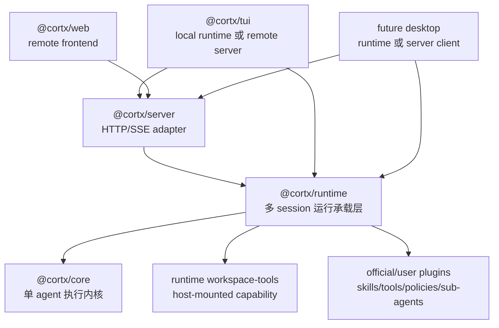
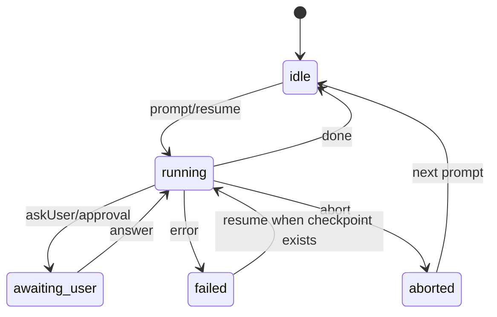

# Cortx Runtime Host 需求整理

## 目标摘要

Cortx 的长期目标是形成一套可以被任意 agent 场景复用的底层架构：

- `@cortx/core` 是单 agent 执行内核，负责最底层的 agent loop、模型流、工具调用、事件、取消、恢复和扩展语义。
- `@cortx/runtime` 是运行承载层，负责多 session、多目录、多 agent、多工具包、默认能力和运行时状态。
- `@cortx/server` 是 runtime 的 HTTP/SSE adapter，给 Web、远程 TUI、未来桌面端和其他客户端使用。
- `@cortx/tui`、`@cortx/web`、未来 Desktop 都是 thin frontends，只负责操控、显示和输入体验。

这套设计的核心判断是：**core 不应该变成产品宿主层，runtime 才是 agent 产品运行时。**

因此，一个只有提示词和少量工具的小 agent 可以直接复用 core/runtime；一个类似 Codex 或 Claude Code 的大型 agent 产品，也应该复用同一套 core/runtime，而不是把多会话、权限、工具、安全、UI 状态不断塞回 core。

## 本轮必须同时交付的三件事

这次架构不是只做一个包名调整，而是要同时把三条线打通。

### 1. Runtime Host

新增并确立 `@cortx/runtime`，让它成为多 session host 的唯一权威。

runtime 要负责：

- 创建、查询、删除 session。
- 同时运行多个 session。
- 每个 session 绑定自己的 working directory、model/profile、tool mode、approval mode 和 event stream。
- 统一处理 prompt、steer、follow-up、answer、abort、resume。
- 保存 bounded event history，方便 Web/TUI/Desktop 迟到订阅或重连。
- 验证 workspace root，装配 workspace tools。
- 挂载默认能力，例如 skills bridge、sub-agent capability、workspace-tools capability、policy。

### 2. Server 与前端薄化

`@cortx/server` 不再自己维护独立的 session manager，而是作为 runtime 的网络 adapter。

server 要负责：

- API key / token 验证。
- CORS。
- REST/SSE 协议。
- 短期 SSE token。
- HTTP 错误格式化。
- 日志脱敏。

server 不负责：

- 自己创建 `Cortx` session。
- 自己维护 session 生命周期。
- 自己决定 workspace 是否安全。
- 自己装配工具。
- 自己定义一套和 runtime 不一致的 agent session 语义。

TUI、Web、未来 Desktop 都应围绕同一套 session/action/event contract 工作：

- Web：remote-only，通过 server 控制 runtime session。
- TUI：同时支持 local mode 和 remote mode。
- Desktop：未来可以嵌入 runtime，也可以连接 server；不重新实现 agent host。

### 3. Core 边界收敛

`@cortx/core` 要继续保留单 agent kernel 的能力，但不能继续吸收宿主层职责。

core 应该稳定承担：

- 单 agent turn loop。
- model request / streaming response。
- tool call prepare / execute / result pipeline。
- policy、transform、observer、error recovery 等 agent 语义扩展点。
- `AbortSignal` 传播。
- turn/tool timeout。
- terminal error normalization。
- checkpoint/resume primitive。
- `AgentEvent` 事件事实。

core 不应该承担：

- 多 session map。
- workspace root allowlist。
- HTTP/SSE。
- TUI/Web/Desktop 状态。
- 默认 coding tool pack。
- 产品级 approval UX。
- skill 安装、发现路径策略。
- sub-agent 是否默认开启、如何展示、如何授权。

判断规则：

- 如果没有它，任何单 agent 都无法正确进行一次推理、工具调用、取消、恢复或事件输出，它才可能属于 core。
- 如果它依赖产品形态、工作目录、权限边界、UI、用户配置或默认工具集，优先属于 runtime、server、frontend 或官方插件。

## 目标架构



## 包职责边界

| 包 | 应该负责 | 不应该负责 |
| --- | --- | --- |
| `@cortx/core` | 单 agent loop、模型流、工具 pipeline、扩展语义、事件、取消、checkpoint/resume primitive | 多 session、workspace root、HTTP、UI 状态、默认产品工具集 |
| `@cortx/runtime` | session 生命周期、多目录、多 agent 承载、workspace 验证、工具挂载、event history、host actions、默认 capability | UI 渲染、HTTP 认证细节、终端快捷键、浏览器状态 |
| `@cortx/server` | REST/SSE、认证、CORS、短期 token、HTTP 错误格式化 | 独立 session manager、独立 workspace policy、独立 agent loop 语义 |
| `@cortx/tui` | Ink UI、本地输入体验、历史消息、快捷键、local/remote adapter、审批表现 | 复制 server session manager、直接绕开 runtime 装配工具 |
| `@cortx/web` | React UI、server client、SSE 消费、session 状态展示 | 浏览器内运行 local agent、本地文件系统工具、导入 core/runtime/workspace-tools 执行 agent |
| `@cortx/sdk` | 插件作者和工具作者使用的稳定类型、helper、extension point 常量 | 产品默认行为、运行时宿主策略 |

## Runtime Host Contract

runtime 对外暴露的核心能力应该稳定成一组 host actions。

```ts
interface CortxRuntimeHost {
  createSession(request: CreateSessionRequest): Promise<RuntimeSessionInfo>;
  listSessions(): RuntimeSessionInfo[];
  getSession(sessionId: string): RuntimeSessionInfo;
  deleteSession(sessionId: string): Promise<void>;

  prompt(sessionId: string, input: PromptRequest): Promise<void>;
  steer(sessionId: string, input: SteerRequest): Promise<void>;
  followUp(sessionId: string, input: FollowUpRequest): Promise<void>;
  resume(sessionId: string): Promise<void>;
  answer(sessionId: string, input: AnswerRequest): Promise<void>;
  abort(sessionId: string): Promise<void>;

  subscribe(
    sessionId: string,
    listener: (event: AgentEvent) => void,
    options?: { replay?: boolean },
  ): () => void;
}
```

runtime session 至少包含：

- `sessionId`
- `workingDirectory`
- `model` 或 `profile`
- `toolMode`
- `approvalMode`
- `status`
- `usage`
- `lastActiveAt`
- bounded event history

## Session 生命周期



runtime 必须保证：

- 同一个 session 同时只能有一个主 run。
- `steer` 和 `follow-up` 进入当前 run 的 controller，不创建第二个 run。
- `answer` 只回答当前 session 的 pending question 或 approval request。
- `abort` 必须释放 running gate，并拒绝 pending questions。
- late subscriber 可以通过 bounded event history 恢复视图。
- 删除 session 时释放订阅者、timer、pending question 和底层 run。

## Workspace 与工具安全

workspace 安全不应该依赖 UI 约定，而应该由 runtime 内部 workspace-tools capability 共同保证。该能力可以在未来抽成官方插件或可安装 tool pack，但不再作为独立 `code` 包存在。

第一版要求：

- runtime 创建 session 时验证 `workingDirectory` 位于 allowed workspace roots 内。
- 路径校验同时包含 lexical containment 和 realpath/symlink containment。
- workspace tools 以 session workspace 为根执行。
- 工具不能读写 sibling workspace 或 allowed root 外路径。
- write/destructive 工具默认接入 approval policy。
- 没有审批通道时，write/destructive 默认拒绝。
- workspace-tools 作为 runtime-hosted capability，被 server、TUI local 和未来 Desktop 通过 runtime 间接复用；frontend 不直接装配这些工具。

建议 tool mode：

| 模式 | 语义 |
| --- | --- |
| `none` | 不挂载 workspace tools |
| `read-only` | 只挂载 read/list/grep/find 等读工具 |
| `coding` | 挂载常用读写编辑工具，write/destructive 仍受 approval 约束 |
| `all` | 挂载完整工具集，仍受 policy/approval 约束 |

## 默认 Approval 行为

Cortx 开箱行为应偏安全：

- read 工具默认允许。
- write 工具默认需要确认。
- destructive 工具默认需要确认。
- 没有可用 UI/server 审批通道时，write/destructive 默认拒绝。
- policy 可以进一步收紧，例如只读模式、禁止 bash、限制 sub-agent 数量。

TUI/Web 的确认弹窗或确认行只是表现层；是否允许执行应该由 runtime/core policy 链路决定。

## Server API 要求

server API 至少覆盖：

- `POST /sessions`
- `GET /sessions`
- `GET /sessions/:id`
- `POST /sessions/:id/prompt`
- `POST /sessions/:id/steer`
- `POST /sessions/:id/follow-up`
- `POST /sessions/:id/resume`
- `POST /sessions/:id/answer`
- `POST /sessions/:id/abort`
- `GET /sessions/:id/events`
- `DELETE /sessions/:id`

错误格式需要让客户端能稳定区分：

| Runtime error kind | HTTP status | 说明 |
| --- | ---: | --- |
| `invalid_workspace` | 400 | 工作目录非法、越界或 symlink escape |
| `permission_denied` | 403 | policy/approval 拒绝 |
| `session_not_found` | 404 | session 不存在或已过期 |
| `session_busy` | 409 | 当前 session 已有主 run |
| `capacity_exceeded` | 429 | session 数量达到上限 |
| `invalid_request` | 400 | 请求体缺失或格式错误 |
| `runtime_failure` | 500 | 未预期 runtime 错误 |

## Frontend 要求

### TUI

TUI 必须支持两种模式：

- local mode：内嵌 `@cortx/runtime`，适合本地仓库、低延迟终端体验。
- remote mode：连接 `@cortx/server`，适合远程 session、后台 session、多机器场景。

TUI UI/store 不应该关心事件来自 local runtime 还是 remote SSE。
差异应封装在 adapter：

```ts
interface TuiSessionAdapter {
  getSession(): RuntimeSessionInfo;
  subscribe(listener: (event: AgentEvent) => void): () => void;
  prompt(input: PromptRequest): Promise<void>;
  steer(input: SteerRequest): Promise<void>;
  followUp(input: FollowUpRequest): Promise<void>;
  answer(input: AnswerRequest): Promise<void>;
  abort(): Promise<void>;
  resume(): Promise<void>;
}
```

### Web

Web 必须保持 remote-only：

- 只连接 server。
- 不导入 `@cortx/core` 来运行 agent。
- 不导入 runtime workspace-tools 来访问本地文件系统。
- 不保存长效 API key 到 SSE URL。
- 所有本地文件访问都必须通过 server/runtime 的 allowed workspace 和工具策略。

### Desktop

未来 Desktop 可以选择两种模式：

- embedded runtime：类似 TUI local mode，适合本机桌面应用。
- server client：类似 Web/TUI remote mode，适合远程控制。

Desktop 不需要重新实现：

- session manager。
- event history。
- workspace validation。
- approval policy。
- tool mounting。

## Core 边界要求

core boundary 需要自动化测试约束。

测试应防止：

- `@cortx/core` 导入 `@cortx/server`、`@cortx/tui`、`@cortx/web`、`@cortx/runtime`。
- core 内出现多 session manager。
- core 内出现 allowed workspace roots 策略。
- core 内出现 HTTP/SSE transport 逻辑。
- core 内新增产品默认 workspace tools。
- skills bridge、sub-agent tool 等宿主能力继续作为不可关闭的 core 默认能力膨胀。

允许 core 暴露：

- `Cortx`
- `CortxSession`
- loop/control 类型
- extension contract
- checkpoint primitive
- capability toggles
- 供 runtime 挂载能力的底层 hook

## Skills 与 Sub-agent 的定位

Skills 仍然应该是文件系统资产，不应该要求 skill 作者写 JavaScript plugin code。

需要迁出的不是 `SKILL.md` 这个资产格式，而是：

- skill discovery 路径策略。
- skill summary 注入策略。
- skill tool bridge 是否启用。
- skill companion files 如何暴露给 agent。

这些属于 runtime 或官方 capability，而不是 core 永久内置产品行为。

Sub-agent 也类似：

- core 可以提供可组合的底层能力和事件语义。
- runtime 或官方插件决定是否启用 sub-agent capability。
- TUI/Web/Desktop 决定如何展示 sub-agent。
- policy 决定 sub-agent 数量、权限和 workspace 边界。

## 关键流程

### F1. 本地 TUI session

1. 用户在 repo 目录启动 TUI。
2. TUI local adapter 创建内嵌 runtime。
3. runtime 验证 cwd。
4. runtime 挂载 workspace tools 和默认 capability。
5. TUI 订阅 session events。
6. 用户发送 prompt。
7. core 执行单 agent loop，runtime 记录 event history。

结果：用户获得本地低延迟 coding agent 体验，但 session、工具、安全边界仍由 runtime 统一管理。

### F2. 远程 Web session

1. 用户通过 Web 创建 session。
2. Web 调用 server `POST /sessions`。
3. server 验证认证，把请求交给 runtime。
4. runtime 验证 workspace、创建 session、挂载工具。
5. Web 通过 SSE 消费 events。
6. Web 通过 REST 发送 prompt、follow-up、abort、answer。

结果：Web 能控制远端 agent，但不会在浏览器内运行本地 filesystem agent。

### F3. 多目录并行

1. 用户为 repo A 创建 session。
2. 用户为 repo B 创建 session。
3. runtime 为每个 session 保存独立 cwd、tools、events、controller 和 running state。
4. 两个 session 可以并行运行。
5. 每个 session 的工具只能访问自己的 workspace boundary。

结果：多项目并行不需要 core 变成多 agent graph runtime。

### F4. 未来桌面端

1. Desktop 选择 embedded runtime 或连接 server。
2. Desktop 使用同一套 session/action/event contract。
3. Desktop 自己实现窗口、通知、文件树、快捷键等表现。
4. agent 执行、安全、session 仍由 runtime 负责。

结果：Desktop 不需要重新做一套 agent host。

## 验收标准

- A1. 可以创建两个不同 working directory 的 session，并并行运行，event stream 和 tool cwd 互不串扰。
- A2. 通过 `..`、绝对路径或 symlink escape 指向 allowed roots 外部的 session creation 必须被拒绝。
- A3. write/destructive tool 在没有审批通道时默认拒绝，在有审批通道时产生可回答的 approval request。
- A4. TUI local mode 可以继续当前本地体验。
- A5. TUI remote mode 可以连接 server session，并支持 prompt、steer、follow-up、answer、abort、resume。
- A6. Web 和 TUI remote mode 使用同一套 server session API。
- A7. Web 包不能导入 `@cortx/core`、`@cortx/runtime` 或 runtime workspace-tools 来执行 agent 或访问本地文件。
- A8. server 不再拥有独立 session manager；所有 session 生命周期委托 runtime。
- A9. core boundary tests 能防止 host/session/workspace/transport 职责回流 core。
- A10. `bun test` 和 `bun run lint` 对相关包保持通过。

## 第一版交付切片

### U1. 新增 `@cortx/runtime`

- 建立 runtime package。
- 抽象 session info、runtime errors、host actions。
- 实现 create/list/get/delete/prompt/steer/follow-up/resume/answer/abort/subscribe。
- 实现 bounded event history。
- 实现 running gate 和 pending question 清理。

### U2. Workspace 与工具挂载

- runtime 支持 allowed workspace roots。
- workspace 校验包含 lexical 和 realpath。
- runtime 内部 workspace-tools 提供 `createWorkspaceToolPack` 或等价 factory。
- runtime 按 tool mode 挂载工具。
- 默认 policy 覆盖 write/destructive。

### U3. Server runtime 化

- 删除或收缩 server 自有 session manager。
- `POST /sessions` 接受 creation body。
- prompt/steer/follow-up/resume/answer/abort/events 全部委托 runtime。
- 统一 runtime error 到 HTTP status。
- SSE 使用短期 token，避免长效 key 进入 URL。

### U4. TUI local/remote adapter

- TUI UI 只依赖 `TuiSessionAdapter`。
- local adapter 内嵌 runtime。
- remote adapter 连接 server。
- Header、输入区、运行状态能显示 local/remote 差异。
- 历史消息、steer、follow-up、abort、resume 保持可用。

### U5. Web remote contract 对齐

- Web bridge 对齐 runtime-backed server API。
- 支持 prompt、steer、follow-up、resume、abort、answer。
- 处理 typed errors。
- 支持短期 SSE token。
- 保持 remote-only 包边界。

### U6. Core capability 边界

- core 提供 capability toggles 或底层 hook。
- skills bridge 和 sub-agent 默认能力向 runtime-mounted capability 收敛。
- core tests 覆盖禁用 skills/sub-agent 后的行为。
- runtime tests 覆盖默认启用和显式禁用。

### U7. Conformance 与文档

- 增加 core/runtime/server/frontend boundary tests。
- 增加 runtime session lifecycle conformance tests。
- 增加 workspace security conformance tests。
- 更新架构文档和开发者文档。
- 明确后续官方插件如何挂载 tools、skills、policy 和 sub-agent。

## 非目标

本轮不做：

- 完整 AgentSpec marketplace。
- skill pack installer。
- prompt template registry。
- UI extension points，例如 `surface.*`、`tui.*`、`web.*`。
- 桌面端具体 UI。
- 多用户租户隔离。
- 分布式调度系统。
- 云端 workspace provisioning。
- Web 直接运行本地 filesystem agent。

## 完成度判断

这份需求完成后，Cortx 应达到以下状态：

- core 是稳定、干净、可长期复用的单 agent kernel。
- runtime 是所有产品形态共用的 agent host。
- server 是轻薄、可替换的 transport adapter。
- TUI/Web/Desktop 不再分叉 agent 运行语义。
- workspace 工具、安全、审批、session 生命周期有统一位置。
- 未来新增小 agent、大 agent、官方插件或新前端时，优先组合 runtime/core，而不是修改 core。

达到这个状态后，Cortx 不需要追求“core 10 分什么都内置”，而是接近“整体 9.5 分”：基础边界清楚、扩展点稳定、默认行为安全、产品层可以继续演进，core 基本不再频繁变动。
