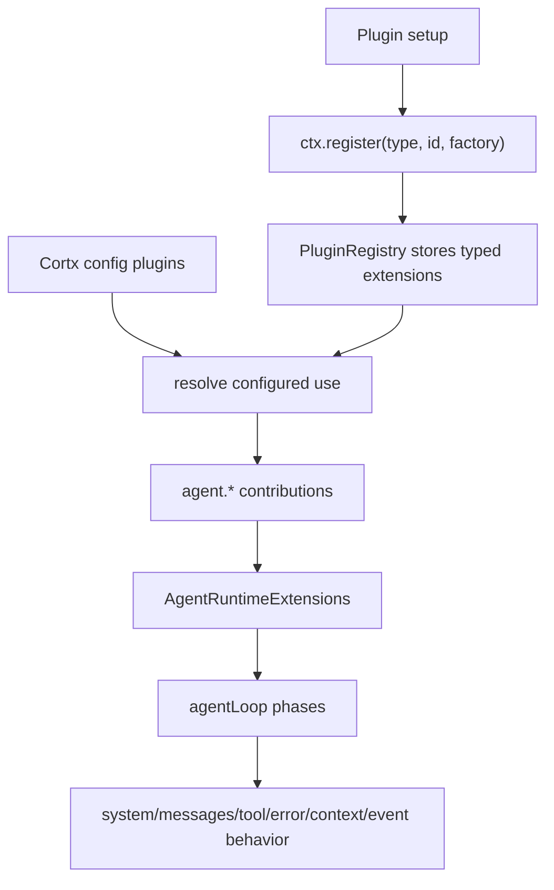

# Cortx Agent Core Extension System - Plan
## Goal Capsule
- **目标：** 先把 Cortx agent 核心扩展系统设计稳定，不再同时设计 TUI/Web/IDE 的展示层扩展。
- **产品原则：** 核心要足够小、清晰、可组合；一个很小的 prompt-only agent 不需要写插件，一个完整 coding agent 也能通过同一套核心能力扩展出来。
- **设计边界：** 本文只覆盖 agent runtime、tool runtime、session/event、assets、core plugin packaging、外部能力接入边界。TUI/Web 扩展暂不考虑，只作为未来 host adapter 消费核心事件和核心 actions。
- **执行轮廓：** 本轮先实现 core runtime 的通用 `ctx.register(type, id, factory)` 类型映射，让 `agent.*` 注册可以在无 TUI/Web 的 headless core 中真实运行；更完整的 session policy、asset pack schema 留给后续。
- **停止条件：** `agent.*` 插件注册方式能通过 registry 装载并影响 agent loop，相关 SDK/core 类型编译通过，核心测试覆盖 `agent.tool`、`agent.systemTransform`、`agent.messagesTransform`、`agent.toolBefore`、`agent.toolAfter`、`agent.errorRecover`、`agent.contextOverflow`、`agent.eventObserver`。
---
## Product Contract
### Summary
Cortx core 的扩展系统应分成两类：
1. **Runtime extensions：** 需要运行时代码介入 agent loop、tool execution、message shaping、error recovery、event observation 的能力。
2. **Assets：** skills、prompt templates、agent specs、tool packs manifest、companion files 这类可安装内容。它们靠发现、索引、引用进入系统，不要求每个资产都写 JavaScript plugin code。
核心层不应该设计 UI-specific extension point。TUI/Web/IDE 将来只消费同一个 core contract：`AgentEvent`、core actions、assets catalog、tool metadata、session state。
### Problem Frame
当前 Cortx 核心扩展第一版采用 `agent.*` runtime contributions：
- `agent.tool`
- `agent.systemTransform`
- `agent.messagesTransform`
- `agent.toolBefore`
- `agent.toolAfter`
- `agent.errorRecover`
- `agent.contextOverflow`
- `agent.eventObserver`
- `ToolContext.reportProgress`
- `ToolContext.askUser`
- `Tool.sideEffects`
- `SKILL.md` discovery + internal skill plugin
- `agent` sub-agent tool
这些能力方向对，但现在存在几个设计风险：
- skills 已经是文件资产，不应再被文档描述成 runtime extension point。
- agent spec、prompt template、skill pack 还没有被清楚定义为资产模型，小 agent 的主路径不够明确。
- event observer、recorder、context manager、permission gate、retry policy 等核心能力应该有 conformance tests，否则未来重构 agent loop 容易破坏行为。
### Design Position
Cortx core 应采用类似 OpenCode 的务实分层，但比 OpenCode 的宽松 hook model 更类型化：
- **代码扩展少而稳定：** 只开放 agent loop 中真正需要运行时代码介入的位置。
- **资产扩展多而轻：** prompt-only、skill-only、agent-profile-only 场景不写插件。
- **provider/gateway 不重复造轮子：** 模型 provider、protocol conversion、endpoint gateway 属于 Synax，Cortx core 只消费 `LanguageClient` 和 provider facts。
- **UI 不进入 core：** core 只发事件、接受控制、执行工具、维护会话语义。
---
## Current Core Extension Inventory
| 区域 | 当前扩展点 | 状态 | 代码位置 | 用途 |
|---|---|---|---|---|
| Agent runtime | `agent.tool` | 已实现 | `packages/sdk/src/index.ts`, `packages/core/src/loop.ts` | 增加 agent 可调用工具。 |
| Agent runtime | `agent.systemTransform` | 已实现 | `packages/sdk/src/index.ts`, `packages/core/src/loop.ts` | 修改 system prompt。 |
| Agent runtime | `agent.messagesTransform` | 已实现 | `packages/sdk/src/index.ts`, `packages/core/src/loop.ts` | 修改 outgoing messages。 |
| Tool runtime | `agent.toolBefore` | 已实现 | `packages/sdk/src/index.ts`, `packages/core/src/loop.ts` | 工具执行前 gate、rewrite、deny、short-circuit。 |
| Tool runtime | `agent.toolAfter` | 已实现 | `packages/sdk/src/index.ts`, `packages/core/src/loop.ts` | 工具结果后处理。 |
| Recovery | `agent.errorRecover` | 已实现 | `packages/sdk/src/index.ts`, `packages/core/src/loop.ts` | stream/provider error retry policy。 |
| Recovery | `agent.contextOverflow` | 已实现 | `packages/sdk/src/index.ts`, `packages/core/src/loop.ts` | context overflow 后压缩 messages。 |
| Observation | `agent.eventObserver` | 已实现 | `packages/sdk/src/index.ts`, `packages/core/src/loop.ts` | 观察 canonical `AgentEvent`。 |
| Tool contract | `Tool.execute` | 已实现 | `packages/sdk/src/index.ts` | 工具执行主体。 |
| Tool contract | `Tool.sideEffects` | 已实现 | `packages/sdk/src/index.ts`, `packages/core/src/loop.ts` | read-only 并发调度依据。 |
| Tool contract | `ToolContext.reportProgress` | 已实现 | `packages/sdk/src/index.ts`, `packages/core/src/loop.ts` | 工具进度上报。 |
| Tool contract | `ToolContext.askUser` | 已实现 | `packages/sdk/src/index.ts`, `packages/core/src/loop.ts` | 工具执行中询问用户。 |
| Skill assets | `SKILL.md` discovery | 已实现 | `packages/core/src/skill/*` | 安装式指令资产。 |
| Built-in tool | `skill` tool | 已实现 | `packages/core/src/skill/tool.ts` | 按需加载完整 skill 内容。 |
| Built-in tool | `agent` tool | 已实现 | `packages/core/src/agent.ts` | 启动 sub-agent。 |
| Session control | `AgentLoopController` | 已实现 | `packages/core/src/types.ts`, `packages/core/src/loop.ts` | abort、steer、follow-up、question gate。 |
| Provider boundary | `LanguageClient` | 已实现 | `@synax-ai/core` | 模型调用抽象，Cortx 不拥有 provider 插件。 |
---
## Key Decisions
- **D1. Core 先正式化 `agent.*`，不设计 `surface.* / tui.* / web.*`。** 当前文档只关心 agent core 的扩展边界。
- **D2. Skills 是资产，不是 runtime extension point。** 普通 skill 作者只安装 `SKILL.md` 和 companion files，不写 plugin code。
- **D3. Prompt-only agent 应走 `AgentSpec`。** 一个小 agent 可以只声明 prompt、skills、tools、model preference 和 policies。
- **D4. Runtime plugin API 以通用注册为主。** Canonical API 应是 `ctx.register(type, id, factory)`，这样新增核心扩展点、未来 host adapter、官方/第三方插件都能使用同一种机制。
- **D5. 类型安全通过 typed registry map 和 factory contract 提供。** 通用注册不等于弱类型字符串乱飞；每个 extension type 都应映射到明确的 TypeScript contract。
- **D6. Hook 方法名必须按 extension type 区分。** 不让多个扩展点都返回 `{ transform() {} }`。即使用通用 `ctx.register()`，factory 返回对象也应使用 `transformSystem`、`transformMessages`、`beforeToolExecute`、`afterToolExecute` 等明确方法名。
- **D7. Tool execution pipeline 是核心稳定性的中心。** permission、cache、validation、result budget、progress、askUser、cancellation 都围绕工具执行链设计。
- **D8. Event stream 是 core 和所有 host 的唯一事实源。** Recorder、metrics、debug、未来 UI 都观察 `AgentEvent`，不直接窥探 loop 内部状态。
- **D9. Synax 负责模型/provider/gateway 扩展。** Cortx 不再创建第二套 provider plugin model。
- **D10. 每个公开 extension point 都必须有真实官方插件场景和 conformance tests。** 只为抽象完整性存在的 extension point 不进入 v1。
---
## Requirements
### Core Runtime
- R1. Core extension taxonomy 第一版只包含 `agent.*` runtime extensions 和 asset models。
- R2. Core runtime 只公开 `agent.*` typed extension API，不保留旧 hook object 作为插件 API。
- R3. `agent.tool` 必须支持工具注册、metadata、side effects、schema、progress、askUser、cancellation。
- R4. `agent.systemTransform` 只处理 system prompt，不处理 message history。
- R5. `agent.messagesTransform` 只处理 outgoing messages，不直接执行工具或发事件。
- R6. `agent.toolBefore` 必须支持 allow、deny、rewrite input、short-circuit result。
- R7. `agent.toolAfter` 必须支持 result normalization、metadata、truncation、masking。
- R8. `agent.errorRecover` 必须只处理可恢复 error policy，不做通用 error display。
- R9. `agent.contextOverflow` 必须能返回新的 messages 或放弃恢复。
- R10. `agent.eventObserver` 必须只观察事件，不修改事件。
- R11. extension ordering 必须可解释：core built-ins 先于 user plugins 还是反过来必须固定并测试。
- R12. plugin failure isolation 必须明确：observer 失败不能中断 loop；before/after/recover 失败是否中断要有规范。
### Assets
- R13. `SKILL.md` 是 core asset model，默认通过发现路径安装，不通过 runtime plugin 注册。
- R14. Skill 系统核心机制应固定：发现路径、frontmatter、优先级、参数替换、summary rendering、`skill` tool、companion files。
- R15. Prompt template 是 asset，可被 agent spec、skill 或 command-like caller 引用，不是 runtime hook。
- R16. Agent spec 是 asset，用于表达 prompt-only 或 prompt-plus-tools agent。
- R17. Skill pack 是分发单位，可包含 skills、prompt templates、agent specs、scripts、fixtures、manifest；安装器负责展开。
- R18. 普通小 agent 不需要写 JavaScript plugin。
### Developer Experience
- R19. 插件作者应使用通用 `ctx.register(type, id, factory)` 作为主路径；类型安全由 registry type map 提供：
```ts
ctx.register('agent.systemTransform', 'repo-policy', () => ({
  async transformSystem(input) {
    const policy = await loadRepoPolicy();
    return { system: policy ? `${input.system}\n\n${policy}` : input.system };
  },
}));
```
- R20. Typed helpers 如 `ctx.agent.transformSystem()` 可以作为可选糖，但不应成为唯一注册方式，也不应替代 `ctx.register()`。
- R21. 每个 extension contribution 必须有 stable id、可选 ordering metadata、capability declaration 和 error policy。
- R22. 同一个 plugin package 可以同时提供 runtime extensions 和 assets，但二者概念分开。
- R23. Host 不支持某种 contribution 时应忽略它；但 core runtime 不应该出现 TUI/Web contribution。
- R24. 新 core extension point 必须先用官方插件 fixture 验证，再公开为稳定 API。
### Verification
- R25. Conformance tests 必须覆盖注册、ordering、failure isolation、cancellation、askUser、progress、tool skip、read-only parallel execution、context overflow、retry、event order。
- R26. Asset tests 必须覆盖安装、发现、覆盖优先级、frontmatter parse、companion files、skill invocation、prompt/agent spec references。
- R27. Headless SDK tests 必须证明没有 TUI/Web 时所有 core extension 都能工作。
---
## Core Extension Catalog
### 1. `agent.tool`
`agent.tool` 是给 agent 增加可调用能力的主入口。
**职责**
- 注册工具名称、描述、input schema。
- 声明 side effects，供 core 决定并发调度。
- 执行工具逻辑。
- 通过 `ToolContext` 上报 progress、请求用户输入、响应 cancellation。
**不负责**
- 不处理 provider/model selection。
- 不渲染 UI。
- 不直接控制 session lifecycle。
**实际场景**
- Filesystem/code tool pack：read、write、search、patch、run command。
- Browser automation tool：open、click、type、screenshot、extract。
- Issue tracker connector：搜索 issue、读取 PR、创建 comment。
- Sub-agent launcher variant：review-only agent、background research agent、isolated worktree agent。
- Internal docs connector：查询内部知识库。
**建议 API**
```ts
ctx.register('agent.tool', 'browser.open', () => ({
  description: 'Open a URL and return page metadata.',
  sideEffects: 'read',
  inputSchema: {
    type: 'object',
    properties: { url: { type: 'string' } },
    required: ['url'],
  },
  async execute(input, ctx) {
    ctx.reportProgress?.(`Opening ${input.url}`);
    const page = await browser.open(String(input.url));
    return { success: true, output: { title: page.title, url: page.url } };
  },
}));
```
**Conformance**
- read-only tools in the same contiguous span run in parallel.
- write/destructive tools do not let later reads jump ahead.
- unknown tool returns structured tool error.
- tool progress is emitted before final `tool_result`.
- tool cancellation stops execution and emits `user_abort` or structured error.
### 2. `agent.systemTransform`
`agent.systemTransform` 修改每次模型调用前的 system prompt。
**职责**
- 注入稳定上下文：repo policy、role、organization policy、available skills summary。
- 根据 run/session metadata 调整 system prompt。
**不负责**
- 不读取或重写 user/assistant messages。
- 不执行工具。
- 不处理 context overflow。
**实际场景**
- Repo policy injector：注入代码规范、测试要求、安全边界。
- Skill summary injector：列出可用 skills 和使用方式。
- Role profile：reviewer、implementer、planner、documentation agent。
- Compliance guardrail：注入客户或组织级数据处理规则。
- Output contract injector：给特定 agent 强制 JSON/Markdown 输出格式。
**建议 API**
```ts
ctx.register('agent.systemTransform', 'repo-policy', (factoryCtx) => ({
  async transformSystem(input) {
    const policy = await factoryCtx.storage.get<string>('repo-policy').catch(() => '');
    return policy ? { system: `${input.system}\n\n${policy}` } : { system: input.system };
  },
}));
```
**Conformance**
- 多个 transform 按稳定顺序执行。
- transform 失败时按 error policy 处理。
- 空 system prompt 也能被 transform 初始化。
- transform 不应修改原始 messages。
### 3. `agent.messagesTransform`
`agent.messagesTransform` 在模型调用前重写 outgoing messages。
**职责**
- task-local prompt expansion。
- secret redaction。
- message windowing。
- prompt template substitution。
- skill explicit invocation expansion。
**不负责**
- 不执行工具。
- 不做 provider retry。
- 不渲染或持久化 UI 状态。
**实际场景**
- Slash skill expansion：`/commit fix bug` 展开为 skill instructions。
- Secret redactor：mask API key、token、private path。
- History windowing：压缩旧消息，只保留 summary 和最近 turns。
- Prompt template expansion：把 `{{branch}}`、`{{diff}}` 替换成上下文。
- Tool result pruning：在下次模型调用前把超大工具结果替换成引用。
**建议 API**
```ts
ctx.register('agent.messagesTransform', 'secret-redactor', () => ({
  async transformMessages(input) {
    return {
      messages: input.messages.map((message) => redactSecretsInMessage(message)),
    };
  },
}));
```
**Conformance**
- system messages 和 conversation messages 的位置规则固定。
- transform 后的 messages 是否回写到 session history 必须由 extension 明确声明或由 core policy 固定。
- slash skill 只匹配 message-start，避免自然语言误触发。
- transform 不能破坏 tool-call/tool-result pairing。
### 4. `agent.toolBefore`
`agent.toolBefore` 在工具真正执行前运行，支持 allow、deny、rewrite input、short-circuit result。
**职责**
- permission gate。
- input validation 和 normalization。
- cache short-circuit。
- rate limit。
- policy enforcement。
**不负责**
- 不处理工具成功后的输出整形。
- 不处理模型调用 retry。
**实际场景**
- Destructive approval：`rm -rf`、write、deploy 前询问用户。
- Read cache：相同 read/search input 直接返回缓存。
- Input validator：把非法 input 返回 model-readable validation error。
- Tool allowlist：某 agent 只允许 read/search，不允许 write/bash。
- Quota limiter：限制某工具每个 session 调用次数。
**建议 API**
```ts
ctx.register('agent.toolBefore', 'destructive-approval', () => ({
  async beforeToolExecute(input) {
    if (input.tool.sideEffects !== 'destructive') return { action: 'allow' };
    const answer = await input.toolContext.askUser?.(`Allow ${input.tool.name}?`);
    return answer === 'allow'
      ? { action: 'allow' }
      : { action: 'shortCircuit', result: { success: false, error: 'Denied by user' } };
  },
}));
```
**Conformance**
- short-circuited tool is not executed.
- before hook progress appears before final result.
- rewrite input affects actual tool execution.
- deny emits `tool_result` with structured error.
- multiple before hooks compose deterministically.
### 5. `agent.toolAfter`
`agent.toolAfter` 在工具返回后、结果进入模型上下文前运行。
**职责**
- result normalization。
- output truncation。
- metadata enrichment。
- sensitive output masking。
- artifact references。
**不负责**
- 不决定工具是否执行。
- 不改变已发出的 `tool_use` 事件。
**实际场景**
- Result budget：长输出保留 head/tail，并写 artifact。
- Error normalizer：把 thrown error 变成一致的 `ToolResult`。
- Artifact linker：把生成文件转成 `artifact://...` 引用。
- Token masker：隐藏 tool output 中的 secrets。
- JSON result compactor：大 JSON 只保留 schema/sample/path。
**建议 API**
```ts
ctx.register('agent.toolAfter', 'result-budget', (factoryCtx) => ({
  async afterToolExecute(input) {
    const text = stringifyToolOutput(input.result);
    if (text.length <= 8000) return { result: input.result };
    const artifact = await factoryCtx.storage.set('tool-output.txt', text);
    return {
      result: {
        ...input.result,
        output: `${text.slice(0, 4000)}\n\n[Full output saved as tool-output.txt]`,
      },
    };
  },
}));
```
**Conformance**
- after hook receives actual tool result.
- after hook can convert success to error and error to normalized error.
- result budget runs before message append.
- secrets are masked in `tool_result` event and model-visible tool result.
### 6. `agent.errorRecover`
`agent.errorRecover` 处理模型 stream error 的恢复策略。
**职责**
- 判断错误是否可 retry。
- 设置 retry delay。
- 可选声明 retry reason。
- 和 context overflow 分开。
**不负责**
- 不压缩 messages。
- 不格式化终端/网页错误。
- 不实现 provider gateway。
**实际场景**
- 429 retry：rate limit 后等待。
- 5xx retry：provider transient failure retry 一次。
- Network flake retry：connection reset retry。
- Circuit breaker：同 provider 连续失败后停止 retry。
- Model fallback signal：把错误标记给上层 router，但不在 Cortx 内做 provider 插件。
**建议 API**
```ts
ctx.register('agent.errorRecover', 'transient-retry', () => ({
  async recoverError(input) {
    if (input.code === 'rate_limited') {
      return { action: 'retry', delayMs: 2000, reason: 'rate limited' };
    }
    if (input.code === 'stream_error') {
      return { action: 'retry', delayMs: 750, reason: 'transient stream error' };
    }
    return { action: 'decline' };
  },
}));
```
**Conformance**
- context overflow 不走普通 retry hook。
- retry attempt count 有上限。
- retry 不重复 append partial assistant messages，除非 core 明确支持 resume checkpoint。
- no hook 时保留 core default retry policy。
### 7. `agent.contextOverflow`
`agent.contextOverflow` 处理 context window 超限。
**职责**
- 压缩或重写 messages。
- 删除或摘要 tool results。
- 保留用户最新意图和必要 system constraints。
- 返回 `{ action: 'decline' }` 表示无法恢复。
**不负责**
- 不处理普通 5xx/429。
- 不做 UI 提示。
**实际场景**
- Session compactor：旧 turns 总结成一个 summary。
- Tool result pruner：把大工具输出替换成 artifact reference。
- Skill-aware compactor：保留已展开 skill 的关键指令。
- Code-review context keeper：保留 findings、files touched、open questions。
- Safety fallback：无法安全压缩时停止并返回 terminal error。
**建议 API**
```ts
ctx.register('agent.contextOverflow', 'compact-history', () => ({
  async handleContextOverflow(input) {
    const summary = await summarizeOldMessages(input.messages.slice(0, -8));
    return {
      action: 'recover',
      messages: [
        { role: 'user', content: [{ type: 'text', text: `Conversation summary:\n${summary}` }] },
        ...input.messages.slice(-8),
      ],
    };
  },
}));
```
**Conformance**
- overflow recovery count 有上限。
- compressed messages 替换 session messages 后重新进入 main loop。
- recovery decline 时发 `context_overflow` 后发 terminal `error`。
- tool-call/tool-result pairing 不被压缩破坏。
### 8. `agent.eventObserver`
`agent.eventObserver` 观察 canonical `AgentEvent` stream。
**职责**
- recording。
- metrics。
- audit。
- trace correlation。
- external bridge。
**不负责**
- 不修改事件。
- 不控制 loop。
- 不渲染 UI。
**实际场景**
- Event tape recorder：写 JSONL，可 replay/debug。
- Metrics collector：统计 latency、tool count、token usage、error codes。
- Audit logger：记录 destructive tool、approval、user_answer。
- Trace bridge：把 turn/tool/model spans 发到 OpenTelemetry。
- Usage facts recorder：记录 Synax/provider metadata。
**建议 API**
```ts
ctx.register('agent.eventObserver', 'event-tape', (factoryCtx) => ({
  async onAgentEvent(event) {
    const previous = await factoryCtx.storage.get<string>('events.jsonl').catch(() => '');
    await factoryCtx.storage.set('events.jsonl', previous + JSON.stringify(event) + '\n');
  },
}));
```
**Conformance**
- observer 按事件顺序调用。
- observer failure 默认不影响 agent loop，但要记录 diagnostics。
- observer 能看到 `tool_use`、`tool_progress`、`tool_result`、`done`、`error`。
- retry 后事件顺序可 replay。
### 9. `agent.sessionPolicy`
这是建议新增的核心扩展点，用来约束 session/run，而不是塞进 UI 或 server。
**职责**
- before run validation。
- max iterations / max tool calls policy。
- tool budget policy。
- sub-agent budget policy。
- session metadata initialization。
**实际场景**
- Read-only agent：整个 run 禁止 write/destructive side effects。
- Budget guard：每个 run 最多 20 tool calls，最多 3 sub-agents。
- Workspace guard：限制 working directory。
- Enterprise policy：某些 skills/tools 在特定 repo 禁用。
- Test mode：固定 model settings 和 deterministic behavior。
**建议 API**
```ts
ctx.register('agent.sessionPolicy', 'read-only-mode', () => ({
  async beforeRun(input) {
    if (input.agentSpec?.policies?.includes('read-only')) {
      return {
        toolPolicy: { maxSideEffects: 'read' },
      };
    }
    return {};
  },
}));
```
**Conformance**
- policy 在第一轮 LLM 调用前生效。
- policy 能影响 tool availability 或 toolBefore default decision。
- policy denial 返回 typed terminal error。
---
## Core Asset Catalog
### 1. `SKILL.md`
`SKILL.md` 是文件系统资产，不是 runtime extension point。
**核心机制**
- discovery：`skillPaths`、`~/.cortx/skills/`、项目 `.cortx/skills/`。
- frontmatter：`name`、`description`、`arguments`。
- priority：高优先级覆盖低优先级同名 skill。
- summary：system prompt 注入名称和描述。
- explicit invocation：`/skill-name args`。
- model invocation：`skill({ name })` tool。
- companion files：列出 skill 目录内支持文件。
**实际场景**
- Code review skill：审查 diff，按 severity 和 file-line 输出。
- Commit skill：生成 commit message，并执行 commit flow。
- Browser testing skill：加载 Playwright 验证指令和 helper scripts。
- Domain policy skill：公司内部 support/legal/release 流程。
- Migration skill：框架升级步骤、检查清单、常见问题。
**资产形态**
```markdown
---
name: code-review
description: Review code changes for bugs, regressions, and missing tests.
arguments:
  - target
---
Read the changed files, prioritize correctness findings, and report file-line issues first.
```
### 2. Skill Pack
Skill pack 是一组资产的分发单位，不等于 runtime plugin。
**实际场景**
- Official coding pack：review、commit、test、debug、docs skills。
- Team workflow pack：release、incident、security、support processes。
- Migration pack：provider migration、framework migration、monorepo cleanup。
- Compound Engineering compatibility pack：把外部 skills 转成 Cortx assets。
- Training pack：示例 prompts、fixtures、expected outputs。
**资产形态**
```text
skill-packs/engineering/
  cortx-pack.json
  skills/
    review/SKILL.md
    commit/SKILL.md
  prompts/
    release-notes.prompt.md
  agents/
    reviewer.agent.yaml
  scripts/
    collect-diff.ts
```
```json
{
  "name": "engineering",
  "version": "1.0.0",
  "skills": ["skills/review/SKILL.md", "skills/commit/SKILL.md"],
  "prompts": ["prompts/release-notes.prompt.md"],
  "agents": ["agents/reviewer.agent.yaml"]
}
```
### 3. Prompt Template
Prompt template 是可复用 prompt body，可被 agent spec、skill、programmatic caller 引用。
**实际场景**
- Release notes prompt：根据 commit range 生成发布说明。
- Bug triage prompt：分析错误日志并分类。
- Migration prompt：按步骤执行标准迁移。
- Extraction prompt：把原始文本抽取成 JSON。
- Test plan prompt：根据 diff 生成验证计划。
**资产形态**
```markdown
---
name: release-notes
arguments:
  - fromRef
  - toRef
---
Summarize user-visible changes between {{fromRef}} and {{toRef}}.
Group output by features, fixes, migrations, and risks.
```
### 4. Agent Spec
Agent spec 是 tiny agent 和 reusable agent profile 的主路径。
**职责**
- 声明 agent 名称、描述、prompt。
- 引用 skills、prompt templates、tools。
- 声明 tool policy、model preference、iteration budget。
- 不直接包含 runtime hook code。
**实际场景**
- Review agent：只读工具 + review skill + findings 输出格式。
- Commit agent：git diff/status tools + commit skill。
- Docs agent：docs skills + write scope 限制到 docs。
- Support reproduction agent：browser/log tools + repro steps prompt。
- Release agent：changelog prompt + package tools + approval policy。
**资产形态**
```yaml
name: review-agent
description: Find correctness issues in a change set.
prompt: prompts/code-review.prompt.md
skills:
  - code-review
tools:
  - read
  - search
  - git.diff
policies:
  - read-only
model:
  preference: coding-fast
limits:
  maxIterations: 8
```
### 5. Tool Pack Manifest
Tool pack manifest 描述一组工具的安装和能力，但工具实现仍然是 runtime code。
**实际场景**
- Filesystem tool pack：read/write/search/edit。
- Browser tool pack：browser automation。
- GitHub tool pack：issues、PR、reviews、actions。
- Database read-only pack：schema inspect、query explain。
- Internal docs pack：search、fetch、cite。
**资产/代码混合形态**
```json
{
  "name": "@cortx/tool-pack-github",
  "tools": [
    { "name": "github.searchIssues", "sideEffects": "read" },
    { "name": "github.comment", "sideEffects": "write" }
  ],
  "permissions": ["network:github.com"]
}
```
---
## Registration API Direction
核心插件注册应以通用 `ctx.register(type, id, factory)` 为主。这样做有几个好处：
- 新增 extension type 时不需要扩展 `ctx.agent.*` 方法集合。
- 同一套注册机制可以服务 core、未来 host adapter 和第三方插件。
- 插件 manifest、ordering、capability declaration、conflict handling 都能挂在统一 contribution model 上。
- 类型安全可以通过 registry type map 解决，不必牺牲通用性。
推荐写法：
```ts
export default defineCortxPlugin({
  setup(ctx) {
    ctx.register('agent.tool', 'github.searchIssues', () => githubSearchIssuesTool);
    ctx.register('agent.systemTransform', 'repo-policy', () => ({
      transformSystem(input) {
        return { system: input.system + '\n\nFollow repository policy.' };
      },
    }));
    ctx.register('agent.toolBefore', 'approval', () => ({
      async beforeToolExecute(input) {
        const answer = input.tool.sideEffects === 'destructive'
          ? await input.toolContext.askUser?.(`Allow ${input.tool.name}?`)
          : 'allow';
        return input.tool.sideEffects === 'destructive'
          ? answer === 'allow'
            ? { action: 'allow' }
            : { action: 'deny', reason: 'Denied by user' }
          : { action: 'allow' };
      },
    }));
    ctx.register('agent.eventObserver', 'metrics', () => ({
      onAgentEvent(event) {
        metrics.count(`agent.event.${event.type}`);
      },
    }));
  },
});
```
可选糖可以存在，但只能作为 wrapper：
```ts
ctx.agent.transformSystem('repo-policy', contribution);
// 等价于
ctx.register('agent.systemTransform', 'repo-policy', () => contribution);
```
Core runtime 直接消费 `AgentRuntimeExtensions`，不再把新扩展编译成旧 hook object。这样插件 API 和执行内核保持同一种语义，代码路径更短，也更适合当前尚未正式发布的阶段。
---
## Official Core Plugin Candidates
这些插件应作为核心扩展系统稳定前的 proving ground。
| 插件 | 覆盖扩展点 | 验证价值 |
|---|---|---|
| Permission plugin | `agent.toolBefore`, `agent.sessionPolicy`, `agent.eventObserver` | 验证 allow/deny/ask、audit、short-circuit。 |
| Context manager plugin | `agent.messagesTransform`, `agent.contextOverflow`, `agent.toolAfter`, `agent.eventObserver` | 验证长会话压缩、工具输出预算、overflow recovery。 |
| Event tape plugin | `agent.eventObserver` | 验证事件可 replay、debug、metrics。 |
| Skill system plugin | `agent.systemTransform`, `agent.messagesTransform`, `agent.tool` + `SKILL.md` assets | 验证 asset 和 runtime 内部桥接。 |
| Agent spec runner | `AgentSpec` assets + `agent.sessionPolicy` | 验证 prompt-only agent 主路径。 |
| Browser tool pack | `agent.tool`, `agent.toolAfter`, `agent.eventObserver` | 验证外部 side effects、progress、artifact 输出。 |
| Retry policy plugin | `agent.errorRecover`, `agent.eventObserver` | 验证 transient failure recovery。 |
| Sub-agent policy plugin | `agent.sessionPolicy`, `agent.toolBefore`, `agent.eventObserver` | 验证 sub-agent 预算和隔离策略。 |
---
## Acceptance Examples
- AE1. 给定一个只包含 `AgentSpec`、prompt template、skills 的小 agent，用户可以启动它，不需要写 runtime plugin。
- AE2. 给定一个注册 `agent.tool` 的插件，工具出现在模型可调用工具列表中，并按 schema 被调用。
- AE3. 给定多个 `agent.systemTransform`，system prompt 按稳定顺序被修改。
- AE4. 给定一个 `agent.messagesTransform` redactor，发送到 LLM 的消息中 secret 被 mask，原始工具结果不会泄漏。
- AE5. 给定 destructive tool call，permission plugin 通过 `agent.toolBefore` short-circuit，工具不执行，模型收到结构化拒绝结果。
- AE6. 给定 read-only tool calls 连续出现，它们并发执行；给定 write tool 在前，后续 read 不越过它执行。
- AE7. 给定 tool output 超过预算，`agent.toolAfter` 把完整输出写 artifact，并把 model-visible result 替换成摘要。
- AE8. 给定 provider 429，`agent.errorRecover` retry 一次，并保留事件顺序。
- AE9. 给定 context overflow，`agent.contextOverflow` 压缩 messages 后重新进入 loop。
- AE10. 给定 observer 抛错，core 记录 diagnostics，但 agent loop 不崩溃。
- AE11. 给定两个同名 skill，项目级 `.cortx/skills` 覆盖用户级 skill。
- AE12. 给定 `/review src/foo.ts`，skill invocation 在 LLM 调用前确定性展开。
- AE13. 给定 model 调用 `skill({ name: "review" })`，skill tool 返回完整内容和 companion file 列表。
---
## Conformance Test Suite
核心到 9.5 分左右，最重要的是有行为护城河。建议建立 `packages/core/tests/conformance/`。
### Runtime Hook Conformance
- `agent.tool` registration and duplicate id behavior。
- `agent.systemTransform` ordering and failure policy。
- `agent.messagesTransform` ordering, persistence policy, tool-call pairing preservation。
- `agent.toolBefore` allow/deny/rewrite/short-circuit。
- `agent.toolAfter` output rewrite and error normalization。
- `agent.errorRecover` retry count and delay。
- `agent.contextOverflow` recovery loop and max recovery count。
- `agent.eventObserver` event order and failure isolation。
### Tool Pipeline Conformance
- read-only contiguous batch runs concurrently。
- write/destructive serializes correctly。
- read does not jump ahead of earlier write。
- progress events emit before final result。
- askUser emits `user_question` and resumes with answer。
- abort during model stream stops run。
- abort during tool execution stops or returns user_abort。
- unknown tool produces structured tool result。
- tool exception becomes structured tool error。
### Asset Conformance
- skill discovery from config path、home、project。
- priority override。
- invalid frontmatter warns but does not stop all skills。
- file size/depth limits。
- companion files listed and bounded。
- `/skill` expansion with `$ARGUMENTS` and `$1`。
- no false positive for mid-sentence `/skill`。
- skill summary respects budget。
- agent spec resolves prompt template、skills、tools、policies。
### Session/Event Conformance
- every `turn_start` has terminal `turn_end` unless terminal error before completion。
- `tool_use` precedes `tool_result` for each call。
- `done` includes usage when provider supplies usage。
- `error.code` is typed。
- retry does not duplicate persisted messages unexpectedly。
- `continue()` resumes pending tool calls correctly。
- sub-agent events are emitted consistently.
---
## Migration Plan
### Phase 1: Stabilize Typed Core Runtime
- Implement `defineCortxPlugin()` and typed `ctx.register()` maps for `agent.*`.
- Make `agentLoop` consume `AgentRuntimeExtensions` directly.
- Clarify skills as assets, not runtime extension points.
- Add optional `ctx.agent.*` helpers only as thin wrappers after the canonical register API is stable.
### Phase 2: Expand Missing Core Semantics
- Expand `toolBefore` policy behavior around permission, quota, and validation.
- Add explicit plugin ordering metadata.
- Add failure isolation policy per extension type.
- Add optional `agent.sessionPolicy`.
### Phase 3: Asset Models
- Formalize prompt template schema.
- Formalize agent spec schema.
- Formalize skill pack manifest.
- Add asset discovery/index tests.
### Phase 4: Official Plugin Fixtures
- Permission plugin fixture.
- Context manager plugin fixture.
- Event tape plugin fixture.
- Browser tool pack fixture.
- Agent spec runner fixture.
---
## Planning Contract
Product Contract preservation: Product Contract unchanged; this section adds the implementation contract for the first code slice.
### Key Technical Decisions
- KTD1. The canonical runtime registration API is `ctx.register(type, id, factory)`. Cortx will type this through a `CortxExtensionType` union and `CortxFactoryMap`, following the existing TUI registry pattern instead of adding a separate plugin framework.
- KTD2. `agentLoop` consumes `AgentRuntimeExtensions` directly. There is no legacy hook object between plugin contributions and runtime execution.
- KTD3. Configured plugin entries resolve only `agent.*` contributions by extension id, full id, or package id.
- KTD4. Semantic contribution method names are part of the API. `transformSystem`, `transformMessages`, `beforeToolExecute`, `afterToolExecute`, `recoverError`, `handleContextOverflow`, and `onAgentEvent` replace ambiguous repeated `transform` methods.
- KTD5. `agent.toolBefore` supports `allow`, `rewrite`, `deny`, and `shortCircuit` results. Broader permission and session policy behavior remains follow-up work.
- KTD6. `agent.sessionPolicy`, prompt template schema, skill pack manifest, and full agent spec runner stay out of this implementation slice. They remain Product Contract direction, not stable code API in this PR.
### High-Level Technical Design

### Assumptions
- Existing plugin installation and activation behavior in `@nerax-ai/plugin` is authoritative; Cortx only supplies its typed extension map and resolver.
- A configured plugin entry may refer to a single extension id, an extension full id, or a package id. Package id matching is needed so one plugin can contribute multiple core extensions without multiple config entries.
- Factory methods can close over their plugin factory context for storage/logger access. Runtime hook method arguments stay focused on agent-loop facts.
### Deferred to Follow-Up Work
- Stabilize `agent.sessionPolicy` only after max tool calls, read-only run mode, and workspace guard semantics are implemented and tested.
- Formalize `AgentSpec`, prompt template, and skill pack schemas after the core runtime registry path is stable.
- Split the agent loop into named phases once the conformance suite protects the current behavior.
---
## Implementation Units
### U1. SDK core extension contracts
- **Goal:** Expose first-class Cortx core extension type constants, contribution interfaces, and the typed factory map used by plugin authors and core registry consumers.
- **Requirements:** R1, R2, R3, R4, R5, R6, R7, R8, R9, R10, R19, R20.
- **Dependencies:** None.
- **Files:** `packages/sdk/src/index.ts`, `packages/core/src/index.ts`.
- **Approach:** Add stable `agent.*` constants for tool, system transform, messages transform, tool before, tool after, error recovery, context overflow, and event observer. Define contribution interfaces with semantic methods and typed input/output records. Export `defineCortxPlugin()` as a thin typed identity helper around inline plugins.
- **Patterns to follow:** `packages/tui/src/types/tui-plugin.ts` for typed extension constants and factory map; existing `Tool` types in `packages/sdk/src/index.ts`.
- **Test scenarios:** Type-facing behavior is covered through U2/U4 runtime tests that register each new extension type through the typed registry. Build/lint must confirm the exported types compile.
- **Verification:** SDK and core TypeScript checks pass, and tests can import the new constants and factory-map types without local casts.
### U2. Core registry resolver
- **Goal:** Let configured plugins registered through `agent.*` run inside `Cortx` by running them directly as `AgentRuntimeExtensions`.
- **Requirements:** R2, R11, R12, R19, R21, R22, R24, AE2, AE3, AE4, AE8, AE9, AE10.
- **Dependencies:** U1.
- **Files:** `packages/core/src/types.ts`, `packages/core/src/agent.ts`, `packages/core/tests/core-extensions.test.ts`, `packages/core/tests/agent-background.test.ts`, `packages/server/tests/server.test.ts`, `packages/tui/src/language.ts`, `packages/server/src/bin.ts`.
- **Approach:** Change the runtime registry type to `CortxRegistry` backed by the new Cortx factory map. Resolve each configured `{ use }` by scanning registry extensions for matching id/full id/package id. Create matching `agent.*` contributions, group them into `AgentRuntimeExtensions`, and pass them directly to `agentLoop`.
- **Patterns to follow:** `packages/tui/src/tui-registry.ts` for `listExtensions(type)` plus `create(type, fullId, instanceId, options, namespace)`; current `resolveExtensions()` in `packages/core/src/plugin-resolver.ts`.
- **Test scenarios:** An `agent.eventObserver` plugin observes `done` when configured by extension id. A package-level config entry activates multiple contributions from one plugin package. Missing configured extension still returns the agent extension not-found error.
- **Verification:** Focused registry tests pass and existing server/session registry tests still pass.
### U3. Tool pipeline semantic before/after behavior
- **Goal:** Make `agent.tool`, `agent.toolBefore`, and `agent.toolAfter` prove the new extension layer with real tool execution behavior.
- **Requirements:** R3, R6, R7, R12, AE2, AE5, AE7.
- **Dependencies:** U1, U2.
- **Files:** `packages/sdk/src/index.ts`, `packages/core/src/loop.ts`, `packages/core/tests/core-extensions.test.ts`, `packages/core/tests/loop.test.ts`.
- **Approach:** Support `rewrite` by changing the actual tool-call input before `tool.execute`. Support `deny` and `shortCircuit` by emitting a structured tool result without executing the tool. Run `agent.toolAfter` directly after tool execution so model-visible results are normalized before message append.
- **Patterns to follow:** `agent.toolBefore` handling and `runToolCall()` result formatting in `packages/core/src/loop.ts`.
- **Test scenarios:** A registered `agent.tool` appears in the model tool list and executes. `agent.toolBefore` rewrites input and the tool receives the rewritten value. `agent.toolBefore` short-circuits and the tool body is not called. `agent.toolAfter` modifies the final model-visible output.
- **Verification:** Tool-focused core tests pass with typed contribution forms.
### U4. Transform, recovery, context, and observer conformance coverage
- **Goal:** Add a small conformance-style test file that exercises every stable `agent.*` contribution in headless core.
- **Requirements:** R4, R5, R8, R9, R10, R25, R27, AE3, AE4, AE8, AE9, AE10.
- **Dependencies:** U1, U2.
- **Files:** `packages/core/tests/core-extensions.test.ts`, `packages/core/src/loop.ts`.
- **Approach:** Add tests that capture language-client request messages after `agent.systemTransform` and `agent.messagesTransform`, retry after `agent.errorRecover`, recover from context overflow with `agent.contextOverflow`, and isolate `agent.eventObserver` failures so observation cannot crash the loop.
- **Patterns to follow:** `packages/core/tests/loop.test.ts` mock language-client helpers; current error classification behavior in `packages/core/src/loop.ts`.
- **Test scenarios:** System transform appends policy. Messages transform redacts outgoing user content. Error recover retries once and succeeds. Context overflow replaces messages and retries. Event observer throwing on `done` does not prevent the `done` event from being yielded.
- **Verification:** The new conformance test file passes and gives automatic pass/fail signal for the core extension layer.
### U5. Public exports and downstream typing
- **Goal:** Keep downstream packages compiling against the new registry type while avoiding broad migration churn.
- **Requirements:** R2, R19, R23, R27.
- **Dependencies:** U1, U2, U3, U4.
- **Files:** `packages/core/src/index.ts`, `packages/server/src/types.ts`, `packages/server/src/bin.ts`, `packages/tui/src/language.ts`, `packages/core/tests/agent-background.test.ts`, `packages/server/tests/server.test.ts`.
- **Approach:** Re-export the new SDK extension constants and types from core. Update local registry construction in server/TUI/tests to use the Cortx factory map or cast through the exported `CortxRegistry` where it shares a Synax registry instance.
- **Patterns to follow:** Existing core SDK re-export pattern in `packages/core/src/index.ts`.
- **Test scenarios:** Server session-manager tests still pass with configured `agent.eventObserver` registry plugins. TUI language registry typing compiles where Cortx and Synax share the same `PluginRegistry` instance.
- **Verification:** `bun run --filter '@cortx/sdk' lint`, `bun run --filter '@cortx/core' lint`, and focused tests pass.
---
## Verification Contract
| Gate | Applies to | Done signal |
|---|---|---|
| `bun test packages/core/tests/core-extensions.test.ts` | U1-U4 | New `agent.*` registry behavior passes. |
| `bun test packages/core/tests/agent-background.test.ts packages/server/tests/server.test.ts` | U2, U5 | Configured `agent.*` extensions work through core and server sessions. |
| `bun test packages/core/tests/loop.test.ts` | U3, U4 | Direct `AgentRuntimeExtensions` behavior passes for transforms, tool pipeline, and observers. |
| `bun run --filter '@cortx/sdk' lint` | U1 | SDK exported type surface compiles. |
| `bun run --filter '@cortx/core' lint` | U1-U5 | Core implementation compiles against the new registry type. |
---
## Definition of Done
- Stable `agent.*` extension constants and contribution contracts are exported from SDK/core.
- A plugin can register core runtime contributions with `ctx.register(type, id, factory)` and activate them through `CortxConfig.plugins`.
- Legacy `cortx` registry plugins continue to work without source changes.
- `agent.tool`, `agent.systemTransform`, `agent.messagesTransform`, `agent.toolBefore`, `agent.toolAfter`, `agent.errorRecover`, `agent.contextOverflow`, and `agent.eventObserver` have automated headless tests.
- Event observer failures do not terminate the agent loop.
- The implementation avoids TUI/Web extension APIs and does not stabilize `agent.sessionPolicy` in code yet.
- Abandoned experimental code is removed from the diff.
---
## Scope Boundaries
- 本文档不设计 `surface.*`、`tui.*`、`web.*`、`server.*` 扩展点。
- 本文档不定义 Web panel、TUI region、route、keybind、renderer。
- 本文档不替代 Synax provider、dispatcher、endpoint、protocol conversion 插件系统。
- 本文档不要求每个 skill、prompt template、agent spec 都包装成 JavaScript plugin。
- 本轮代码不稳定暴露 `agent.sessionPolicy`，也不实现 agent spec runner、prompt template schema、skill pack installer。
---
## Sources / Code Facts
- `packages/sdk/src/index.ts` 定义当前 `agent.*` contracts、`Tool`、`ToolContext`、`AgentEvent`。
- `packages/core/src/loop.ts` 执行 system/messages/tool/error/context/event hooks，以及 tool batching。
- `packages/core/src/agent.ts` 集成 skill plugin、sub-agent tool、plugin registry。
- `packages/core/src/skill/discover.ts` 实现 skill discovery、priority、limits。
- `packages/core/src/skill/plugin.ts` 实现 skill summary injection 和 `/skill` expansion。
- `packages/core/src/skill/tool.ts` 实现 `skill` tool 和 companion file listing。
- OpenCode 对照结论：OpenCode 把 tools/hooks 作为 runtime plugin，把 agents/commands/skills/themes 作为文件或配置资产；没有开放 TUI/Web UI extension points。这支持 Cortx 当前先收敛到 core 的方向。
