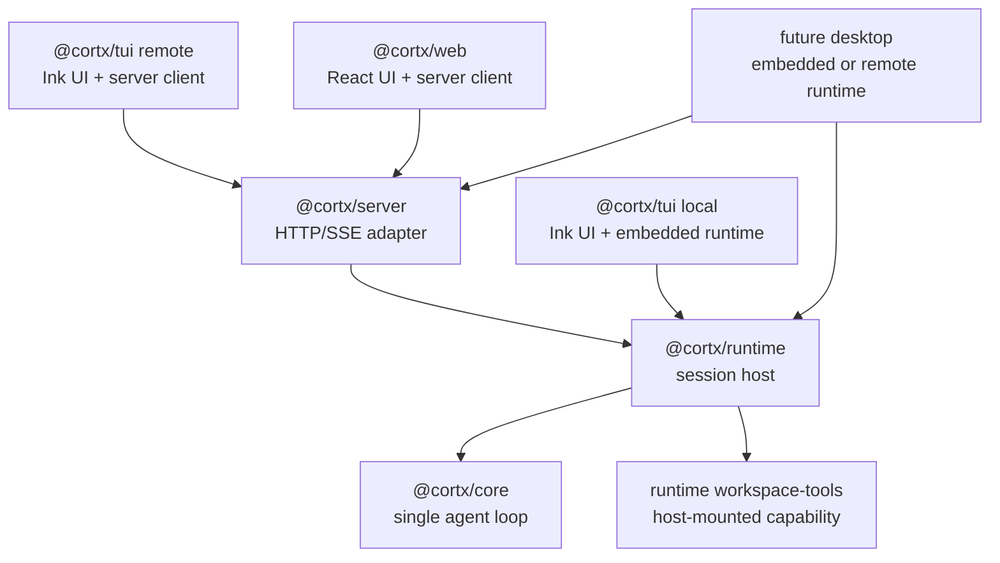
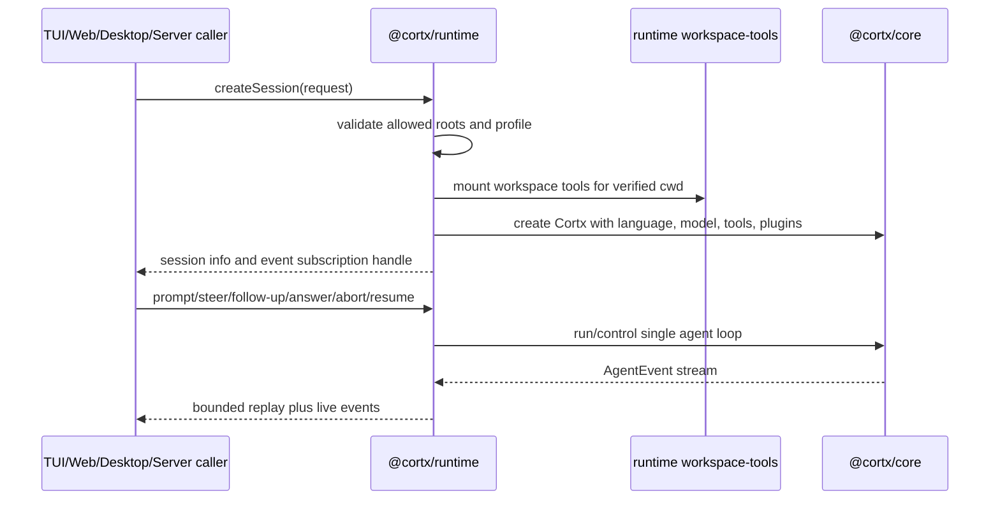
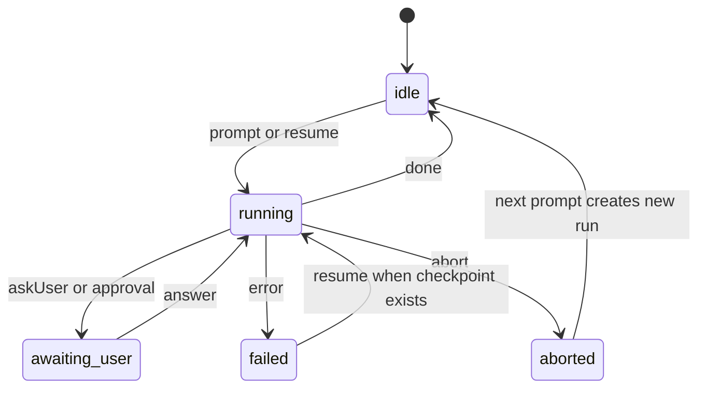

# Cortx Runtime Host Architecture - Plan

## Goal Capsule

- **Objective:** 将 Cortx 重组为 `core + runtime + thin frontends` 的分层架构，让 `core` 成为单 agent 底层执行内核，`runtime` 成为多 session、多目录、多 agent 的运行承载层，`server`、`tui`、`web` 和未来 desktop 都围绕 runtime 操控 agent。
- **Product authority:** 本文定义 runtime 化改造的产品与架构边界；已有 `docs/plans/2026-06-29-001-feat-cortx-extension-system-plan.md` 继续作为 core extension system 的权威来源。
- **Execution profile:** Deep, cross-package refactor. 第一版必须同时交付 server 多目录运行、TUI remote mode、core slimming 护栏，但允许按实现单元分阶段落地。
- **Stop conditions:** `@cortx/runtime` 成为 session host 权威，server 委托 runtime，TUI local/remote 都能操控 prompt、steer、follow-up、answer、abort 和 resume，Web 继续通过 server API 操控 session，workspace/root 安全与默认 approval 行为有自动化测试，core boundary tests 防止 host/session/workspace 职责回流 core。
- **Open blockers:** No launch-blocking open questions. `runtime` 作为包名和 multi-session host 边界已采纳；allowed workspace roots、TUI mode selection、skills/sub-agent 迁移节奏在 Planning Contract 中以实现决策固定。

---

## Product Contract

### Summary

Cortx 将形成三层职责：`core` 负责单 agent loop，`runtime` 负责承载多个 agent session，前端只负责展示和控制。
第一版同时交付 server 多目录运行、TUI 远程模式、以及 core 瘦身，但以 runtime/session 能力作为共同地基。

### Problem Frame

当前 Cortx 已经具备单 agent 执行能力和 HTTP/SSE server 雏形，但运行职责分散在不同包里。
TUI 直接 in-process 创建 `Cortx` 并装配 workspace tools，Web 已经是 server 客户端，server 则只能创建同构 session，不能按会话指定目录、模型或工具。
这会让多项目并行、远程控制、桌面端复用和 core 精简互相牵扯。

这个改造把产品形态从“每个前端自己理解 agent 如何运行”调整为“runtime 统一承载 agent，前端只控制 runtime”。
这样未来的 Web、TUI、Desktop、CI 或其他宿主都能复用同一个运行层，而不是重复实现 session 管理、工具装配、事件缓存、取消和审批。

### Product Contract Preservation

Product Contract changed only to clarify previously blocking architecture choices: `runtime` is the package and host-layer name, workspace root examples use portable fixture-style paths, and the open blockers are converted into Planning Contract decisions.
Requirement IDs R1-R25, actors, flows, and acceptance examples keep the same product intent.

### Key Decisions

- **Runtime is the host, core is the kernel.** `core` 保持为单 agent 执行内核；`runtime` 承载多个 `Cortx` 实例、workspace、工具、profile、session lifecycle 和事件订阅。
- **Server is an adapter over runtime.** `server` 不拥有 agent 编排语义；它只把 runtime 暴露成 HTTP/SSE API，并处理认证、CORS 和传输错误。
- **Frontends stay thin.** `tui`、`web` 和未来 desktop 都消费同一套 session/action/event contract；它们可以有不同表现方式，但不重新定义 agent 运行语义。
- **TUI keeps local mode.** TUI 的本地 in-process 模式仍是一级能力；远程模式是增强，不替代本地模式。
- **Workspace tools become runtime-mounted capabilities.** 原 `@cortx/code` 不再作为独立包保留；文件/命令工具能力迁入 runtime 内部 workspace-tools capability，未来可再抽成官方插件或可安装 tool pack。
- **Core slimming is part of the same architecture version.** skills runtime bridge、built-in sub-agent tool、inline tools path 等 core 内能力入口需要向统一 contribution/runtime path 收敛，避免 core 再次变成产品宿主层。

### Actors

- A1. **Local coding user:** 在终端或桌面端操作本机代码目录，需要低延迟、本地权限边界和可复制的终端输出。
- A2. **Remote operator:** 通过 Web、TUI 远程模式或未来 desktop 连接 server，管理一组后台运行的 agent session。
- A3. **Frontend implementer:** 构建 TUI/Web/Desktop 展示层，只需要理解 session actions 和 `AgentEvent`，不应重新实现 agent runtime。
- A4. **Plugin/tool author:** 提供 workspace tools、skills bridge、sub-agent capability 或 policy，需要稳定的 runtime/core contract。
- A5. **Planning/review agent:** 读取本 Product Contract，并在后续 planning 中把需求拆成实现单元。

### Requirements

**Runtime Host**

- R1. Cortx 必须提供一个 runtime host 层，用于创建、保存、查询、取消、恢复和订阅多个 agent session。
- R2. 每个 runtime session 必须绑定自己的 working directory、model/profile、tools、plugins、policy 和 event stream。
- R3. runtime 必须支持多个 session 并行运行，不要求 core 内部新增“多 agent 工作台”概念。
- R4. runtime 必须把 prompt、steer、follow-up、answer、abort、resume、subscribe 作为 host actions 暴露给 server、TUI 本地模式和未来 desktop。
- R5. runtime 必须保留 bounded event history，并为 late subscriber 提供足够的 session 状态恢复能力。

**Workspace and Tool Safety**

- R6. runtime 创建 session 时必须验证 requested working directory 位于允许的 workspace roots 内。
- R7. workspace 路径边界必须使用 lexical containment 和 realpath/symlink containment，不能只依赖字符串前缀。
- R8. workspace tools 必须按 session working directory 装配，工具执行不能越过该 session 的 workspace boundary。
- R9. write/destructive 工具必须接入默认 approval policy；无可用审批通道时默认拒绝而不是静默执行。
- R10. workspace tools 必须作为 runtime 可挂载 capability 或官方插件形态存在，而不是由每个前端复制工具实现，也不再保留模糊的独立 `code` 包。

**Server Adapter**

- R11. server `POST /sessions` 必须接受 session creation body，并允许调用方指定 working directory、model/profile 和可选 agent configuration。
- R12. server 必须把 session creation body 交给 runtime 验证和创建，不能绕过 runtime 自行构造 `Cortx`。
- R13. server 必须继续通过 REST/SSE 暴露 create/list/get/prompt/steer/follow-up/answer/abort/resume/events 能力。
- R14. server 必须返回可诊断的错误结果，让前端区分 invalid workspace、permission denied、session busy、session missing 和 runtime failure。

**Thin Frontends**

- R15. Web 必须保持 server client 模式，不在浏览器内运行 local agent loop 或本地 filesystem tools。
- R16. TUI 必须支持 local mode 和 remote mode；local mode 内嵌 runtime，remote mode 连接 server。
- R17. TUI remote mode 和 Web 必须消费同一种 server session API 和 event stream。
- R18. TUI/Web/Desktop 的差异应限制在展示、输入、快捷键、布局和本地宿主能力上，不应分叉 agent session 语义。
- R19. 前端必须能显示多个 session 的基础信息，包括 session id、workspace、model/profile、running state、token usage 和最近活动时间。

**Core Boundary**

- R20. `core` 必须继续只承载单 agent loop、extension contract、tool execution pipeline、control plane、event emission 和 checkpoint semantics。
- R21. `core` 不应承担多 session 管理、workspace root policy、HTTP transport、TUI/Web/Desktop state 或多项目工作台职责。
- R22. `CortxConfig.tools`、skills special-case merge 和 built-in sub-agent tool 必须向统一 contribution/runtime path 收敛。
- R23. skills 仍是文件资产；迁出 core 的目标是 skill discovery/transform/tool bridge 这个 runtime adapter，不是要求 skill 作者写 JavaScript plugin。
- R24. sub-agent capability 必须从 core 默认能力变为可选官方插件或 runtime-mounted capability，并保留 TUI 默认启用的产品行为。
- R25. core boundary 必须由测试强制，防止 skills bridge、sub-agent tool 或 host/session logic 回流 core。

### Key Flows

- F1. Local TUI session
  - **Trigger:** 用户在项目目录内启动 TUI。
  - **Actors:** A1
  - **Steps:** TUI 以内嵌 runtime 创建 session；runtime 验证 cwd；runtime 装配 workspace tools；TUI 订阅 session events 并发送 prompt。
  - **Outcome:** 用户获得本地、低延迟、可操作当前目录的 agent 体验。
  - **Covers:** R1, R2, R4, R6, R8, R16

- F2. Remote Web session
  - **Trigger:** 用户通过 Web 创建或连接 server session。
  - **Actors:** A2, A3
  - **Steps:** Web 调用 server create session；server 把请求交给 runtime；runtime 创建独立 `Cortx` session；Web 通过 SSE 消费 events。
  - **Outcome:** Web 能控制远端 agent，但不获得本地 filesystem 运行能力。
  - **Covers:** R11, R12, R13, R15, R17

- F3. Multi-directory workspace
  - **Trigger:** 用户同时为多个 repo 创建 session。
  - **Actors:** A1, A2
  - **Steps:** runtime 为每个 workspace 建立独立 session；每个 session 拥有自己的 cwd、tools、events 和 running state；前端按 session 切换或并排展示。
  - **Outcome:** 多项目并行不需要 core 新增多 agent graph，也不会共享错误的 workspace boundary。
  - **Covers:** R2, R3, R5, R6, R19, R20

- F4. Future desktop shell
  - **Trigger:** 桌面端需要提供 Codex-like 多项目 agent 工作台。
  - **Actors:** A1, A2, A3
  - **Steps:** Desktop 选择内嵌 runtime 或连接 server；session/action/event contract 保持一致；UI 只实现桌面交互和窗口管理。
  - **Outcome:** Desktop 不需要重新实现 agent 编排或工具安全边界。
  - **Covers:** R4, R17, R18, R19

### Acceptance Examples

- AE1. **Covers R2, R3, R6.** Given allowed root 包含 `fixtures/workspaces/root`, when 用户创建两个 session 分别指向 `fixtures/workspaces/root/a` 和 `fixtures/workspaces/root/b`, then runtime 创建两个独立 session，且每个 session 的工具只在自己的目录边界内运行。
- AE2. **Covers R6, R7, R14.** Given 请求的 working directory 通过 `..`、绝对路径或 symlink 指向 allowed roots 外部, when server 创建 session, then runtime 拒绝并返回 invalid workspace 类错误。
- AE3. **Covers R9, R16.** Given TUI local mode 中 agent 请求 write tool, when approval channel 可用, then 前端显示确认并把用户回答送回 runtime；when approval channel 不可用, then write/destructive tool 默认拒绝。
- AE4. **Covers R15, R17.** Given Web 已连接 server session, when agent emits `tool_use`、`thinking_delta`、`text_delta`、`done`, then Web 只通过 event stream 更新 UI，不直接访问 core 或 workspace tools。
- AE5. **Covers R20, R21, R25.** Given 后续修改 core, when 测试扫描 core boundary, then 出现 server/TUI/Web/session-host/workspace-root 管理逻辑时测试失败。
- AE6. **Covers R4, R13, R16, R17.** Given TUI remote mode 连接到正在运行的 server session, when 用户发送 steer 或 follow-up, then 请求通过 server/runtime 进入同一个 controller 通道，而不是 TUI 直接访问 core。

### Success Criteria

- S1. Server 可以创建至少两个不同 working directory 的 session，并让它们并行运行互不串 workspace。
- S2. TUI 可以在 local mode 下继续现有本地体验，并在 remote mode 下连接 server session，包含 prompt、steer、follow-up、answer、abort 和 resume 操作。
- S3. Web 和 TUI remote mode 使用同一套 server session API，不需要前端专属 agent session 语义。
- S4. Workspace tools 的路径边界由 shared runtime/tool contract 保证，不由每个前端自行维护。
- S5. Core 的公开职责更小，新增能力默认落在 runtime、server adapter、frontend 或官方插件，而不是直接进入 core。

### Scope Boundaries

**In scope for this architecture version**

- 新增 `@cortx/runtime` host 层。
- Server session 参数化和 runtime-backed session creation。
- TUI local/remote 双模式。
- Web 继续作为 remote frontend 并与 TUI remote 共享 session API。
- Workspace tools 统一装配和路径安全契约。
- Core 内能力入口向统一 contribution/runtime path 收敛。
- Core boundary tests。

**Deferred for later**

- 完整 AgentSpec schema、agent marketplace、skill pack installer 和 prompt template registry。
- Desktop shell 的具体 UI、窗口模型和打包方式。
- 跨机器分布式调度、队列、job scheduler 和多用户权限系统。
- UI extension points，例如 `surface.*`、`tui.*`、`web.*`。
- 多用户 server 权限、租户隔离、审计存储和远程 workspace provisioning。

**Outside this product's identity**

- Web 直接运行本地 coding agent 或浏览器内 filesystem agent。
- 把多项目工作台实现为 core 内 graph runtime。
- 为 TUI、Web、Desktop 各自维护不同的 agent session semantics。

### Dependencies / Assumptions

- D1. Existing core `AgentEvent` remains the canonical event stream shared by runtime, server and frontends.
- D2. Existing server and web transport can evolve without replacing Hono/SSE as the first remote protocol.
- D3. Existing workspace tool path-safety work becomes runtime-owned workspace safety infrastructure.
- D4. Existing core extension plan remains valid and should not be duplicated by this runtime architecture plan.
- D5. Runtime naming is accepted as the durable term for the multi-session host layer.
- D6. TUI remote mode may initially share the Web bridge contract through a small TypeScript client rather than a React-specific implementation.
- D7. Core slimming should be behavior-preserving in this plan; removing public APIs or changing plugin author contracts belongs in a later compatibility plan if the project has already shipped.
- D8. Server auth remains API-key/token based in this slice. Remote clients must never put the long-lived API key in EventSource URLs; SSE may use short-lived exchange tokens only, and logs/errors must redact credentials.

### Sources / Research

- `packages/tui/src/cli.tsx` shows current TUI in-process construction of `Cortx` and direct `createAllTools(cwd)` usage.
- `packages/server/src/session-manager.ts` shows current server session creation has global model/system/plugins and no per-session working directory or tools.
- `packages/server/src/server.ts` shows current `POST /sessions` does not read a creation body.
- `packages/server/src/types.ts` shows server config owns language/model/plugins today and lacks workspace root configuration.
- `packages/web/src/bridge/event-bridge.ts` shows Web already acts as a server REST/SSE client.
- `packages/runtime/src/workspace-tools/path-safety.ts` shows runtime-owned workspace path containment.
- `packages/runtime/src/workspace-tools/index.ts` shows workspace tools are exposed as cwd-bound runtime capability factories.
- `packages/core/src/agent.ts` and `packages/core/src/types.ts` show core still has inline tools, skills special-case merge and built-in sub-agent tool paths.
- `packages/server/tests/server.test.ts` shows existing server tests already cover auth, basic sessions, event cap, abort running gate and plugin pass-through.
- `docs/plans/2026-06-29-001-feat-cortx-extension-system-plan.md` establishes that core should avoid TUI/Web extension APIs and treat skills/agent specs as assets around a typed runtime extension system.

---

## Planning Contract

### Key Technical Decisions

- KTD1. `@cortx/runtime` is the durable host package. It owns session lifecycle, per-session working directory, event history, run gates, prompt/steer/follow-up/answer/abort/resume actions, workspace root validation, and default session capability mounting.
- KTD2. `@cortx/core` remains a single-agent execution kernel. It may expose `Cortx`, `CortxSession`, loop/control types, extension contracts, and checkpoint primitives, but it must not own multi-session maps, server transport, allowed workspace roots, frontend state, or workspace selection policy.
- KTD3. Server delegates to runtime instead of owning `SessionManager`. The existing `packages/server/src/session-manager.ts` behavior should either move into runtime or shrink to an adapter wrapper that contains no independent session semantics.
- KTD4. Session creation and actions are typed request/response contracts. Server, Web, and TUI remote mode should share a shape for `workingDirectory`, optional `model` or `profile`, optional `metadata`, and tool mode; prompt, steer, follow-up, answer, abort and resume should route through runtime with typed host errors.
- KTD5. Workspace roots are configured at the runtime/server boundary. Runtime validates requested directories against allowed roots with lexical containment and realpath/symlink containment before creating tools or `Cortx`.
- KTD6. Runtime owns the workspace-tools capability provider. It exposes a mount/factory path that takes the verified session workspace and returns tools with the same path-safety behavior, rather than forcing each frontend to call individual tool factories.
- KTD7. TUI has two runtime adapters behind one UI: local mode embeds runtime and creates a local session; remote mode speaks the server API. The rendered experience should not depend on whether events came from local runtime or SSE.
- KTD8. Web stays remote-only. Any feature that requires local filesystem access must go through server/runtime and explicit allowed workspace roots, not browser-local code.
- KTD9. Skills and sub-agent defaults move toward runtime-mounted capabilities, but the first implementation should preserve current product behavior. TUI local mode and server default profiles can enable the official skill/sub-agent bridge by default while core stops being the place new host capability is added.
- KTD10. Boundary tests are part of the architecture, not cleanup. New tests must fail if server/TUI/Web recreate session semantics independently or if core starts importing server/runtime/frontend/workspace host modules.
- KTD11. Remote credentials are transport concerns, not runtime state. Server owns API-key validation and short-lived token exchange; runtime receives authenticated actions only. TUI/Web may store connection settings, but should redact API keys in logs, persisted session metadata and error messages.

### High-Level Technical Design

The first version should turn the current server-side `SessionManager` into reusable runtime infrastructure and make every surface depend on the same session/action/event contract.

Session creation should flow through one validation and construction path.

The runtime-facing session state should remain compact and transport-neutral.

### Runtime Host Contract

Runtime should expose a small host contract that can be implemented in-process and adapted over HTTP without leaking transport details:

- `createSession(request)` validates workspace/profile/tools and returns session metadata.
- `listSessions()` and `getSession(sessionId)` return metadata suitable for TUI/Web session pickers.
- `prompt(sessionId, message)`, `steer(sessionId, message)`, `followUp(sessionId, message)`, `resume(sessionId)`, `answer(sessionId, toolCallId, response)`, and `abort(sessionId)` drive the underlying `Cortx` instance.
- `subscribe(sessionId, listener)` streams canonical `AgentEvent` values and replays bounded history for late subscribers.
- `deleteSession(sessionId)` aborts, rejects pending questions, clears subscribers, and releases timers.

Runtime should pass per-session durable-store configuration through to core when available, but core remains responsible for checkpoint schema and single-agent resume semantics.

### Error Contract

Runtime should normalize host errors before server or frontend formatting:

| Error kind          | Typical cause                                                            | Server status | Frontend behavior                                |
| ------------------- | ------------------------------------------------------------------------ | ------------: | ------------------------------------------------ |
| `invalid_workspace` | Requested cwd outside allowed roots, missing root, symlink escape        |           400 | Show actionable workspace message                |
| `permission_denied` | Default policy rejects write/destructive action without approval channel |           403 | Show denial in tool/result area                  |
| `session_not_found` | Unknown or expired session id                                            |           404 | Offer reconnect or create session                |
| `session_busy`      | Prompt/resume requested while run gate is active                         |           409 | Keep input disabled or offer steer/abort         |
| `capacity_exceeded` | Runtime max sessions reached                                             |           429 | Ask user to close a session                      |
| `runtime_failure`   | Unexpected construction or stream error                                  |           500 | Show diagnostic message and preserve log context |

### Sequencing

Implement runtime first, then move server onto it, then add TUI remote mode and Web parity, then tighten core boundary.
This order keeps the visible product surfaces usable after each slice and gives core slimming a stable host layer to move capabilities into.

### Assumptions

- The server remains a single-user or trusted-network adapter in this plan; multi-user authorization is explicitly deferred.
- Workspace root configuration can start as explicit server/runtime config plus TUI local cwd default; richer workspace discovery is not required in this slice.
- Runtime may reuse existing `CortxSession` concepts internally, but the public host contract should not expose React/TUI-specific state.
- Existing `AgentEvent` values remain the frontend rendering source; this plan does not redesign the event schema.

---

## Implementation Units

### U1. Extract Runtime Host Package

- **Goal:** Create `@cortx/runtime` as the reusable multi-session host and move the current server-owned session lifecycle semantics into it.
- **Requirements:** R1, R2, R3, R4, R5, R20, R21.
- **Dependencies:** None.
- **Files:** `packages/runtime/package.json`, `packages/runtime/tsconfig.json`, `packages/runtime/src/index.ts`, `packages/runtime/src/runtime.ts`, `packages/runtime/src/session.ts`, `packages/runtime/src/events.ts`, `packages/runtime/src/errors.ts`, `packages/runtime/tests/runtime.test.ts`, `package.json`.
- **Approach:** Start from the behavior in `packages/server/src/session-manager.ts`: session id creation, max session cap, bounded event history, subscriber set, idle timeout, run gate, abort handling, answer handling, and plugin/model pass-through. Move host-neutral behavior into runtime and keep server transport concerns out of the package. Runtime should accept language/model/default system/registry/plugins/logger defaults plus per-session overrides.
- **Patterns to follow:** `packages/server/src/session-manager.ts` for current host behavior; `packages/core/src/session.ts` for in-process event subscription concepts; `packages/sdk/src/index.ts` for shared event and logger types.
- **Test scenarios:** Create two sessions and confirm distinct ids, independent `isRunning` states, independent event histories, and bounded replay. Prompt a session with a mock language client and verify events are broadcast live and retained up to the cap. Send steer and follow-up to a running session and verify they enter the underlying controller without creating a second run. Abort a running session and verify the running gate clears and stale run events are ignored. Resume a session through the runtime host and verify it delegates to the core resume path. Delete a session and verify pending questions are rejected and subscribers stop receiving events. Create more than `maxSessions` and expect `capacity_exceeded`.
- **Verification:** Runtime tests prove current server session behavior survived the extraction and runtime exports compile independently of server, TUI, and Web.

### U2. Add Workspace Root Validation and Tool Mounting

- **Goal:** Make runtime the authority for session workspace validation and mount runtime-owned workspace tools only after a requested working directory is proven inside allowed roots.
- **Requirements:** R2, R6, R7, R8, R9, R10, R14.
- **Dependencies:** U1.
- **Files:** `packages/runtime/src/workspace.ts`, `packages/runtime/src/tool-mount.ts`, `packages/runtime/tests/workspace.test.ts`, `packages/runtime/src/workspace-tools/index.ts`, `packages/runtime/src/workspace-tools/path-safety.ts`, `packages/runtime/tests/workspace-tools.test.ts`.
- **Approach:** Add a runtime workspace resolver that checks lexical containment and realpath/symlink containment for requested directories. Keep the path rules in `packages/runtime/src/workspace-tools/path-safety.ts` and expose a workspace-tools capability factory suitable for runtime mounting. Ensure default write/destructive approval policy is still active when mounted through runtime.
- **Patterns to follow:** `packages/runtime/src/workspace-tools/path-safety.ts` for containment semantics; `packages/core/src/safety-policy.ts` for default approval behavior; `packages/runtime/tests/workspace-tools.test.ts` for tool safety test style.
- **Test scenarios:** Covers AE1 and AE2. Resolve a normal workspace under an allowed root and create tools for it. Reject `..` traversal, absolute escape, and symlink escape. Execute read/write/edit/search tools through a mounted session and verify each stays inside the session workspace. Attempt a write/destructive tool with no approval channel and verify the tool returns a structured denial rather than executing. Verify two sessions under sibling workspaces cannot read or write each other's files.
- **Verification:** Workspace tests prove root validation happens before `Cortx` construction and tool tests prove runtime-mounted tools keep the same path safety as direct internal workspace-tools usage.

### U3. Make Server a Runtime Adapter

- **Goal:** Replace server-owned session semantics with runtime delegation and extend `POST /sessions` to accept per-session creation options.
- **Requirements:** R1, R2, R4, R5, R6, R11, R12, R13, R14.
- **Dependencies:** U1, U2.
- **Files:** `packages/server/package.json`, `packages/server/src/types.ts`, `packages/server/src/server.ts`, `packages/server/src/session-manager.ts`, `packages/server/src/bin.ts`, `packages/server/tests/server.test.ts`, `packages/server/tests/auth.test.ts`.
- **Approach:** Add `@cortx/runtime` as a server dependency and construct a runtime host from `ServerConfig`. `POST /sessions` should parse JSON when present, pass the creation body to runtime, and format typed runtime errors into stable HTTP responses. Existing REST/SSE routes should call runtime actions and use runtime session metadata, while auth, CORS, token exchange and Hono streaming stay in server.
- **Patterns to follow:** Existing `packages/server/src/server.ts` route shape and auth middleware; existing SSE replay logic; runtime error contract from Planning Contract.
- **Test scenarios:** Create a session with no body using defaults. Create sessions with two different working directories under allowed roots and verify response metadata includes workspace. Reject invalid JSON and invalid workspace with distinct 400 responses. Route prompt, steer, follow-up, answer, abort and resume through runtime. Return 409 for busy session, 404 for missing session, 429 for capacity cap, and 500 only for unexpected runtime failure. SSE should replay bounded history and continue streaming new runtime events with short-lived tokens rather than long-lived API keys. Existing auth tests should keep passing unchanged.
- **Verification:** Server tests prove the transport API remains compatible while session construction, workspace validation, events, prompt, answer, abort, and delete all route through runtime.

### U4. Add TUI Local and Remote Runtime Adapters

- **Goal:** Let the same TUI experience run either with an embedded runtime session or a remote server session.
- **Requirements:** R1, R4, R13, R16, R17, R18, R19.
- **Dependencies:** U1, U2, U3.
- **Files:** `packages/tui/package.json`, `packages/tui/src/config.ts`, `packages/tui/src/cli.tsx`, `packages/tui/src/app.tsx`, `packages/tui/src/message-io.ts`, `packages/tui/src/session-store.ts`, `packages/tui/src/remote-client.ts`, `packages/tui/src/runtime-session.ts`, `packages/tui/src/__tests__/integration.test.ts`, `packages/tui/src/__tests__/session-header.test.ts`, `packages/tui/tests/message-io.test.ts`.
- **Approach:** Introduce a small TUI session adapter interface covering subscribe, prompt, resume, answer, abort, controller-like steering where available, and session metadata. Local mode creates an embedded runtime host with `workingDirectory` from config or process cwd. Remote mode connects to server with base URL/API key, creates or attaches to a session, consumes the same event stream contract as Web, and keeps TUI rendering logic ignorant of where the events originated. Keep existing TUI command palette, history, markdown rendering, and approval UX intact.
- **Patterns to follow:** `packages/tui/src/app.tsx` for current `CortxSession` usage; `packages/web/src/bridge/event-bridge.ts` for remote REST/SSE flow; `packages/tui/src/config.ts` for persisted configuration.
- **Test scenarios:** Start local mode with a mock runtime and verify prompt events render through the existing store. Start remote mode with a fake server client and verify create/connect/prompt/steer/follow-up/answer/abort/resume calls use the remote adapter. Press approval answer in local mode and remote mode and verify the answer goes to the correct channel. Cover remote connecting, auth failed, server unreachable, session missing, invalid workspace, streaming, interrupted and reconnected states. Verify session header can display mode, session id, workspace, model/profile, running state, usage and elapsed time without duplicating turn/seconds information. Verify up-arrow history and steer mode still work after adapter insertion.
- **Verification:** TUI tests prove UI behavior is adapter-neutral and the CLI can choose local or remote mode from config/flags without regressing existing local startup.

### U5. Keep Web Remote-Only and Align Session API

- **Goal:** Update Web's server bridge and UI state to consume the richer session contract without introducing browser-local agent execution.
- **Requirements:** R11, R13, R15, R17, R18, R19.
- **Dependencies:** U3.
- **Files:** `packages/web/src/bridge/event-bridge.ts`, `packages/web/src/bridge/auth.ts`, `packages/web/src/App.tsx`, `packages/web/src/components/StatusBar.tsx`, `packages/web/src/components/ConnectionOverlay.tsx`, `packages/web/src/components/PromptInput.tsx`, `packages/web/src/hooks/use-store.ts`, `packages/web/tests/auth.test.ts`.
- **Approach:** Extend the Web bridge to pass session creation options when the UI has them, parse runtime/session metadata, and surface typed errors from server. Keep event consumption through EventSource using short-lived exchange tokens rather than the long-lived API key. Do not add local filesystem access or core imports to Web. Align shared session metadata names with TUI remote mode so future frontend code can share a small client package if needed.
- **Patterns to follow:** Current `packages/web/src/bridge/event-bridge.ts` for REST/SSE flow; `packages/store/src/store.ts` for canonical event-to-view state; TUI remote adapter from U4 for contract parity.
- **Test scenarios:** Create a remote session with default body and with a working directory field. Handle invalid workspace, auth failure, server unreachable, expired token, missing session and stream reconnect states with user-visible messages. Verify Web consumes `tool_use`, `tool_result`, `thinking_delta`, `text`, `done`, `error`, and askUser/approval events only from SSE/store dispatch. Verify Web package has no dependency on `@cortx/core`, `@cortx/runtime`, or runtime workspace-tools implementation unless explicitly introduced as a transport-only type package.
- **Verification:** Web tests and package manifest checks prove Web remains a thin remote frontend and shares the server session contract.

### U6. Slim Core Capability Mounting

- **Goal:** Move host-like default capabilities toward runtime-mounted official contributions while keeping current TUI/server product behavior.
- **Requirements:** R20, R21, R22, R23, R24, R25.
- **Dependencies:** U1, U2.
- **Files:** `packages/core/src/agent.ts`, `packages/core/src/types.ts`, `packages/core/src/skill/discover.ts`, `packages/core/src/skill/plugin.ts`, `packages/core/src/skill/tool.ts`, `packages/core/src/sub-agent-session.ts`, `packages/core/tests/core-extensions.test.ts`, `packages/core/tests/agent-background.test.ts`, `packages/core/tests/sub-agent-session.test.ts`, `packages/runtime/src/default-capabilities.ts`, `packages/runtime/tests/core-boundary.test.ts`.
- **Approach:** Make core consume configured tools and runtime extensions as the primary path. Move default skill bridge and sub-agent mounting decisions into runtime default capabilities where feasible. If code movement would be too disruptive for the first slice, add explicit boundary wrappers and tests first, then remove direct core defaults in the same implementation plan only after behavior is preserved. Skills remain filesystem assets; migration means runtime decides how the skill asset bridge is enabled, not that skill authors write plugins.
- **Execution note:** Use characterization tests before moving current skill/sub-agent behavior. The test signal should prove behavior stayed the same while ownership moved outward.
- **Patterns to follow:** `docs/plans/2026-06-29-001-feat-cortx-extension-system-plan.md` for skill-as-asset and typed runtime extension direction; `packages/core/tests/core-extensions.test.ts` for headless extension expectations.
- **Test scenarios:** Core can run a prompt-only agent with no runtime-mounted workspace tools. Runtime default profile can enable skill discovery and the `skill` tool without TUI-specific code. Runtime default profile can enable the sub-agent tool and preserve foreground/background agent events. Core boundary test fails if `packages/core/src` imports `packages/server`, `packages/tui`, `packages/web`, or runtime workspace host modules. Existing core extension tests still pass for `agent.tool`, system/messages transforms, tool before/after, error recovery and event observers.
- **Verification:** Core tests prove single-agent execution still works, runtime tests prove default capabilities preserve product behavior, and boundary tests prove new host logic does not move back into core.

### U7. Add Cross-Package Conformance and Documentation

- **Goal:** Turn the new architecture into a maintained contract with tests and developer-facing documentation.
- **Requirements:** R3, R4, R5, R13, R17, R18, R19, R25.
- **Dependencies:** U1, U2, U3, U4, U5, U6.
- **Files:** `docs/architecture/runtime-host.md`, `docs/architecture/sdk-and-core-extension-guide.md`, `packages/runtime/tests/conformance.test.ts`, `packages/server/tests/server.test.ts`, `packages/tui/src/__tests__/integration.test.ts`, `packages/web/tests/auth.test.ts`, `packages/core/tests/core-extensions.test.ts`, `package.json`.
- **Approach:** Document the final `core + runtime + thin frontends` boundary and add conformance tests that run through runtime, server adapter, and frontend adapters at the behavior level. Keep documentation as a contract for future contributors: where to add agent behavior, where to add host/session behavior, and where UI-only changes belong.
- **Patterns to follow:** Existing architecture docs under `docs/architecture/`; plan language in this document; existing Bun test layout per package.
- **Test scenarios:** Runtime can manage two concurrent sessions with separate workspaces. Server API and TUI remote adapter use the same session creation and event semantics. TUI local and remote adapters emit the same store-facing events for a simple prompt. Web and TUI remote can answer askUser/approval events through the server route. A package-boundary test confirms Web has no local agent execution dependencies and core has no host/frontend dependencies. A full `bun test` run covers all modified packages.
- **Verification:** Documentation names the new boundaries and tests enforce them, so future work can extend runtime/server/frontends without modifying core by default.

---

## Verification Contract

| Gate                                                                               | Applies to     | Done signal                                                                                                            |
| ---------------------------------------------------------------------------------- | -------------- | ---------------------------------------------------------------------------------------------------------------------- |
| `bun run --filter '@cortx/runtime' lint`                                           | U1, U2, U6, U7 | New runtime package compiles with strict TypeScript and no server/frontend imports.                                    |
| `bun test packages/runtime/tests/*.test.ts`                                        | U1, U2, U6, U7 | Runtime session, workspace, default capability and boundary tests pass.                                                |
| `bun test packages/runtime/tests/workspace-tools.test.ts`                                        | U2             | Workspace tools retain path safety, unique edit behavior and cross-platform search behavior.                           |
| `bun test packages/server/tests/server.test.ts packages/server/tests/auth.test.ts` | U3             | Server routes, auth, SSE replay, typed errors, prompt/steer/follow-up/answer/abort/resume and runtime delegation pass. |
| `bun test packages/tui/src/__tests__/*.test.ts packages/tui/tests/*.test.ts`       | U4             | TUI local mode, remote adapter, input/history/approval/rendering behavior pass.                                        |
| `bun test packages/web/tests/*.test.ts`                                            | U5             | Web auth and bridge-level remote behavior pass.                                                                        |
| `bun test packages/core/tests/*.test.ts`                                           | U6, U7         | Core loop/extension/session/sub-agent behavior remains intact and boundary tests pass.                                 |
| `bun test`                                                                         | All units      | Cross-package behavior passes together, including integration between runtime, server, TUI, Web and core.              |
| `bun run lint`                                                                     | All units      | Workspace TypeScript checks pass for every package.                                                                    |

Manual or smoke verification is still useful after automated tests:

- Start TUI local mode from a repo directory and verify it creates a local runtime session, renders assistant/tool/thinking events, and can answer approval prompts.
- Start server with an allowed workspace root, create two sessions in sibling workspaces, and verify Web and TUI remote can attach to them independently.
- Confirm invalid workspace requests produce actionable errors instead of generic failures.

---

## Definition of Done

- `@cortx/runtime` exists as the canonical multi-session host package and exports runtime/session/error types needed by server and TUI.
- Server no longer owns independent session orchestration; it delegates create/list/get/prompt/steer/follow-up/resume/answer/abort/delete/subscribe semantics to runtime.
- Server `POST /sessions` accepts a creation body, validates working directories through runtime, and returns typed, diagnosable errors.
- TUI supports local mode with embedded runtime and remote mode through server, with one UI/store path for both and complete prompt/steer/follow-up/answer/abort/resume coverage.
- Web remains remote-only and uses the same server session API/event stream contract as TUI remote mode.
- Workspace tools are mounted through the runtime-owned workspace-tools capability or a future official tool-pack path and keep lexical plus realpath/symlink containment.
- Default write/destructive approval behavior remains protective in local runtime, server runtime and TUI approval flows.
- Core's role is smaller: no new multi-session, workspace-root, HTTP, TUI/Web or desktop host logic is added to `@cortx/core`.
- Skill and sub-agent behavior is preserved for default coding-agent products while the ownership of default mounting moves toward runtime or explicit official capabilities.
- Tests cover runtime sessions, workspace boundaries, server adapter errors, TUI local/remote adapters, Web remote bridge behavior, core boundary constraints and full-package lint/test gates.
- Documentation explains where future requirements should land: core for single-agent execution primitives, runtime for host/session/workspace capabilities, server for HTTP/SSE transport, frontends for presentation/control, and official plugins/tool packs for optional capabilities.
- Abandoned migration code, duplicated session managers and temporary compatibility shims are removed unless a shim is explicitly documented as a transitional boundary.

---

## System-Wide Impact

- **Core maintainability:** This plan reduces pressure to modify `@cortx/core` for every product feature. Future multi-session, workspace, frontend and desktop work should land outside core by default.
- **Security posture:** Workspace access becomes a runtime-level contract instead of a frontend convention, reducing path-boundary drift across TUI, server and Web.
- **Frontend velocity:** TUI/Web/Desktop can add UI features against one session/action/event contract rather than re-implementing agent orchestration.
- **Plugin/tool ecosystem:** Tool packs and official capabilities get a clearer home: runtime mounts them, core executes their contributions, frontends display their events.
- **Testing cost:** Cross-package tests increase, but they protect the architecture boundary that makes future changes cheaper.

---

## Risks & Dependencies

| Risk                                                                               | Mitigation                                                                                                                                                                 |
| ---------------------------------------------------------------------------------- | -------------------------------------------------------------------------------------------------------------------------------------------------------------------------- |
| Runtime extraction becomes a broad rewrite instead of a move-and-tighten refactor. | Start from existing `SessionManager` behavior, preserve tests first, then expand per-session options.                                                                      |
| Core slimming breaks skill or sub-agent behavior users already rely on.            | Characterize current behavior before moving ownership; keep runtime default profile enabling the same product behavior.                                                    |
| TUI remote mode creates a second frontend contract parallel to Web.                | Share session creation and event semantics; prefer a small transport client module over TUI-specific route assumptions.                                                    |
| Workspace root validation rejects legitimate symlink-based projects.               | Test symlink-inside and symlink-outside cases separately; allow inside-root symlinks while rejecting escapes.                                                              |
| Approval behavior differs between local runtime and server runtime.                | Route both through the same policy/tool context shape and cover no-approval-channel denial in tests.                                                                       |
| Web grows accidental local-agent dependencies.                                     | Add package manifest and import-boundary tests that fail on `@cortx/core`, `@cortx/runtime`, or runtime workspace-tools implementation imports unless explicitly approved for transport-only types. |
| Remote credentials leak through logs, URLs or persisted UI state.                  | Keep long-lived API keys out of EventSource URLs, use short-lived tokens for SSE, redact credentials in logs/errors, and test serialized session metadata for secrets.     |

---

## Documentation / Operational Notes

- Update `docs/architecture/runtime-host.md` with the boundary diagram, runtime actions, error contract and package ownership rules from this plan.
- Update `docs/architecture/sdk-and-core-extension-guide.md` only where runtime mounting changes how official tools/skills/sub-agent capabilities are enabled.
- Add startup/config notes for server allowed workspace roots, TUI local/remote mode selection, and remote credential storage/redaction expectations.
- Keep runtime docs focused on host semantics; do not reopen `surface.*`, `tui.*`, or `web.*` extension design in this plan.
