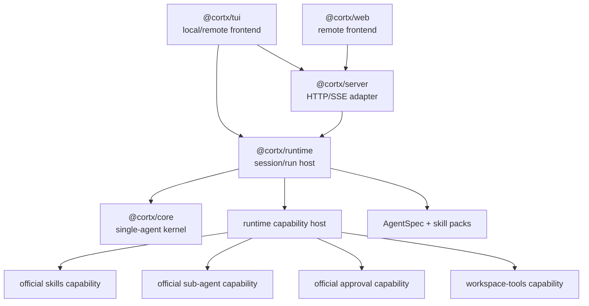
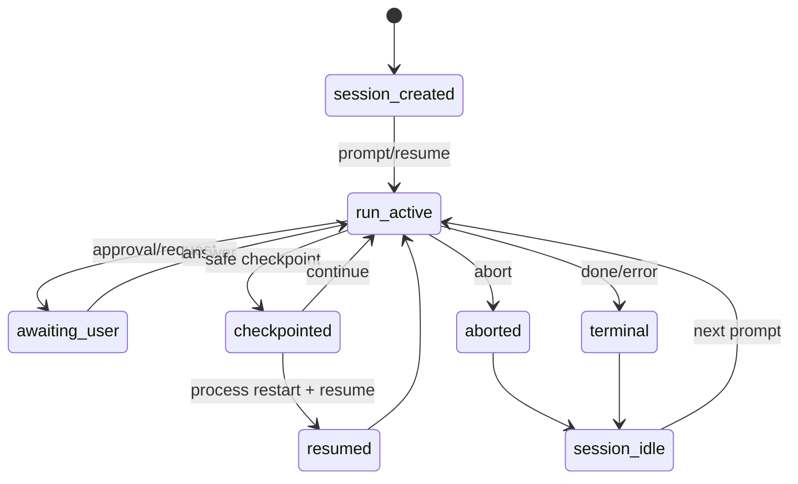
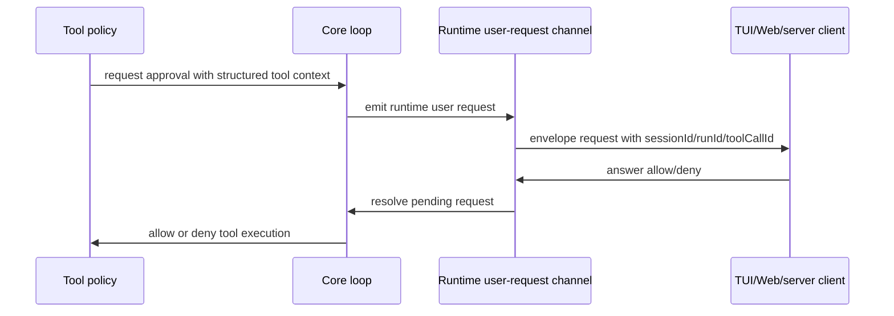

# Cortx Core Runtime Completion - Plan

## Goal Capsule

| Field | Value |
| --- | --- |
| Objective | 将 Cortx 推进到 core 最小化、runtime 可长期承载、上层 asset 能力可扩展的下一稳定架构点。 |
| Product authority | `docs/architecture/cortx-core-runtime-blueprint.md` 和 `docs/architecture/cortx-runtime-host-final-design.md` 是本计划的架构权威。 |
| Baseline | `e8e359c` 已完成 runtime host 重组、删除 `@cortx/code`、将 workspace tools 收进 runtime。 |
| Execution profile | Deep refactor，优先 characterization/conformance tests，再迁移产品能力，最后补 runtime durability 与上层 assets。 |
| Stop conditions | `@cortx/core` 不再发现 skills、不再内建 `agent` tool、不再装配产品默认安全策略；runtime 负责官方 capabilities、session/run identity、approval transport、durable resume 和 AgentSpec/skill pack launch path。 |
| Tail ownership | 实现完成后以 `bun run lint`、`bun run build`、`bun test`、`git diff --check` 作为全局出门条件，并用 targeted conformance 覆盖每个 U-ID。 |

Product Contract preservation: changed only to translate and enrich the requirements-only artifact into an implementation-ready Chinese plan; R/F/AE semantics and product scope are preserved.

---

## Product Contract

### Summary

Cortx 的下一阶段要把三条线作为同一项工作交付：core purity、runtime closure、upper capabilities。
目标不是追求抽象洁癖，而是让 `@cortx/core` 只保留任意 agent 都必须依赖的单 agent 执行内核；让 runtime 成为多 session、多目录、多 agent、审批、恢复和官方能力挂载的唯一 host；让 skills、sub-agent、AgentSpec、skill packs 这类产品能力都通过 runtime 或官方 capability 组合出来。

这样小 agent 可以只带一份 prompt 和少量显式工具运行，大 agent 产品也可以在不继续改 core 基础结构的情况下扩展到 TUI、Web、server、未来 Desktop 和更多官方能力。

### Problem Frame

上一轮 runtime host 已经解决外围架构问题：server 委托 runtime，TUI 支持 local/remote，Web remote-only，workspace tools 不再是模糊的 `@cortx/code` 包。
剩下的架构债集中在 core 与 runtime 的边界：`packages/core/src/agent.ts` 仍直接 import skill discovery、创建 skill bridge，并默认创建 model-visible `agent` sub-agent tool。
`packages/core/src/safety-policy.ts` 也仍由 core 自动装配默认写入/破坏性工具确认策略。

这些折中短期可用，因为 runtime 已通过 capability toggles 控制是否启用 skills/sub-agent。
但如果不继续收口，未来功能仍会倾向于“顺手塞进 core”，core 会逐渐变成产品宿主层，而不是可复用的 agent kernel。

这次计划因此覆盖全部剩余主线：先立 core/runtime capability 边界，再迁移 skills、sub-agent 与 approval，之后补齐 session/run durable semantics、事件归属、AgentSpec 和 skill pack。

### Requirements

**Core purity and capability extraction**

- R1. Core must no longer discover skills, render skill summaries, expand slash skill invocations, or create the model-visible `skill` tool by default.
- R2. A runtime-mounted skill capability must preserve the existing skill behavior when enabled: discovery, priority, summary injection, explicit invocation, argument substitution, skill tool loading, and companion file listing.
- R3. Core must no longer create the model-visible `agent` sub-agent tool by default.
- R4. A runtime-mounted sub-agent capability must preserve existing foreground and background sub-agent behavior when enabled.
- R5. Runtime must be able to enable or disable official capabilities per session without changing core construction paths.
- R6. Core boundary tests must fail if product capabilities move back into core through asset discovery, default tool creation, host session management, workspace tools, or frontend imports.
- R7. Direct caller-supplied tools and extensions remain allowed as kernel inputs for small custom agents; they are explicit inputs, not product defaults.

**Runtime closure for long-running agents**

- R8. Runtime sessions must have stable identity usable by checkpoint storage, event history, server APIs, and frontend restore flows.
- R9. Durable resume must restore a non-terminal run from the last safe checkpoint without requiring the user to reconstruct hidden core state.
- R10. Background and sub-agent runs must have parent-child ownership metadata that survives event replay and supports UI attribution.
- R11. Runtime cancellation must propagate consistently to model streams, tools, pending user requests, foreground sub-agents, and background sub-agents where cooperative cancellation is available.
- R12. Runtime event history must remain bounded in memory while allowing durable event or checkpoint stores to provide deeper restore when configured.
- R13. Token and tool budgets may continue to be enforced after provider usage is known, but runtime contracts must leave room for streaming-time budget enforcement later.

**Approval and safety closure**

- R14. Write and destructive tools must continue to require approval by default when runtime mounts interactive coding capabilities.
- R15. When no approval channel exists, write and destructive tools must deny by default rather than execute silently.
- R16. TUI local mode, TUI remote mode, Web, and server clients must all answer the same runtime user-request contract.
- R17. Approval events must carry structured tool context so a frontend can render a clear decision without parsing prose.
- R18. Policy decisions must remain reusable outside coding agents, so approval cannot depend on terminal-specific keybindings, browser components, or workspace tool names.

**Upper assets and product capabilities**

- R19. AgentSpec must describe a small agent as data: prompt, optional model/profile preference, optional tool mode, optional skills, optional policies, optional capability flags, and optional metadata.
- R20. Runtime must launch an AgentSpec-backed session without requiring the spec author to write JavaScript plugin code.
- R21. Skill packs must remain asset bundles: they may include skills, companion files, prompt templates, agent specs, and metadata.
- R22. Skill pack installation, discovery, and enablement must not require changes to core.
- R23. Workspace tools must remain runtime-hosted capability code and must not return as a standalone `@cortx/code` package.
- R24. Multi-session product UX must build on runtime sessions rather than invent new frontend session state machines.
- R25. Future Desktop must choose between embedded runtime and server-client mode without changing the core execution model.

### Key Flows

- F1. Small prompt-only agent
  - **Trigger:** A caller wants a tiny agent with a prompt and no product defaults.
  - **Steps:** The caller creates a runtime session with minimal capabilities, supplies explicit tools or none, prompts the session, and consumes standard runtime events.
  - **Outcome:** The agent runs through the same kernel without loading skills, sub-agent tools, workspace tools, TUI, Web, or server-only behavior.
  - **Covered by:** R5, R7, R19, R20.

- F2. Full coding agent session
  - **Trigger:** TUI local mode or server creates a workspace-backed session.
  - **Steps:** Runtime validates the workspace, mounts workspace tools, enables official skill/sub-agent/approval capabilities, wires user-request transport, and starts the core loop.
  - **Outcome:** Frontends see one session event stream while product capabilities remain outside core.
  - **Covered by:** R1-R6, R14-R18, R23, R24.

- F3. Crash-safe resume
  - **Trigger:** A session stops after a checkpoint but before a terminal event.
  - **Steps:** Runtime restarts, finds stable session identity and current run generation, loads the latest non-terminal checkpoint, reconstructs the run boundary, and resumes from the safe point.
  - **Outcome:** The user can continue the session without manually replaying hidden state.
  - **Covered by:** R8, R9, R12.

- F4. Background sub-agent tracking
  - **Trigger:** The runtime-mounted sub-agent capability starts a background child run.
  - **Steps:** Runtime records parent-child ownership, emits child lifecycle events with attribution, forwards cancellation, and preserves enough history for frontend replay.
  - **Outcome:** TUI/Web can show the child run as part of the parent session rather than a detached in-memory detail.
  - **Covered by:** R4, R10, R11.

### Acceptance Examples

- AE1. Covers R1 and R2. Given skills are enabled for a runtime session, when the user invokes an installed skill, then existing skill behavior works and core does not directly own discovery or bridge creation.
- AE2. Covers R1 and R5. Given skills are disabled for a session, when the session starts, then no skill summary or `skill` tool is visible to the model.
- AE3. Covers R3 and R4. Given sub-agents are enabled, when the model uses the `agent` tool, then foreground and background behavior matches current behavior; when disabled, the `agent` tool is absent.
- AE4. Covers R6. Given a future change imports frontend, runtime workspace-tools, or product capability internals into core, when boundary tests run, then tests fail.
- AE5. Covers R8 and R9. Given a session has a non-terminal checkpoint and the process restarts, when runtime resumes the session, then it restores from checkpoint using stable session and run identity.
- AE6. Covers R10 and R11. Given a background sub-agent is running, when the parent session is aborted, then the child receives cancellation and emits an attributable terminal state when possible.
- AE7. Covers R14-R17. Given a write tool runs in interactive approval mode, when a frontend approves, then the tool proceeds; when no channel exists or the answer is denial, then the tool is denied.
- AE8. Covers R19 and R20. Given an AgentSpec with only a prompt and no tools, when runtime launches it, then it runs as a valid session without plugin code.
- AE9. Covers R21 and R22. Given a skill pack is installed, when runtime enables it for a session, then its skills and companion files become available without core changes.
- AE10. Covers R23. Given workspace tool capability evolves, when dependency and boundary tests run, then `packages/code` remains absent and frontends still do not import workspace tool internals.

### Success Criteria

- `packages/core/src` imports no runtime, server, TUI, Web, workspace-tools, skill discovery capability, sub-agent product capability, or default approval capability implementation.
- Runtime composes workspace tools, skill capability, sub-agent capability, approval, AgentSpec, skill packs, and explicit caller tools per session.
- Existing TUI local, TUI remote, server, and Web smoke paths continue to work.
- Small prompt-only runtime session is tested and documented as a first-class path.
- Boundary tests protect `packages/code` deletion, frontend thinness, server delegation, and core purity.
- Full lint, build, test, and diff whitespace checks pass at the end.

### Scope Boundaries

#### Deferred for Later

- Desktop shell implementation can wait until runtime and server contracts stabilize further.
- Skill marketplace, remote registry, and commercial distribution can wait until local skill pack semantics are stable.
- Distributed scheduling, multi-user permissions, and team tenancy can wait until single-user durable runtime semantics are correct.
- Streaming-time token preemption can follow after usage-based budget behavior remains stable.

#### Outside This Product's Identity

- Reintroducing `@cortx/code` as a package boundary is out of scope.
- Creating a second model provider or gateway plugin system inside Cortx is out of scope; Synax owns provider and protocol conversion.
- Adding UI-specific extension points to core is out of scope.
- Making ordinary `SKILL.md` authors write JavaScript plugins is out of scope.

### Dependencies / Assumptions

- The current runtime host baseline remains `e8e359c` or a descendant with the same package boundaries.
- Existing `agent.*` extension contracts remain the low-level core extension vocabulary.
- Synax continues to provide the `LanguageClient` model boundary.
- Runtime may depend on injected durable storage for persistence, but core should not know the storage backend.
- TUI and Web may render approval differently as long as they answer the same runtime user-request contract.

### Outstanding Questions

All previously blocking planning questions are resolved as KTDs in this plan.
Remaining questions are implementation-time details:

- Whether skill asset parsing should become a public runtime export immediately or stay internal until a package extraction is justified.
- Whether durable event storage should ship first as an in-memory/test adapter plus interface, or include a file-backed adapter in the same slice if implementation stays small.
- Whether Web should render child-run attribution in the first pass or only preserve the event contract until a later UI polish pass.

### Sources / Research

- `docs/architecture/cortx-core-runtime-blueprint.md`
- `docs/architecture/cortx-runtime-host-final-design.md`
- `docs/progress/2026-07-04-runtime-host-progress.md`
- `docs/plans/2026-06-29-001-feat-cortx-extension-system-plan.md`
- `packages/core/src/agent.ts`
- `packages/core/src/loop/pipeline.ts`
- `packages/core/src/safety-policy.ts`
- `packages/runtime/src/default-capabilities.ts`
- `packages/runtime/src/runtime.ts`
- `packages/runtime/tests/core-boundary.test.ts`

---

## Planning Contract

### Key Technical Decisions

- KTD1. Official capabilities start inside `@cortx/runtime`, not as new packages. This avoids package churn while the contracts are still settling; extraction to packages remains possible after runtime owns the boundaries cleanly.
- KTD2. Core keeps explicit kernel inputs, but loses product defaults. Passing tools, extensions, recorder, tracer, durable store, controller, and stable session id into core remains valid; core must stop discovering assets, creating model-visible product tools, or auto-mounting default product policies.
- KTD3. Skill asset behavior moves out of core as a runtime-mounted official capability. `SKILL.md` stays an asset format; skill authors do not write JavaScript plugins for ordinary skills.
- KTD4. The sub-agent model-visible tool becomes a runtime-mounted official capability. Core may keep loop primitives and controller semantics, but the product decision to expose an `agent` tool belongs to runtime.
- KTD5. Default approval moves to runtime capability composition. Core policy hooks stay generic; runtime decides whether write/destructive tools require approval and how no-channel denial is represented.
- KTD6. Durable identity uses `sessionId + runId`. `sessionId` identifies the runtime session across process restarts; `runId` identifies the active generation and prevents stale events or checkpoints from corrupting a resumed run.
- KTD7. Runtime introduces an event envelope for host-level metadata. Core continues to emit `AgentEvent` facts; runtime attaches sequence, timestamp, session id, run id, and parent-child attribution for server/frontends.
- KTD8. Approval and ask-user share one runtime user-request contract. Tool approval is a structured request kind, not a prose-only `user_question`; TUI/Web/server answer the same contract.
- KTD9. AgentSpec and skill packs are runtime asset models, not a second core runner. Runtime validates data and launches normal sessions with composed capabilities.
- KTD10. Conformance comes before and after migration. Each behavior moved out of core gets characterization coverage before migration and boundary coverage after migration.

### High-Level Technical Design







### Output Structure

Expected new or moved implementation shape:

```text
packages/runtime/src/capabilities/
  index.ts
  approval.ts
  skills/
    discover.ts
    parse.ts
    render.ts
    substitute.ts
    tool.ts
    extension.ts
  sub-agent/
    session-store.ts
    tool.ts
packages/runtime/src/assets/
  agent-spec.ts
  skill-pack.ts
packages/runtime/src/durable/
  memory-store.ts
  types.ts
```

The exact file split may adjust during implementation, but the ownership should not: capability code belongs to runtime, reusable public types/helpers belong to SDK, and core should not import runtime capability modules.

### Assumptions

- Official capabilities can be internal runtime modules for this milestone; publishing them as separate packages is deferred until the contracts prove stable.
- Core can accept a caller-provided `sessionId` because identity is a kernel input, not a product default.
- Core event types may remain SDK-level facts while runtime introduces a host envelope for frontend/server replay.
- Existing frontend stores can be migrated incrementally by unwrapping runtime event envelopes at the adapter edge before deeper UI improvements.

### Sequencing

1. Establish tests and core boundary expectations first.
2. Add runtime capability host scaffolding and move default approval, so later skill/sub-agent migration uses the real mounting path.
3. Move skill capability and sub-agent capability out of core, preserving behavior.
4. Add stable session/run identity, durable resume, cancellation, and parent-child event attribution.
5. Add AgentSpec and skill pack asset launch path on top of the stable runtime boundary.
6. Update docs and run full verification.

### Risks & Mitigations

| Risk | Mitigation |
| --- | --- |
| Moving skills out of core breaks slash invocation or companion-file loading. | Add runtime characterization tests before migration and keep existing skill tests as migrated coverage. |
| Moving sub-agent out of core breaks TUI background viewer state. | Introduce runtime child-run store and keep TUI local adapter reading it through runtime local state, not core internals. |
| Event envelope breaks existing UI stores. | Migrate adapters first and keep store dispatch receiving plain `AgentEvent` until UI stores are ready for envelope metadata. |
| Durable resume over-promises by replaying unsafe tool state. | Resume only from checkpoints that already contain messages and pending tool results; mark unsupported checkpoints as non-resumable with typed errors. |
| Approval transport becomes terminal-specific. | Keep request/answer shape in SDK/runtime, with TUI/Web rendering as adapters only. |

---

## Implementation Units

### U1. Lock Core Kernel Boundary

- **Goal:** Remove product-default behavior from core and make boundary tests fail when skills, sub-agent product tool, default approval capability, runtime, server, TUI, Web, or workspace tools re-enter core.
- **Requirements:** R1, R3, R5, R6, R7, R14, R15, AE2, AE3, AE4.
- **Dependencies:** None.
- **Files:** `packages/core/src/agent.ts`, `packages/core/src/types.ts`, `packages/core/src/index.ts`, `packages/core/src/safety-policy.ts`, `packages/core/tests/capabilities.test.ts`, `packages/core/tests/core-extensions.test.ts`, `packages/runtime/tests/core-boundary.test.ts`.
- **Approach:** Add a stable `sessionId` core config input, keep explicit caller-provided tools/extensions supported, and remove the automatic skill bridge, automatic `agent` tool creation, `skillPaths`, `capabilities`, and automatic default safety extension from core construction. Core should still execute whatever tools and extensions the caller passes in.
- **Execution note:** Start with characterization tests that prove direct explicit tools still work after core product defaults are gone.
- **Patterns to follow:** Existing `packages/runtime/tests/core-boundary.test.ts` package-boundary scan; existing core conformance tests for explicit tools and extensions.
- **Test scenarios:**
  - Covers AE2. Create a core `Cortx` with no tools and a workspace containing `.cortx/skills`; prompt `/commit fix`; verify the model receives the literal message and no skill summary/tool appears.
  - Covers AE3. Create a core `Cortx` with no tools; verify the available tools sent to the model do not include `agent`.
  - Pass an explicit custom tool into core and verify the tool remains visible and executable.
  - Pass explicit runtime extensions into core and verify system/message transforms still run.
  - Boundary test fails if any `packages/core/src` file imports `./skill`, `sub-agent-session`, `safety-policy`, `@cortx/runtime`, `@cortx/server`, `@cortx/tui`, `@cortx/web`, or `workspace-tools`.
- **Verification:** Core unit and conformance tests pass with no product-default code path in `packages/core/src/agent.ts`.

### U2. Add Runtime Official Capability Host

- **Goal:** Give runtime a clean internal mounting mechanism for official capabilities without introducing public package churn or a second plugin system.
- **Requirements:** R2, R4, R5, R14-R18, R23, AE1, AE3, AE7, AE10.
- **Dependencies:** U1.
- **Files:** `packages/runtime/src/capabilities/index.ts`, `packages/runtime/src/default-capabilities.ts`, `packages/runtime/src/runtime.ts`, `packages/runtime/src/session.ts`, `packages/runtime/src/tool-mount.ts`, `packages/runtime/tests/runtime.test.ts`, `packages/runtime/tests/core-boundary.test.ts`.
- **Approach:** Introduce a runtime-internal capability contribution shape that can return tools, core runtime extensions, local state, child-run observers, and cleanup hooks. Keep the public `RuntimeDefaultCapabilities` booleans, but map them to runtime mounting instead of core flags.
- **Execution note:** Keep this scaffold small; it should compose existing mechanisms rather than invent a parallel extension framework.
- **Patterns to follow:** Existing `createWorkspaceTools()` mounting path and `mergeAgentRuntimeExtensions()` semantics.
- **Test scenarios:**
  - Runtime with all default capabilities enabled mounts workspace tools plus official capabilities.
  - Runtime with skills/subAgents disabled does not mount those capabilities and does not pass disabled flags into core.
  - Request-level capability override affects only that session.
  - `packages/code` remains absent and frontends still do not import runtime `workspace-tools` internals.
- **Verification:** Runtime tests demonstrate capability composition is per session and core no longer receives product capability toggles.

### U3. Move Skill Capability Out of Core

- **Goal:** Move skill discovery, parsing, rendering, slash invocation expansion, skill tool creation, and companion-file listing into a runtime-mounted official capability while preserving asset-only skill authoring.
- **Requirements:** R1, R2, R5, R6, R21, R22, AE1, AE2, AE9.
- **Dependencies:** U1, U2.
- **Files:** `packages/core/src/skill/discover.ts`, `packages/core/src/skill/parse.ts`, `packages/core/src/skill/plugin.ts`, `packages/core/src/skill/render.ts`, `packages/core/src/skill/substitute.ts`, `packages/core/src/skill/tool.ts`, `packages/core/tests/skill/discover.test.ts`, `packages/core/tests/skill/e2e.test.ts`, `packages/core/tests/skill/parse.test.ts`, `packages/core/tests/skill/plugin.test.ts`, `packages/core/tests/skill/render.test.ts`, `packages/core/tests/skill/substitute.test.ts`, `packages/runtime/src/capabilities/skills/discover.ts`, `packages/runtime/src/capabilities/skills/parse.ts`, `packages/runtime/src/capabilities/skills/extension.ts`, `packages/runtime/src/capabilities/skills/tool.ts`, `packages/runtime/tests/skills.test.ts`, `packages/sdk/src/skill.ts`.
- **Approach:** Relocate implementation to runtime capability modules. Keep reusable stable public skill asset types in SDK. If pure parsing helpers need public export, expose them from runtime or SDK deliberately; do not keep product discovery in core as a convenience export.
- **Execution note:** Migrate existing core skill tests into runtime before deleting core skill files, then make the boundary test enforce absence of skill imports in core.
- **Patterns to follow:** Existing skill tests are the behavior oracle; existing `createSkillExtensions()` behavior defines the compatibility target.
- **Test scenarios:**
  - Covers AE1. Runtime with skills enabled discovers `.cortx/skills`, injects summary, expands slash invocation, substitutes arguments, and exposes `skill` tool.
  - Covers AE2. Runtime with skills disabled sees no summary, no slash expansion, and no `skill` tool.
  - Skill priority remains config paths, home skills, then nearest workspace skills.
  - Companion file listing skips hidden files and `SKILL.md`, limits traversal, and returns relative paths.
  - Invalid frontmatter emits warnings without crashing the session.
- **Verification:** All former skill behavior passes under runtime tests, and `packages/core/src/skill` is deleted or reduced to no product-discovery code.

### U4. Move Sub-Agent Capability Out of Core

- **Goal:** Move the model-visible `agent` tool, sub-agent session store, foreground/background execution, and child lifecycle events into a runtime-mounted official capability.
- **Requirements:** R3, R4, R5, R10, R11, R24, AE3, AE6.
- **Dependencies:** U1, U2.
- **Files:** `packages/core/src/agent.ts`, `packages/core/src/sub-agent-session.ts`, `packages/core/tests/agent-background.test.ts`, `packages/core/tests/sub-agent-session.test.ts`, `packages/core/tests/conformance/sub-agent.test.ts`, `packages/runtime/src/capabilities/sub-agent/tool.ts`, `packages/runtime/src/capabilities/sub-agent/session-store.ts`, `packages/runtime/src/session.ts`, `packages/runtime/src/runtime.ts`, `packages/runtime/tests/sub-agent.test.ts`, `packages/tui/src/runtime-session.ts`, `packages/tui/src/components/agent-viewer.tsx`, `packages/tui/src/__tests__/agent-navigation.test.ts`, `packages/tui/tests/store-agent-sessions.test.ts`.
- **Approach:** Runtime sub-agent capability creates the `agent` tool as an explicit mounted tool. It can instantiate child core runs with inherited model, workspace, explicit mounted tools, extensions, limits, and runtime cancellation signal. Local TUI state should read child-run state from runtime local state rather than importing a core store.
- **Execution note:** Preserve current foreground return preview and background event behavior before adding richer parent-child metadata in U7.
- **Patterns to follow:** Existing `createAgentTool()` behavior in `packages/core/src/agent.ts`; existing TUI agent viewer tests.
- **Test scenarios:**
  - Covers AE3. Enabled runtime session exposes `agent`; disabled runtime session does not.
  - Foreground sub-agent accumulates output, iterations, and tool call count, then returns a preview.
  - Background sub-agent returns immediately, emits started/completed events, and updates local child-run state.
  - Parent abort cancels a running foreground child and attempts cooperative cancellation for a background child.
  - Sub-agent policy denial still returns a structured tool result.
- **Verification:** Core no longer owns sub-agent sessions or creates `agent`; runtime/TUI tests preserve foreground and background behavior.

### U5. Unify Approval and User-Request Transport

- **Goal:** Replace prose-only ask-user approval with a structured runtime user-request contract shared by TUI local, TUI remote, Web, server, and future Desktop.
- **Requirements:** R14-R18, R24, AE7.
- **Dependencies:** U1, U2.
- **Files:** `packages/sdk/src/events.ts`, `packages/sdk/src/tools.ts`, `packages/sdk/src/policy.ts`, `packages/core/src/ask-user.ts`, `packages/core/src/loop/tool-prepare-phase.ts`, `packages/runtime/src/capabilities/approval.ts`, `packages/runtime/src/runtime.ts`, `packages/server/src/server.ts`, `packages/tui/src/runtime-session.ts`, `packages/tui/src/components/input-area.tsx`, `packages/tui/src/__tests__/runtime-session.test.ts`, `packages/web/src/bridge/event-bridge.ts`, `packages/web/src/components/AskUserDialog.tsx`, `packages/web/tests/event-bridge.test.ts`.
- **Approach:** Define a generic runtime user request with request id, kind, prompt, structured context, and allowed answer semantics. Approval requests include tool name, side effect level, input preview, working directory, and tool call id. Core can still wait on a user response through the controller, but runtime owns the default approval policy and event transport.
- **Execution note:** Keep backward compatibility at the adapter edge only if needed for existing stores; the new contract should be the source of truth.
- **Patterns to follow:** Existing `user_question`/`user_answer` controller flow and server `/sessions/:id/answer` route.
- **Test scenarios:**
  - Covers AE7. Interactive approval accepts yes/allow and proceeds with a write tool.
  - Denial answer returns a tool denial result and does not execute the write tool.
  - No approval channel in deny mode rejects write/destructive tools by default.
  - TUI local, TUI remote, and Web all answer the same request id through runtime/server.
  - Approval events contain structured tool context and do not require parsing the question text.
- **Verification:** Approval works consistently across local and remote paths, and default approval implementation lives outside core.

### U6. Implement Stable Durable Resume

- **Goal:** Make runtime session identity, run identity, checkpoint persistence, and resume semantics coherent enough for process restart recovery.
- **Requirements:** R8, R9, R12, R13, AE5.
- **Dependencies:** U1, U2.
- **Files:** `packages/sdk/src/runtime.ts`, `packages/core/src/types.ts`, `packages/core/src/loop.ts`, `packages/core/src/loop/pipeline.ts`, `packages/core/tests/conformance/session-events.test.ts`, `packages/runtime/src/durable/types.ts`, `packages/runtime/src/durable/memory-store.ts`, `packages/runtime/src/runtime.ts`, `packages/runtime/src/session.ts`, `packages/runtime/tests/runtime.test.ts`, `packages/runtime/tests/durable-resume.test.ts`, `packages/server/src/server.ts`, `packages/server/tests/server.test.ts`.
- **Approach:** Runtime owns stable session id and increments run id for each prompt/resume generation. Core receives session id and writes checkpoints through an injected durable store wrapper. Runtime can load the latest non-terminal checkpoint for a session/run, rebuild the core instance with stable identity, and resume from the safe checkpoint.
- **Execution note:** Do not over-promise exact replay of unsafe side effects; resume from the existing checkpoint model of messages and pending tool results.
- **Patterns to follow:** Existing checkpoint recording in `packages/core/src/loop/pipeline.ts` and resume checkpoint tests in `packages/core/tests/conformance/session-events.test.ts`.
- **Test scenarios:**
  - Covers AE5. A non-terminal checkpoint saved under a stable session id can be loaded by a new runtime instance and resumed.
  - Terminal checkpoints are ignored for resume and return a typed non-resumable outcome.
  - Unsupported checkpoint schema is ignored or rejected with a typed error without crashing runtime.
  - Stale run completion after abort does not overwrite the active run generation.
  - Bounded in-memory event history remains bounded while durable checkpoint storage can retain deeper state.
- **Verification:** Runtime durable resume tests pass without relying on private `Cortx` random session ids.

### U7. Add Runtime Event Envelopes and Child-Run Attribution

- **Goal:** Preserve core `AgentEvent` facts while giving runtime/server/frontends stable sequence, timestamp, session, run, and parent-child attribution.
- **Requirements:** R8, R10, R11, R12, R16, R24, AE6.
- **Dependencies:** U4, U6.
- **Files:** `packages/sdk/src/events.ts`, `packages/runtime/src/session.ts`, `packages/runtime/src/runtime.ts`, `packages/runtime/tests/runtime.test.ts`, `packages/runtime/tests/sub-agent.test.ts`, `packages/server/src/server.ts`, `packages/server/tests/server.test.ts`, `packages/tui/src/runtime-session.ts`, `packages/tui/src/store.ts`, `packages/tui/src/__tests__/renderer.test.ts`, `packages/web/src/bridge/event-bridge.ts`, `packages/web/tests/event-bridge.test.ts`, `packages/store/src/types.ts`, `packages/store/tests/store.test.ts`.
- **Approach:** Introduce a runtime event envelope type for host consumers and keep adapters responsible for dispatching the inner `AgentEvent` to stores that still expect plain events. Child-run lifecycle events carry parent session/run and child run ids so UI attribution survives replay.
- **Execution note:** Prefer an adapter migration over a full UI rewrite in this slice; the contract is the main deliverable.
- **Patterns to follow:** Existing server SSE sequence behavior and store reducer event dispatch.
- **Test scenarios:**
  - Every runtime event has monotonic sequence, timestamp, session id, and run id.
  - Server SSE replay preserves envelope order and continues sequence for live events.
  - TUI local and remote adapters unwrap or consume envelopes consistently.
  - Background sub-agent started/progress/completed events include parent-child attribution.
  - Parent abort emits a terminal child outcome when cooperative cancellation completes.
- **Verification:** Frontend stores still render existing conversations, while runtime/server tests prove replay and attribution metadata.

### U8. Add AgentSpec and Skill Pack Asset Launch Path

- **Goal:** Let small agents and bundled capabilities be described as data assets and launched by runtime without JavaScript plugin code or core changes.
- **Requirements:** R19-R22, R5, R7, AE8, AE9.
- **Dependencies:** U2, U3, U5, U6.
- **Files:** `packages/runtime/src/assets/agent-spec.ts`, `packages/runtime/src/assets/skill-pack.ts`, `packages/runtime/src/runtime.ts`, `packages/runtime/src/session.ts`, `packages/runtime/tests/agent-spec.test.ts`, `packages/runtime/tests/skill-pack.test.ts`, `packages/sdk/src/runtime.ts`, `packages/sdk/src/skill.ts`, `docs/architecture/sdk-and-core-extension-guide.md`.
- **Approach:** Define minimal AgentSpec and skill pack schemas with manual validation or existing Bun-compatible primitives. Runtime can launch a session from an AgentSpec by mapping prompt/system/model/tool mode/skills/policies/capability flags into normal `createSession()` inputs. Skill packs register asset roots for the skills capability and optional AgentSpecs.
- **Execution note:** Keep v1 intentionally small; do not add marketplace, registry, signing, or remote install behavior.
- **Patterns to follow:** Existing runtime `createSession()` request shape and existing skill discovery path semantics.
- **Test scenarios:**
  - Covers AE8. AgentSpec with only a prompt launches a no-tool session and runs successfully.
  - AgentSpec can request `toolMode: none` and disabled skills/subAgents for tiny agents.
  - AgentSpec can reference a local skill pack and expose its skills to the runtime skill capability.
  - Invalid AgentSpec returns a typed validation error with path/context.
  - Skill pack discovery enables skills and companion files without any core import changes.
- **Verification:** Runtime can launch both prompt-only and skill-pack-backed sessions through data assets.

### U9. Update Docs, Exports, and Conformance Gates

- **Goal:** Make the new architecture discoverable and protected by tests so future changes do not regress core purity or frontend thinness.
- **Requirements:** R6, R23-R25, AE4, AE10.
- **Dependencies:** U1-U8.
- **Files:** `docs/architecture/cortx-core-runtime-blueprint.md`, `docs/architecture/cortx-runtime-host-final-design.md`, `docs/architecture/sdk-and-core-extension-guide.md`, `docs/progress/2026-07-04-runtime-host-progress.md`, `packages/core/src/index.ts`, `packages/runtime/src/index.ts`, `packages/sdk/src/index.ts`, `packages/runtime/tests/core-boundary.test.ts`, `packages/runtime/tests/runtime.test.ts`, `packages/server/tests/server.test.ts`, `packages/tui/src/__tests__/runtime-session.test.ts`, `packages/web/tests/event-bridge.test.ts`.
- **Approach:** Update docs to describe runtime official capabilities, core kernel inputs, durable resume, user-request contract, AgentSpec, and skill packs. Strengthen boundary tests for deleted `packages/code`, deleted core skill/product sub-agent imports, server delegation, frontend remote/local responsibilities, and public export hygiene.
- **Execution note:** Treat docs as part of the shipped contract, not after-the-fact notes.
- **Patterns to follow:** Existing architecture docs and progress log format.
- **Test scenarios:**
  - Boundary test fails if `packages/code` reappears.
  - Boundary test fails if core imports runtime official capabilities or skill discovery modules.
  - Boundary test fails if server directly constructs `Cortx` or imports workspace-tools internals.
  - Boundary test fails if Web imports core/runtime/workspace-tools execution internals.
  - Public export tests prove SDK/runtime exports the stable types intended for plugin/asset authors.
- **Verification:** Documentation matches implementation state, and boundary tests encode the architecture rules.

---

## Verification Contract

| Gate | Scope | Done Signal |
| --- | --- | --- |
| `bun test packages/core/tests/capabilities.test.ts packages/core/tests/core-extensions.test.ts packages/core/tests/conformance/session-events.test.ts` | Core kernel behavior and checkpoint compatibility | Core still supports explicit tools/extensions/checkpoints without product defaults. |
| `bun test packages/runtime/tests/core-boundary.test.ts packages/runtime/tests/runtime.test.ts` | Runtime host and architecture boundaries | Core purity, runtime session behavior, and boundary rules pass. |
| `bun test packages/runtime/tests/skills.test.ts packages/runtime/tests/sub-agent.test.ts packages/runtime/tests/durable-resume.test.ts packages/runtime/tests/agent-spec.test.ts packages/runtime/tests/skill-pack.test.ts` | New official capability and asset behavior | Skill, sub-agent, durable resume, AgentSpec, and skill pack behavior pass under runtime ownership. |
| `bun test packages/server/tests/server.test.ts packages/server/tests/auth.test.ts` | Server adapter compatibility | HTTP/SSE, answer, resume, abort, and typed errors remain aligned with runtime. |
| `bun test packages/tui/src/__tests__/runtime-session.test.ts packages/tui/src/__tests__/renderer.test.ts packages/tui/src/__tests__/agent-navigation.test.ts packages/web/tests/event-bridge.test.ts packages/store/tests/store.test.ts` | TUI/Web/store adapter compatibility | Local/remote adapters consume runtime events and user requests correctly. |
| `bun run lint` | Workspace lint | All packages pass lint. |
| `bun run build` | Workspace build | All packages compile, including Web production build. |
| `bun test` | Full regression | Full suite passes. |
| `git diff --check` | Patch hygiene | No whitespace errors. |

Manual smoke after tests:

- Start TUI local mode, create a session, run a read-only prompt, trigger a write-tool approval, approve once, deny once, and confirm UI state remains coherent.
- Start server, create two sessions with different working directories, connect Web or remote TUI, verify replay and live events include stable session/run attribution.
- Run an AgentSpec prompt-only session to confirm no skills/sub-agent/workspace tools are loaded.

---

## Definition of Done

- Product capability code is out of `@cortx/core`: no skill discovery/bridge, no default `agent` tool, no default approval capability, no workspace or frontend host imports.
- Runtime composes official capabilities per session and can disable skills/sub-agent/approval/workspace tools for tiny agents.
- Existing skill behavior, sub-agent behavior, approval safety, server/TUI/Web action flows, and workspace tool safety are preserved.
- Durable resume has stable session/run identity, typed unsupported-checkpoint behavior, and tests that instantiate a new runtime over saved checkpoint state.
- Runtime event envelopes carry sequence, timestamp, session id, run id, and child-run attribution while existing UI stores continue to render conversations.
- AgentSpec and skill pack v1 exist as data assets and can launch sessions without JavaScript plugin code.
- Architecture docs and boundary tests are updated so the intended core/runtime/server/frontend split is machine-checked.
- All Verification Contract gates pass.
- Abandoned transitional code from earlier capability toggles is removed rather than left as parallel paths.
