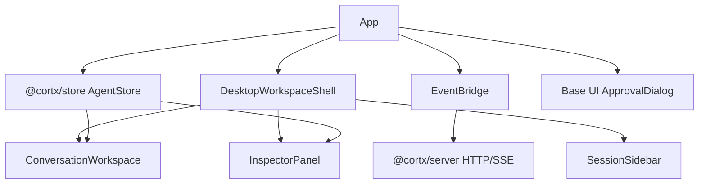
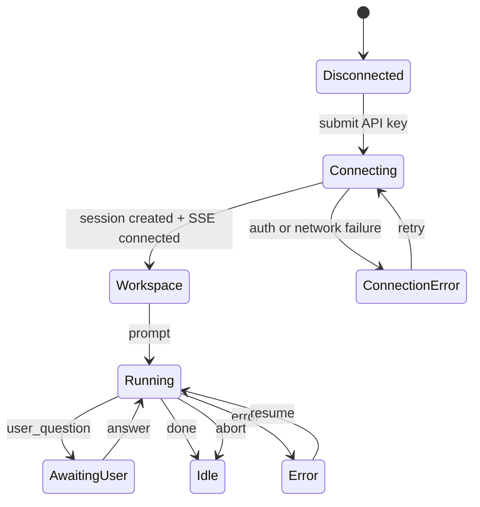

# feat: Cortx Web Desktop Experience

## Goal Capsule

| Field | Value |
| --- | --- |
| Objective | 将 `@cortx/web` 从单栏聊天骨架推进成接近 Codex 桌面端工作台气质的 Web agent 操控界面。 |
| Product authority | 用户要求“参考 Codex 桌面端的所有设计”，并明确底层架构使用 React + UnoCSS + Base UI；`docs/progress/2026-07-05-cortx-remaining-work.md` 中的 Web P1 缺口作为本轮范围来源。 |
| Baseline | `c06a513` 已完成 core/runtime/server/TUI/Web 分层，Web 当前是 remote-only 薄前端，已有 `EventBridge`、`AgentStore`、连接页、聊天、工具区和 approval dialog 骨架。 |
| Execution profile | UI-heavy feature slice；保持 remote-only，不改 core/runtime 协议；优先组件结构、视觉系统、浏览器 smoke 和现有 Web bridge 测试。 |
| Stop conditions | Web 首屏呈现桌面式 agent workspace：左侧会话/上下文栏，中间对话与输入区，右侧工具/子任务检查器；状态、approval、thinking、tool result、error 和空状态都可读、可操作、可验证。 |
| Tail ownership | 实现完成后运行 `bun run --filter '@cortx/web' lint`、Web 相关测试、全量质量门和浏览器 smoke；LFG 继续负责 review、browser test、commit/push。 |

---

## Product Contract

### Summary

本轮把 Web 端做成一个可长期迭代的桌面端 agent workspace，而不是继续堆单页聊天组件。
设计要借鉴 Codex 桌面端的核心体验：会话上下文始终可见，输出区域密集但清晰，工具调用和子任务有独立检查器，输入框是稳定的底部操作台，状态和错误不打断主流程。

技术边界已经确定：React + UnoCSS + Base UI。
Base UI 用于可访问交互原语，UnoCSS 负责视觉和布局，React 组件保持薄前端，只消费 `@cortx/store` 与 server/runtime API。

### Problem Frame

当前 Web 端能连接 server 并显示事件，但产品形态仍是最小聊天页。
它缺少真实 agent 产品需要的工作区感：没有 session/上下文导航，没有工具检查器，没有 Codex/Cortx 风格的状态密度，没有适合长输出和多工具调用的布局，也没有足够清晰的 approval 和错误体验。

这会让 Web 即使协议已通，也难以承担未来桌面端、浏览器端和远程多 agent 管理入口。
本轮先补齐桌面端设计骨架，让后续 session list、event replay、AgentSpec、SkillPack 和多 workspace 能在同一个信息架构上继续增长。

### Requirements

**Workspace Shell**

- R1. Web 首屏必须从单栏聊天页升级为三栏工作台：左侧 rail/side panel，中间 conversation canvas，右侧 inspector。
- R2. 左侧区域必须显示 Cortx 品牌、连接/session 基本信息、workspace/model/tool/approval 摘要和未来 session 列表占位。
- R3. 顶部或中间上下文栏必须压缩展示 status、working directory、model、session id、turn、tokens、elapsed，避免信息散落。
- R4. 布局必须在窄屏下降级为单列体验，不出现文本重叠或不可访问的固定宽度区域。

**Conversation Experience**

- R5. 对话区域必须区分 user、assistant、streaming、thinking、error 和 empty state，长文本保持可读且可复制。
- R6. Assistant 输出不应该过度卡片化；应更接近代码助手输出流，使用轻边界、窄行宽和清楚的 role/status 标识。
- R7. Thinking 以低对比灰色、可折叠方式显示，默认不压过 assistant 正文。
- R8. 输入区必须固定在底部工作台位置，支持 prompt/follow-up/awaiting-user 三种模式的清晰状态。

**Inspector and Tools**

- R9. 右侧 inspector 必须汇总工具调用、子 agent、token usage 和 session metadata。
- R10. Tool cards 必须支持输入/输出展开、pending/success/error 状态、长结果滚动和简洁摘要。
- R11. Sub-agent 展示必须能区分 running/completed/error/background，并保留 parent session 中的归属感。
- R12. 右侧区域在没有工具或子 agent 时必须显示有用空状态，而不是消失造成布局跳动。

**Base UI and Accessibility**

- R13. Approval dialog 必须迁移到 Base UI dialog 原语，保留键盘 focus、escape/close、title/description 语义。
- R14. 右侧 inspector 或子区域切换应优先使用 Base UI tabs/collapsible/scroll-area 等 headless 原语，不引入新的组件库。
- R15. 交互控件必须有清楚 disabled、focus、hover、active 状态，图标按钮必须配备可识别 label 或 tooltip。

**Architecture and Testing**

- R16. Web 必须继续保持 remote-only，不直接导入 `@cortx/core`、`@cortx/runtime` 或 workspace tool internals。
- R17. 设计系统应沉淀为 Web 本地 helpers/components，而不是把长 UnoCSS class 串复制到每个组件。
- R18. 现有 `EventBridge` 协议行为必须保持不变，UI 改造不能破坏 prompt/follow-up/steer/answer/abort/resume。
- R19. 测试必须覆盖新的 UI 状态 helpers、Base UI approval dialog 和 remote-only package boundary。
- R20. 浏览器 smoke 必须覆盖连接页和连接后的 workspace shell 首屏渲染。

### Acceptance Examples

- AE1. Covers R1-R4. Given the user connects to a server session, when the Web app renders, then the viewport shows side panel, conversation canvas, and inspector on desktop widths, and collapses without overlap on narrow widths.
- AE2. Covers R5-R8. Given text, thinking, tool, and error events arrive, when the store updates, then conversation content remains readable, thinking is subdued/collapsible, and the composer stays available at the bottom.
- AE3. Covers R9-R12. Given pending and completed tools plus sub-agent events exist, when the inspector renders, then it summarizes counts and exposes expandable details without hiding the main conversation.
- AE4. Covers R13-R15. Given an approval/user question is pending, when the dialog opens, then focus lands inside the dialog and the user can submit or close with accessible Base UI semantics.
- AE5. Covers R16-R18. Given the Web package is tested, when dependency and bridge tests run, then it remains remote-only and all existing EventBridge request paths still pass.
- AE6. Covers R20. Given the Vite dev server runs, when a browser opens `/`, then the connection view renders; after using mocked/real bridge state in tests, the workspace shell renders without a blank screen.

### Scope Boundaries

#### In Scope

- Web-only UI and component architecture under `packages/web`.
- React + UnoCSS + Base UI implementation.
- Local UI helpers and tests needed to keep the layout stable.
- Browser smoke using the existing Vite app.

#### Deferred to Follow-Up Work

- Real persisted server-side session list and event replay.
- Multi-workspace creation UI backed by new server APIs.
- AgentSpec / SkillPack launch UI.
- Full Web desktop parity with future native Desktop shell.
- Authentication beyond the current single API key and short token bridge.
- Runtime protocol changes for richer tool metadata.

#### Outside This Product's Identity

- Replacing React, UnoCSS, or Base UI.
- Making Web directly host agents locally.
- Importing core/runtime internals into Web.
- Building a marketing landing page instead of the usable workspace.

---

## Planning Contract

### Key Technical Decisions

- KTD1. Web remains a remote-only thin frontend. It should look like a capable desktop workspace, but all agent execution stays behind `@cortx/server` and `@cortx/runtime`.
- KTD2. The first viewport is the product surface. Do not add a landing page; unauthenticated users see a compact connection panel, authenticated users see the actual agent workspace.
- KTD3. Use a three-zone shell as the stable information architecture: left context rail, center conversation, right inspector. This maps cleanly to future session list, replay, skills, AgentSpec and sub-agent views.
- KTD4. Use Base UI where semantics matter: dialog, tabs/collapsible, scroll areas and tooltips. Do not wrap every visual element in Base UI if a semantic `div` or `button` is enough.
- KTD5. Use UnoCSS tokens through local helpers. Shared class fragments should live in `packages/web/src/design.ts` or small presentational components so the UI can evolve without repeated class edits.
- KTD6. Preserve current bridge contracts. `EventBridge` and server routes are already covered; UI components should consume store state and callbacks without changing request/response shape.
- KTD7. Test stable state mapping, not pixels. Unit tests should verify labels, status derivation, empty states and package boundary; browser smoke verifies the rendered shell is nonblank and usable.

### High-Level Technical Design

### Assumptions

- The current server API remains the source of truth for a single active session in this slice.
- The left sidebar may show a single real session plus placeholders until persistent session listing lands.
- Codex desktop is treated as design direction: dense workspace, stable context, restrained panels, visible execution state. It is not a pixel-copy requirement.
- Base UI version is the installed `@base-ui-components/react@1.0.0-rc.0` package.

### System-Wide Impact

This work should not alter core/runtime/server behavior.
Its main architectural impact is establishing the Web layout and component vocabulary that later multi-session, replay, SkillPack and AgentSpec work will extend.

---

## Implementation Units

### U1. Web Design Primitives and State Helpers

- **Goal:** Create a small Web-local design layer for status labels, metrics, path compaction, panel class names and count summaries so the UI does not duplicate formatting logic.
- **Requirements:** R3, R4, R17, R19
- **Dependencies:** None
- **Files:** `packages/web/src/design.ts`, `packages/web/tests/design.test.ts`
- **Approach:** Add pure helpers for status tone, compact path, compact session id, token formatting, elapsed formatting, tool/sub-agent counts and shared class fragments. Keep this free of React so tests stay cheap.
- **Patterns to follow:** `packages/tui/src/components/session-header.tsx` for compact session metadata helpers; `packages/web/src/components/StatusBar.tsx` for current formatting behavior.
- **Test scenarios:**
  - Given root, one-part and deep workspace paths, compact path returns stable short labels.
  - Given each `AgentStatus`, status helper returns label, tone and busy flag.
  - Given zero/pending/error/success tool entries, inspector summary counts match expected totals.
  - Given large token counts and elapsed values, display formatting stays compact.
- **Verification:** Web lint and `packages/web/tests/design.test.ts` pass.

### U2. Desktop Workspace Shell

- **Goal:** Replace the connected single-column `App` layout with a desktop-style shell containing sidebar, top context strip, conversation workspace and inspector.
- **Requirements:** R1-R4, R8, R12, R16, R18
- **Dependencies:** U1
- **Files:** `packages/web/src/App.tsx`, `packages/web/src/components/DesktopWorkspace.tsx`, `packages/web/src/components/SessionSidebar.tsx`, `packages/web/src/components/WorkspaceHeader.tsx`, `packages/web/src/components/ConnectionOverlay.tsx`, `packages/web/tests/event-bridge.test.ts`
- **Approach:** Keep `App` responsible for store/bridge/session orchestration, then pass state and callbacks to a new shell component. Sidebar shows app identity, connection/session summary, workspace/model/tool/approval metadata and future session placeholders. Header compresses live status and metrics. Use responsive UnoCSS grid/flex classes so desktop shows three zones and narrow screens stack without overlap.
- **Patterns to follow:** Existing `App` bridge ownership; `StatusBar` metadata formatting; TUI session header density.
- **Test scenarios:**
  - Given a connected session, shell renders model, compact workspace, session id and status.
  - Given no connected session, connection overlay remains the only first-viewport surface.
  - Given running status, header/sidebar expose a busy state without hiding abort controls.
  - Given narrow viewport in browser smoke, shell content remains reachable without horizontal text overlap.
- **Verification:** Web tests pass and browser smoke shows nonblank connected and disconnected surfaces.

### U3. Conversation Canvas and Composer

- **Goal:** Redesign the main conversation area for assistant output, user turns, streaming text, thinking, errors and bottom composer.
- **Requirements:** R5-R8, R15, R18, R20
- **Dependencies:** U1, U2
- **Files:** `packages/web/src/components/ChatView.tsx`, `packages/web/src/components/ConversationCanvas.tsx`, `packages/web/src/components/MessageBubble.tsx`, `packages/web/src/components/StreamingText.tsx`, `packages/web/src/components/ThinkingPanel.tsx`, `packages/web/src/components/PromptInput.tsx`, `packages/web/tests/web-ui.test.ts`
- **Approach:** Move from heavy chat bubbles to a document-like output stream with subtle role labels, stable max line width and clear current streaming state. Keep user input visibly separate but compact. Composer stays fixed at bottom inside the main column and communicates prompt/follow-up/awaiting-user modes.
- **Patterns to follow:** `packages/tui/src/components/output-region.tsx` for output ordering and thinking visibility; current `PromptInput` keyboard behavior.
- **Test scenarios:**
  - Given current thinking without assistant text, thinking panel renders subdued and collapsible.
  - Given current streaming text, assistant stream label and cursor render.
  - Given running status, composer label changes to follow-up and abort remains available.
  - Given awaiting user status, composer disables and points to approval dialog.
  - Given error state, error surface renders without replacing previous conversation.
- **Verification:** UI tests assert labels/states; browser smoke confirms the composer stays in the main workspace.

### U4. Inspector, Tool Cards and Sub-Agent Cards

- **Goal:** Turn the right-side area into a persistent inspector for tools, sub-agents, usage and session facts.
- **Requirements:** R9-R12, R14, R17, R19
- **Dependencies:** U1, U2
- **Files:** `packages/web/src/components/InspectorPanel.tsx`, `packages/web/src/components/ToolRegion.tsx`, `packages/web/src/components/ToolCard.tsx`, `packages/web/tests/web-ui.test.ts`
- **Approach:** Use Base UI tabs or collapsible primitives for inspector sections if the API stays small. Tool cards keep input/output expansion but adopt compact summaries, status tokens, scrollable result bodies and empty states. Sub-agent cards render all statuses, not only running sessions.
- **Patterns to follow:** Current `ToolCard` expand behavior; `packages/tui/src/components/agent-viewer.tsx` for sub-agent status vocabulary.
- **Test scenarios:**
  - Given no tools and no sub-agents, inspector renders a stable empty state.
  - Given pending, success and error tools, inspector summary and card states are correct.
  - Given long tool output, card body is scrollable and does not expand the page width.
  - Given running/completed/error/background sub-agents, all are visible with distinct status labels.
- **Verification:** UI tests pass; browser smoke shows inspector panel present on desktop.

### U5. Base UI Approval and Accessible Controls

- **Goal:** Replace the custom approval overlay with Base UI dialog semantics and add accessible labels/tooltips for icon-like controls.
- **Requirements:** R13-R15, R18, R19
- **Dependencies:** U1
- **Files:** `packages/web/src/components/AskUserDialog.tsx`, `packages/web/src/components/ControlButton.tsx`, `packages/web/tests/web-ui.test.ts`
- **Approach:** Use Base UI dialog parts for root, portal, backdrop, popup, title, description and close/submit actions. Keep existing `onSubmit(toolCallId, response)` contract. Add a small `ControlButton` component for repeated icon/text controls with consistent focus and disabled styles.
- **Patterns to follow:** Base UI installed package exports under `@base-ui-components/react/dialog` and existing dialog behavior in `AskUserDialog`.
- **Test scenarios:**
  - Given a pending question, dialog renders title, question text and response textarea.
  - Given empty response, submit is disabled.
  - Given non-empty response, submit calls `onSubmit` with the original toolCallId and response.
  - Given close/cancel action, dialog can be dismissed only through an intentional control that does not answer the question.
- **Verification:** Web UI tests pass and manual/browser smoke can focus the dialog.

### U6. Visual Polish and Browser Verification

- **Goal:** Add final responsive polish, use real browser screenshots/smoke, and keep the Web package buildable without changing server/runtime contracts.
- **Requirements:** R4, R16, R19, R20
- **Dependencies:** U1-U5
- **Files:** `packages/web/src/App.tsx`, `packages/web/src/components/*.tsx`, `packages/web/tests/*.test.ts`, `docs/progress/2026-07-05-cortx-remaining-work.md`
- **Approach:** Run Web lint/build/tests and browser smoke against Vite. Confirm no new dependencies beyond existing React/UnoCSS/Base UI. Update the remaining-work doc only if this work changes the Web completion assessment.
- **Execution note:** This slice is UI-heavy; browser smoke is a required proof, not optional polish.
- **Patterns to follow:** Existing `ce-test-browser` pipeline and `agent-browser` smoke.
- **Test scenarios:**
  - Given disconnected state, browser renders the connection overlay with enabled/disabled button states.
  - Given connected/mocked state in component tests, shell renders sidebar, conversation and inspector.
  - Given package boundary test, Web still has no `@cortx/core`, `@cortx/runtime` or `@cortx/code` dependency.
- **Verification:** `bun run --filter '@cortx/web' lint`, Web tests, full `bun run lint`, `bun run build`, `bun test`, `git diff --check`, and browser smoke pass.

---

## Verification Contract

| Gate | Scope | Done Signal |
| --- | --- | --- |
| Web typecheck | `@cortx/web` | `bun run --filter '@cortx/web' lint` passes |
| Web tests | Web design helpers, UI states and bridge boundary | Targeted Web tests pass |
| Full monorepo lint | All packages | `bun run lint` passes |
| Full build | All packages, including Vite production build | `bun run build` passes |
| Full tests | Core/runtime/server/tui/web/store/sdk | `bun test` passes |
| Whitespace | Repository diff | `git diff --check` passes |
| Browser smoke | Vite Web app | Disconnected and connected shell surfaces render nonblank without obvious overlap |

---

## Definition of Done

- `@cortx/web` presents a desktop-style workspace instead of a single-column chat page.
- Sidebar, header, conversation canvas, bottom composer and inspector have stable responsive layout.
- Approval dialog uses Base UI dialog semantics.
- Tool and sub-agent information is visible in a persistent inspector with useful empty states.
- Existing bridge/session request behavior is unchanged.
- Web remains remote-only and has no direct core/runtime/tool implementation imports.
- Tests and browser smoke prove the new UI states.
- Dead-end experimental components or unused styling helpers are removed before shipping.

---

## Appendix

### Sources and Research

- `docs/progress/2026-07-05-cortx-remaining-work.md`
- `docs/brainstorms/2026-05-12-web-frontend-requirements.md`
- `docs/plans/2026-04-26-002-feat-web-frontend-plan.md`
- `packages/web/src/App.tsx`
- `packages/web/src/components/ChatView.tsx`
- `packages/web/src/components/ToolRegion.tsx`
- `packages/web/src/components/AskUserDialog.tsx`
- `packages/web/package.json`
- `packages/web/uno.config.ts`
- Local package metadata for `@base-ui-components/react@1.0.0-rc.0`
