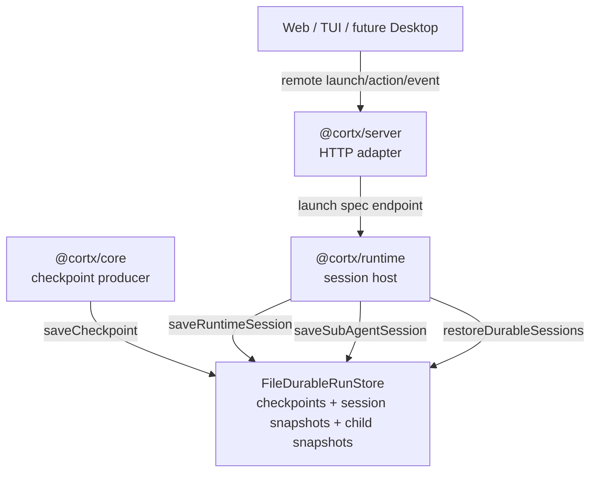
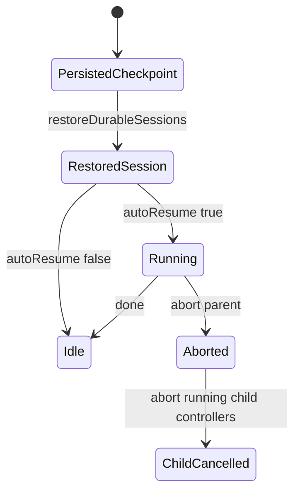

# Runtime Productization Closure - Plan

## Goal Capsule

| Field | Value |
| --- | --- |
| Objective | 修复当前 Cortx 从架构正确走向长期可用产品时最关键的缺口：真实持久化 resume、durable event replay、background/sub-agent 生命周期闭环、AgentSpec/SkillPack 使用入口、SDK 作者体验。 |
| Product authority | `docs/architecture/cortx-runtime-host-final-design.md` 是分层和边界权威；本计划不处理本地测试阶段仍需要的 `link:@synax-ai/*` 依赖。 |
| Baseline | `f0ab492` 已完成 Web 多会话基础、runtime host、workspace tools 收敛、core boundary/conformance tests。 |
| Execution profile | Standard cross-package runtime hardening；优先补 runtime/sdk/server 测试，再实现。 |
| Stop conditions | Core 基础结构不因本轮产品化改动变胖；所有新增长期能力落在 runtime/sdk/server 或文档示例；`bun run build`、`bun run lint`、`bun test` 通过。 |

---

## Product Contract

### Summary

Cortx 当前架构已经基本自洽，剩余缺口集中在产品化收尾。
本轮要把 runtime 从“进程内可跑”推进到“可以承载长时间后台 agent”的状态，同时让小 agent asset 和插件作者入口更可用。
`link:` 依赖清理暂时排除，因为当前仍以本地联调为主。

### Problem Frame

`@cortx/runtime` 现在可以创建多 session、按目录挂载工具、提供 Web/TUI/server 共享 action/event contract。
但 durable resume 只有 `MemoryDurableRunStore`，进程崩溃后 session 配置和 checkpoint 都会丢失。
background sub-agent 能启动并回传事件，但 parent abort 之后缺 runtime 持有的 child controller，事件和 child session 也没有可恢复的持久化归属。
AgentSpec/SkillPack 已有 runtime API，但缺文件启动、server 入口和示例资产；SDK helper 已有一部分，还需要把常用 contributor shape 固化成更顺手的作者入口。

### Requirements

**Durable runtime**

- R1. Runtime must ship a file-backed durable store that persists checkpoints outside process memory.
- R2. Runtime must persist enough serializable session metadata to recreate sessions after process restart.
- R3. Runtime must expose an explicit restore method that scans durable sessions, recreates non-terminal sessions, and can optionally resume them.
- R4. Unsupported or invalid persisted records must be skipped or surfaced as typed runtime errors without corrupting valid sessions.
- R14. Runtime must durably persist runtime event envelopes separately from core checkpoints.
- R15. Restored sessions must hydrate persisted event envelope history so server/frontends can replay session history after restart.

**Background and sub-agent lifecycle**

- R5. Parent session abort or destroy must cancel running foreground/background child loops where the child is still cooperative.
- R6. Runtime must persist child session lifecycle snapshots with parent session, parent run, tool call, status, output, counters, and timestamps.
- R7. Restored sessions must hydrate persisted child session summaries so frontends can attribute background work after replay.
- R8. Child lifecycle event envelopes must keep parent attribution stable across event replay.

**Asset/product entry points**

- R9. Runtime must launch AgentSpec from a file path in addition to an inline object.
- R10. Server must expose a launch endpoint so Web/Desktop/remote TUI can start an AgentSpec-backed session without importing runtime internals.
- R11. SkillPack and AgentSpec examples must demonstrate prompt-only and skill-pack-backed small agents without JavaScript plugin code.

**SDK author experience**

- R12. SDK must expose small helper factories for common contribution types without weakening the existing typed extension model.
- R13. SDK tests must prove helper exports preserve narrow contribution types.

### Scope Boundaries

- `@synax-ai/*` `link:` dependencies are explicitly out of scope for this local-testing pass.
- This plan does not add multi-user permissions, distributed scheduling, or a database backend.
- This plan does not redesign Web/TUI layout; it only adds runtime/server capability that frontends can consume.

---

## Planning Contract

### Key Technical Decisions

- KTD1. File durable store lives in `@cortx/runtime`, not core. Core remains the checkpoint producer through `AgentDurableRunStore`; runtime owns host session metadata, sub-agent snapshots, and restore orchestration.
- KTD2. Durable APIs are optional extensions on top of the existing checkpoint store. Existing in-memory tests and custom stores keep working, while runtime detects richer file-backed methods when available.
- KTD3. Restore is explicit rather than constructor-side async work. Callers choose when to scan and whether to auto-resume, which keeps server/TUI startup deterministic.
- KTD4. Background child cancellation uses runtime-owned in-memory abort callbacks plus persisted lifecycle snapshots. Persisted snapshots restore visibility, while live callbacks handle active process cancellation.
- KTD5. AgentSpec file launch goes through the same `launchAgentSpec()` path as inline launch. There is still one runtime session runner.
- KTD6. Durable event replay belongs to runtime host storage, not core checkpoint state. Core checkpoints stay focused on safe resume state; runtime event envelope snapshots serve UI/server replay after process restart.

### High-Level Technical Design

### Assumptions

- File durable storage can use JSON files and atomic write/rename for the local product stage.
- Persisted runtime session snapshots cover serializable session configuration. Custom inline tools or non-serializable plugin objects remain caller responsibility after restart.
- Link dependency cleanup remains deferred by user instruction.

---

## Implementation Units

### U1. File-backed durable store and runtime session snapshots

- **Goal:** Add a file durable store that persists core checkpoints plus runtime session snapshots.
- **Requirements:** R1, R2, R4.
- **Dependencies:** None.
- **Files:** `packages/sdk/src/runtime.ts`, `packages/runtime/src/durable/file-store.ts`, `packages/runtime/src/durable/types.ts`, `packages/runtime/src/durable/memory-store.ts`, `packages/runtime/src/index.ts`, `packages/runtime/tests/durable-store.test.ts`.
- **Approach:** Extend the durable store contract with optional runtime-owned methods for session snapshot listing/loading/deleting. Keep checkpoint methods compatible. Store records in separate directories to avoid mixing checkpoint schema and runtime schema.
- **Patterns to follow:** `packages/runtime/src/workspace-tools/path-safety.ts` for defensive filesystem posture; existing `MemoryDurableRunStore` for minimal interface shape.
- **Test scenarios:** Save/load checkpoint round trip; save/list/load/delete runtime session snapshot; invalid JSON file is skipped without preventing valid records; terminal checkpoint does not count as resumable.
- **Verification:** Runtime exports the file store and all new durable store tests pass.

### U2. Runtime restore orchestration

- **Goal:** Let runtime recreate durable sessions after restart and optionally resume non-terminal checkpoints.
- **Requirements:** R2, R3, R4.
- **Dependencies:** U1.
- **Files:** `packages/runtime/src/runtime.ts`, `packages/runtime/src/session.ts`, `packages/runtime/tests/durable-resume.test.ts`, `packages/runtime/tests/runtime.test.ts`.
- **Approach:** Persist session snapshots on creation and material state changes. Add `restoreDurableSessions({ autoResume })`, which scans durable session snapshots, skips already loaded sessions, recreates serializable sessions, hydrates child summaries, and optionally calls `resume()`.
- **Test scenarios:** A new runtime instance restores a session created by a previous runtime using file storage; `autoResume: true` resumes a non-terminal checkpoint; invalid snapshot does not block valid snapshots; restored sessions keep workingDirectory/toolMode/approvalMode/model metadata.
- **Verification:** Durable resume tests prove restart-style recovery with a new store instance pointed at the same directory.

### U3. Background sub-agent cancellation and persistence

- **Goal:** Make live background child loops cancellable by the parent runtime and persist child lifecycle summaries for restore/replay.
- **Requirements:** R5, R6, R7, R8.
- **Dependencies:** U1, U2.
- **Files:** `packages/runtime/src/capabilities/sub-agent/session-store.ts`, `packages/runtime/src/capabilities/sub-agent/tool.ts`, `packages/runtime/src/runtime.ts`, `packages/runtime/tests/sub-agent.test.ts`, `packages/runtime/tests/sub-agent-session.test.ts`.
- **Approach:** Let `SubAgentSessionStore` hold live abort callbacks separately from serializable snapshots. Runtime abort/destroy calls `abortRunning()`. Broadcast/persistence saves child snapshots on start/progress/completion.
- **Test scenarios:** Parent abort cancels a running background child and records error completion; destroyed session cancels running children; child snapshots persist and hydrate into a restored session; parent attribution remains on lifecycle envelopes.
- **Verification:** Existing foreground/background behavior remains unchanged while new cancellation and persistence tests pass.

### U6. Durable runtime event replay

- **Goal:** Persist runtime event envelopes and hydrate bounded replay history when sessions are restored.
- **Requirements:** R14, R15.
- **Dependencies:** U1, U2.
- **Files:** `packages/runtime/src/durable/types.ts`, `packages/runtime/src/durable/file-store.ts`, `packages/runtime/src/runtime.ts`, `packages/runtime/tests/durable-store.test.ts`, `packages/runtime/tests/durable-resume.test.ts`.
- **Approach:** Add event envelope snapshots to the runtime durable store contract. File storage writes one envelope file per sequence and restores them in sequence order. Runtime broadcasts remain live and non-blocking, while restore hydrates the in-memory bounded event history from durable snapshots.
- **Test scenarios:** Event envelope snapshots survive new store instances; persisted error events restore their error message; deleting a runtime session removes its durable events; restored runtime sessions replay pre-restart envelope history and continue with the next run id.
- **Verification:** Durable store and durable resume tests prove event replay survives process-style restart.

### U4. AgentSpec file and server launch endpoint

- **Goal:** Make AgentSpec usable as a product asset from runtime and remote clients.
- **Requirements:** R9, R10, R11.
- **Dependencies:** U2.
- **Files:** `packages/runtime/src/assets/agent-spec.ts`, `packages/runtime/src/runtime.ts`, `packages/runtime/tests/agent-spec.test.ts`, `packages/server/src/server.ts`, `packages/server/tests/server.test.ts`, `examples/skill-packs/basic/`.
- **Approach:** Add `loadAgentSpecFile()` and `launchAgentSpecFile()` in runtime. Add server `POST /agent-specs/launch` accepting either inline `spec` or server-side `path` constrained by allowed workspace roots. Include a small example skill pack with a spec and skill.
- **Test scenarios:** Runtime launches a JSON spec file; server launch endpoint returns session info and starts prompt; invalid spec file returns typed error; path outside allowed roots is rejected.
- **Verification:** Runtime/server asset tests pass and examples are parseable.

### U5. SDK helper polish

- **Goal:** Improve plugin author ergonomics with exported helper factories and tests.
- **Requirements:** R12, R13.
- **Dependencies:** None.
- **Files:** `packages/sdk/src/extensions.ts`, `packages/sdk/src/index.ts`, `packages/sdk/tests/exports.test.ts`, `docs/architecture/sdk-and-core-extension-guide.md`.
- **Approach:** Preserve existing typed helpers and add missing aliases or bundled helper exports for common contribution authoring where useful. Document the official usage path without changing extension IDs.
- **Test scenarios:** Helper factories preserve narrow object types; exports remain available from `@cortx/sdk`; docs show one minimal tool, policy, and observer example.
- **Verification:** SDK tests and build pass.

---

## Verification Contract

| Gate | Scope | Done signal |
| --- | --- | --- |
| `bun test packages/runtime/tests/durable-store.test.ts packages/runtime/tests/durable-resume.test.ts` | U1, U2 | File durable store and restart-style restore pass. |
| `bun test packages/runtime/tests/durable-store.test.ts packages/runtime/tests/durable-resume.test.ts` | U6 | Durable runtime event replay survives restart and preserves envelope ordering. |
| `bun test packages/runtime/tests/sub-agent.test.ts packages/runtime/tests/sub-agent-session.test.ts` | U3 | Parent abort and child snapshot lifecycle pass. |
| `bun test packages/runtime/tests/agent-spec.test.ts packages/server/tests/server.test.ts packages/sdk/tests/exports.test.ts` | U4, U5 | Asset launch, server endpoint, and SDK helper exports pass. |
| `bun run lint` | Whole repo | TypeScript no-emit succeeds. |
| `bun run build` | Whole repo | All packages compile. |
| `bun test` | Whole repo | Full regression suite passes. |

---

## Definition of Done

- File-backed durable store is exported and covered by tests.
- Runtime can restore durable sessions from a fresh process-style runtime instance using persisted metadata and checkpoints.
- Runtime can restore durable event envelope history for server/frontend replay after process restart.
- Runtime abort/destroy cancels live background sub-agents where cooperative cancellation is available.
- Sub-agent lifecycle summaries are persisted and hydrated for restored sessions.
- AgentSpec can launch from JSON file and through server API.
- Example skill pack exists and does not require JavaScript plugin code.
- SDK helper exports are documented and tested.
- No core product capability regression is introduced.
- Local `link:@synax-ai/*` dependencies remain untouched by design.
- Build, lint, and tests pass.
