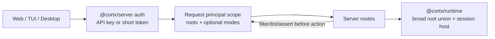

# Server Token Workspace Authorization - Plan

## Goal Capsule

| Field | Value |
| --- | --- |
| Objective | 给 `@cortx/server` 补上 token 级 workspace 权限边界，防止 remote Web/TUI 或未来桌面端拿到 token 后跨项目访问不属于自己的 session。 |
| Product authority | `docs/architecture/cortx-runtime-host-final-design.md` 的薄前端 + server/runtime host 分层；`@synax-ai/*` `link:` 依赖继续保持本地测试状态，不纳入本计划。 |
| Execution profile | Small cross-layer server hardening with focused tests first. |
| Stop conditions | 不把权限逻辑下沉到 core；runtime 仍负责通用 workspace safety，server 只负责 request principal 的授权裁剪。 |

---

## Product Contract

### Requirements

- R1. Server must support multiple API-key principals, each optionally scoped to allowed workspace roots.
- R2. Short-lived `/auth/token` tokens must inherit the workspace and mode scope of the API key that created them.
- R3. Session creation and AgentSpec file launch must reject workspaces outside the current principal scope.
- R4. Session list, get, event stream, prompt, steer, follow-up, resume, answer, abort, and delete must not expose or mutate sessions outside the current principal scope.
- R5. Token-scoped tool/control mode defaults may narrow remote sessions without allowing clients to escalate beyond that token scope.

### Scope Boundaries

- This is local-product authorization hardening, not a full SaaS multi-tenant account system.
- No database user model, OAuth, TLS, org membership, or audit log is added in this plan.
- `@synax-ai/*` `link:` dependencies remain unchanged by request.

---

## Planning Contract

### Key Technical Decisions

- KTD1. Auth principal scope belongs in `@cortx/server`. `@cortx/runtime` still receives a broad allowed-root union and enforces filesystem safety; server narrows access per request before calling runtime.
- KTD2. Existing single `apiKey` config remains valid. Optional `apiKeys[]` adds named principals without breaking current Web/TUI local setup.
- KTD3. Short-lived tokens store a principal snapshot, not just a string token. This keeps SSE query-token auth aligned with the same workspace boundary as bearer auth.
- KTD4. Cross-principal session access returns `permission_denied` instead of pretending the session does not exist. This is clearer for trusted local clients and keeps runtime's `session_not_found` semantics unchanged.

### High-Level Technical Design

---

## Implementation Units

### U1. Scoped auth principals

- **Goal:** Make server auth resolve a request principal with optional workspace roots and mode constraints.
- **Requirements:** R1, R2, R5.
- **Dependencies:** None.
- **Files:** `packages/server/src/auth.ts`, `packages/server/src/types.ts`, `packages/server/tests/auth.test.ts`.
- **Approach:** Extend auth config to accept multiple API keys. Store principal metadata on the Hono context after authentication. Token exchange copies the matched principal into the short-lived token entry.
- **Test scenarios:** Multiple API keys authenticate with distinct principal metadata; exchanged tokens carry the same principal; a token from one auth handler is still rejected by another handler.
- **Verification:** Auth tests prove direct and token authentication both expose the correct principal.

### U2. Server route authorization

- **Goal:** Enforce principal workspace/mode scope across session and AgentSpec routes.
- **Requirements:** R3, R4, R5.
- **Dependencies:** U1.
- **Files:** `packages/server/src/server.ts`, `packages/server/tests/server.test.ts`, `docs/progress/2026-07-05-cortx-remaining-work.md`.
- **Approach:** Build the runtime with the union of configured roots, then add route-level helpers that resolve the request principal scope, authorize requested workspaces, filter `GET /sessions`, and assert session ownership before every session action and SSE replay/subscribe.
- **Test scenarios:** Key A can create/list/access only root A sessions; Key B can create/list/access only root B sessions; Key A cannot prompt or inspect Key B's session; AgentSpec file launch outside Key A's root is rejected; token-scoped mode constraints cannot be escalated by request body.
- **Verification:** Server tests cover create/list/action/file-launch authorization and existing single-key tests keep passing.

---

## Verification Contract

| Gate | Scope | Done signal |
| --- | --- | --- |
| `bun test packages/server/tests/auth.test.ts packages/server/tests/server.test.ts` | U1, U2 | Auth principal scoping and server route authorization pass. |
| `bun run lint` | Whole repo | TypeScript no-emit succeeds. |
| `bun run build` | Whole repo | All packages compile. |
| `bun test` | Whole repo | Full regression suite passes. |

---

## Definition of Done

- Server accepts current single-key config and optional scoped `apiKeys[]`.
- Short-lived tokens inherit principal workspace/mode scope.
- Cross-principal session list/access/action/event routes are scoped.
- AgentSpec file launch and session creation honor principal roots.
- Mode-scoped principals cannot be escalated by request body.
- Core stays untouched.
- `link:@synax-ai/*` dependencies stay untouched.
