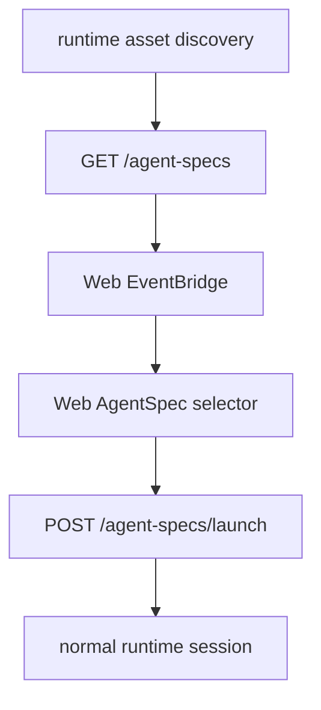

## Goal Capsule

| Field | Value |
|---|---|
| Objective | Give runtime/server/Web a discoverable AgentSpec asset path so users can launch prompt-only or SkillPack-backed agents without knowing JSON file paths. |
| Authority | Current Cortx direction: core remains a minimal agent kernel; runtime/server/Web own product capabilities. |
| Scope | Add local asset discovery, scoped server listing, Web bridge support, and a Web sidebar launcher. |
| Stop conditions | Do not move AgentSpec or SkillPack logic into core; do not remove local `link:@synax-ai/*` dependencies; do not build marketplace/install flows in this slice. |

---

## Product Contract

Cortx already supports `launchAgentSpec()` from inline data or a JSON file, but users still need to know the path manually. This leaves AgentSpec/SkillPack as a developer API rather than a product entry.

### Requirements

- R1. Runtime must discover AgentSpec JSON files from explicitly allowed roots and SkillPack `agents/` folders without requiring JavaScript plugin code.
- R2. Server must expose discovered AgentSpec assets through an authenticated endpoint and apply the current API key workspace scope.
- R3. Web must list discovered AgentSpec assets and launch one into a normal runtime session.
- R4. Discovery must be read-only and must not introduce a second runner path; launching still goes through the existing `launchAgentSpec()` route.
- R5. The slice must be covered by runtime, server, Web bridge, and Web UI tests.

### Scope Boundaries

- Deferred to follow-up work: SkillPack installation, marketplace/distribution, TUI selector UI, desktop shell integration, and richer AgentSpec editing.
- Outside this slice: core architecture changes and npm dependency cleanup.

---

## Planning Contract

- KTD1. Discovery belongs in `@cortx/runtime` assets. Runtime already owns SkillPack and AgentSpec asset parsing, so adding read-only enumeration there keeps core clean and lets server/TUI/Web share one contract.
- KTD2. Server should filter assets by principal roots before returning them. The endpoint must not leak specs from workspaces the current API key cannot access.
- KTD3. Web should treat AgentSpec launch like creating a session. After launch, it connects to the returned session and refreshes the existing session list rather than inventing separate agent state.

### Assumptions

- AgentSpec JSON files are local trusted assets under allowed workspace roots or SkillPack roots.
- Discovery can start with simple recursive JSON scanning under `agents/` directories; a manifest registry can be added later if needed.

---

## Implementation Units

### U1. Runtime AgentSpec Discovery

- **Goal:** Add read-only discovery helpers that enumerate local AgentSpec files and return display metadata.
- **Requirements:** R1, R4, R5.
- **Dependencies:** None.
- **Files:** `packages/runtime/src/assets/agent-spec.ts`, `packages/runtime/src/assets/skill-pack.ts`, `packages/runtime/src/index.ts`, `packages/runtime/tests/agent-spec.test.ts`, `packages/runtime/tests/skill-pack.test.ts`.
- **Approach:** Add a typed discovery result with path, name, prompt preview, workingDirectory, skillPacks, and metadata. Reuse `parseAgentSpec()` for validation and ignore malformed JSON only when caller opts into tolerant discovery.
- **Patterns to follow:** Existing `loadAgentSpecFile()` and `resolveSkillPack()` asset helpers.
- **Test scenarios:** Discover valid specs in an `agents/` directory; skip non-JSON files; report invalid specs when strict mode is used; resolve a SkillPack and expose concrete AgentSpec file paths.
- **Verification:** Runtime tests prove discovery is read-only and launch remains unchanged.

### U2. Server Discovery Endpoint

- **Goal:** Add an authenticated server endpoint that lists discoverable AgentSpec assets visible to the current principal.
- **Requirements:** R2, R4, R5.
- **Dependencies:** U1.
- **Files:** `packages/server/src/server.ts`, `packages/server/tests/server.test.ts`.
- **Approach:** Add `GET /agent-specs`, scan allowed server roots plus any configured scoped roots, then filter results through `authorizeWorkspace()` for the current principal. Return a stable `{ agentSpecs: [...] }` shape.
- **Patterns to follow:** Existing `listAuthorizedSessions()` and AgentSpec launch authorization.
- **Test scenarios:** Default key sees specs under the default root; scoped key sees only its allowed root; malformed specs do not break tolerant listing; unauthorized roots are not leaked.
- **Verification:** Server tests cover endpoint shape and principal scoping.

### U3. Web Bridge and Launcher UI

- **Goal:** Surface discovered AgentSpecs in the Web sidebar and launch one as a normal session.
- **Requirements:** R3, R4, R5.
- **Dependencies:** U2.
- **Files:** `packages/web/src/bridge/event-bridge.ts`, `packages/web/src/App.tsx`, `packages/web/src/components/SessionSidebar.tsx`, `packages/web/tests/event-bridge.test.ts`, `packages/web/tests/web-ui.test.tsx`.
- **Approach:** Add `listAgentSpecs()` to the bridge. Load specs after connection and refresh after launches. Render a compact `Agents` section under projects, with per-item name, path, and prompt preview, plus launch button state.
- **Patterns to follow:** Existing session list, project grouping, and `launchAgentSpec()` bridge call.
- **Test scenarios:** Bridge calls `/agent-specs`; UI renders discovered specs; clicking a spec launches it, connects to the new session, and refreshes sessions; empty discovery does not show misleading controls.
- **Verification:** Web tests prove the UI calls the same launch route and does not bypass runtime sessions.

### U4. Progress Documentation and Full Verification

- **Goal:** Record the productization improvement and run focused plus full repo verification.
- **Requirements:** R5.
- **Dependencies:** U1, U2, U3.
- **Files:** `docs/progress/2026-07-05-cortx-remaining-work.md`.
- **Approach:** Update the AgentSpec/SkillPack section from "底层入口已就绪" to "discovery + Web selector landed" while keeping installer/marketplace/TUI selector as remaining work.
- **Test scenarios:** Test expectation: none -- documentation only.
- **Verification:** Focused tests, lint, build, and full `bun test` pass.

---

## Verification Contract

| Gate | Covers | Done signal |
|---|---|---|
| `bun test packages/runtime/tests/agent-spec.test.ts packages/runtime/tests/skill-pack.test.ts` | U1 | Runtime discovery and SkillPack asset paths pass. |
| `bun test packages/server/tests/server.test.ts` | U2 | Server endpoint and principal filtering pass. |
| `bun test packages/web/tests/event-bridge.test.ts packages/web/tests/web-ui.test.tsx` | U3 | Web bridge and UI launcher behavior pass. |
| `bun run lint` | U1-U4 | Type/lint gate passes. |
| `bun run build` | U1-U4 | Workspace build passes. |
| `bun test` | U1-U4 | Full suite passes. |

---

## Definition of Done

- Runtime can discover AgentSpec files without changing core.
- Server exposes discovery through an authenticated, scoped endpoint.
- Web shows discovered AgentSpecs and launches them into normal sessions.
- Tests cover runtime, server, bridge, and UI behavior.
- Progress docs reflect the new state and remaining product gaps.
- The final diff contains no abandoned exploratory code.
