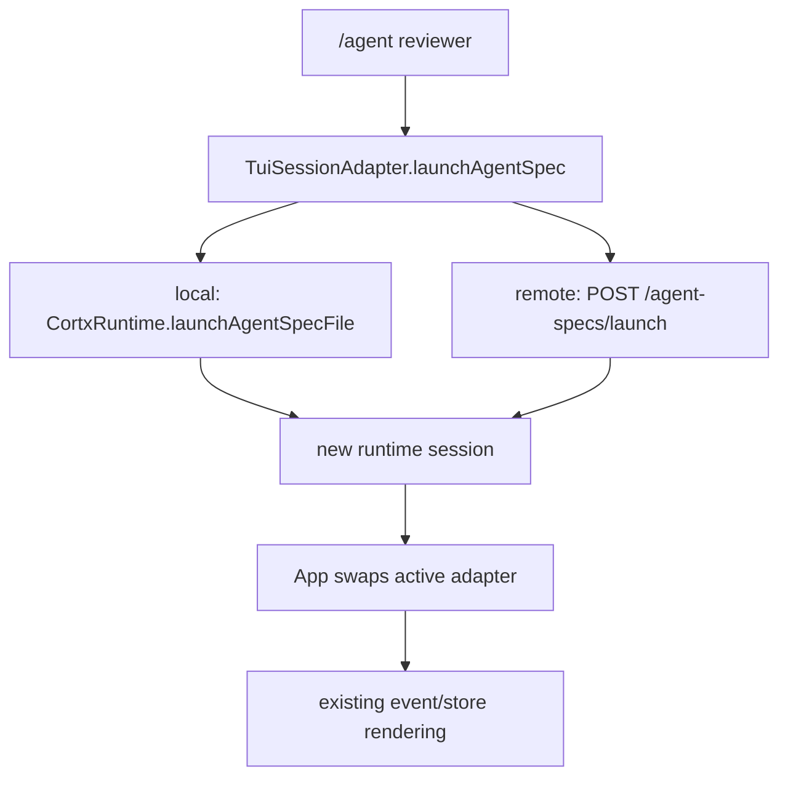

## Goal Capsule

| Field | Value |
|---|---|
| Objective | Let TUI users discover and launch AgentSpec assets without manually pasting JSON paths. |
| Authority | Current Cortx split: core stays minimal; runtime/server expose AgentSpec assets; TUI is a thin controller over local or remote runtime sessions. |
| Scope | Add list/launch methods to the TUI session adapter, remote client support for `GET /agent-specs`, and built-in `/agents` + `/agent` commands. |
| Stop conditions | Do not move AgentSpec logic into core; do not build marketplace/install flows; do not clean local `link:@synax-ai/*` dependencies. |

---

## Product Contract

Web can now discover and launch AgentSpecs, but TUI still only has a low-level remote launch client method and no user-facing command. This leaves terminal users behind the same product asset path.

### Requirements

- R1. TUI local mode must list AgentSpec assets from the current workspace using runtime discovery.
- R2. TUI remote mode must list AgentSpec assets through the server endpoint and launch them through the existing server launch route.
- R3. Users must be able to type `/agents` to see discoverable agents and `/agent <name-or-path>` to launch one.
- R4. Launching an AgentSpec must replace the active TUI session adapter and keep rendering through the existing store/event path.
- R5. The change must keep AgentSpec as a runtime asset and avoid new core dependencies.

---

## Planning Contract

- KTD1. Extend the TUI session adapter rather than special-casing local and remote commands. The command plugin should know that it can list and launch assets, not how each runtime mode does it.
- KTD2. Use a command-first UX for this slice. A richer selector overlay can follow later, but slash commands are testable, fit the existing command palette, and create a usable product entry immediately.
- KTD3. Launching an AgentSpec creates a new normal runtime session. The App swaps the adapter, resets the store to the new session id, and subscribes through the existing effect.

### Assumptions

- AgentSpec names are display identifiers; when duplicate names exist, `/agent` reports an ambiguity and asks the user to use the relative path from `/agents`.
- TUI local discovery is scoped to the current working directory, matching the local runtime workspace boundary.

---

## Implementation Units

### U1. Adapter and Remote Client Contract

- **Goal:** Expose AgentSpec listing and launch through `TuiSessionAdapter`.
- **Requirements:** R1, R2, R4, R5.
- **Dependencies:** None.
- **Files:** `packages/tui/src/runtime-session.ts`, `packages/tui/src/remote-client.ts`, `packages/tui/src/__tests__/runtime-session.test.ts`, `packages/tui/src/__tests__/remote-client.test.ts`.
- **Approach:** Add a small TUI-facing `TuiAgentSpecInfo` type. Local adapter calls runtime `discoverAgentSpecs({ roots: [workingDirectory] })` and launches by path. Remote client adds `listAgentSpecs()` and remote adapter delegates list/launch to the server.
- **Patterns to follow:** Existing `RemoteRuntimeClient.launchAgentSpec()` and `createRemoteRuntimeSession()` tests.
- **Test scenarios:** Remote client calls `/agent-specs`; local adapter lists a workspace spec and launches it; remote adapter lists and launches through injected client; launched session info becomes active.
- **Verification:** Focused adapter and remote-client tests pass.

### U2. TUI Built-In Commands

- **Goal:** Add `/agents` and `/agent <name-or-path>` built-in commands.
- **Requirements:** R3, R4.
- **Dependencies:** U1.
- **Files:** `packages/tui/src/plugins/command-plugin.ts`, `packages/tui/src/app.tsx`, `packages/tui/src/__tests__/command-palette.test.ts`, `packages/tui/src/__tests__/input.test.ts`.
- **Approach:** Inject `listAgentSpecs` and `launchAgentSpec` dependencies into the command plugin. `/agents` logs a compact sorted list. `/agent` resolves exact name, relative path, or absolute path and launches; missing/ambiguous input returns an error event instead of silently falling through to the model.
- **Patterns to follow:** Existing `/help`, `/steer`, and command execution error isolation.
- **Test scenarios:** `/agents` appears in help and logs discovered agents; `/agent reviewer` calls launch; missing args and missing matches surface command errors; ordinary slash command routing remains unchanged.
- **Verification:** TUI command tests pass and command palette shows both commands.

### U3. Progress Documentation and Verification

- **Goal:** Record that TUI now has a first AgentSpec product entry.
- **Requirements:** R1-R5.
- **Dependencies:** U1, U2.
- **Files:** `docs/progress/2026-07-05-cortx-remaining-work.md`.
- **Approach:** Update the AgentSpec/SkillPack and TUI sections, leaving richer selector overlay and installer/manifest strategy as remaining work.
- **Test scenarios:** Test expectation: none -- documentation only.
- **Verification:** `bun run lint`, `bun run build`, and `bun test` pass.

---

## Verification Contract

| Gate | Covers | Done signal |
|---|---|---|
| `bun test packages/tui/src/__tests__/remote-client.test.ts packages/tui/src/__tests__/runtime-session.test.ts` | U1 | Adapter and remote client AgentSpec list/launch pass. |
| `bun test packages/tui/src/__tests__/command-palette.test.ts packages/tui/src/__tests__/input.test.ts` | U2 | Built-in slash command behavior passes. |
| `bun run lint` | U1-U3 | Type/lint gate passes. |
| `bun run build` | U1-U3 | Workspace build passes. |
| `bun test` | U1-U3 | Full suite passes. |

---

## Definition of Done

- TUI local and remote sessions can list AgentSpec assets.
- `/agents` shows discoverable AgentSpecs.
- `/agent <name-or-path>` launches a discovered AgentSpec as a normal session.
- The active TUI store/event rendering path works after launch.
- Progress docs reflect the new TUI capability and remaining richer selector/install work.
