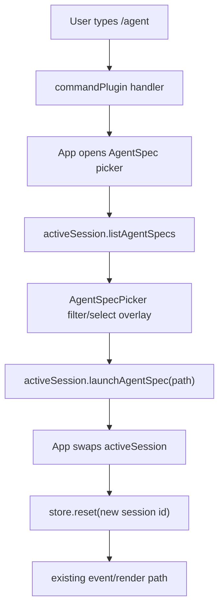

## Goal Capsule

| Field | Value |
|---|---|
| Objective | Give TUI users a real AgentSpec picker so local and remote sessions can launch small agents without memorizing names or JSON paths. |
| Authority | Cortx's current architecture keeps `@cortx/core` minimal and exposes AgentSpec assets through `@cortx/runtime`, server, Web, and TUI controller surfaces. |
| Scope | Add a TUI AgentSpec selector overlay, wire it to the existing `/agent` command and App session swap path, and cover the helper and routing behavior with focused tests. |
| Stop conditions | Do not move AgentSpec logic into core, do not build marketplace or installer flows, and do not clean local `link:@synax-ai/*` dependencies. |

---

## Product Contract

### Summary

This plan upgrades the TUI AgentSpec entry from command-only text output to an interactive selection flow.
It keeps AgentSpec as a runtime asset and uses the same active-session replacement path that `/agent <name-or-path>` already uses.

### Problem Frame

The TUI can list AgentSpecs with `/agents` and launch one with `/agent <name-or-path>`, but this still asks users to copy names or paths from text output.
That is usable for developers but weak for the Claude Code / Codex-style terminal experience Cortx is moving toward.
The next product step is a picker that feels like the existing session restore overlay: type to filter, move with arrows, press Enter to launch, and Esc to cancel.

### Requirements

- R1. TUI users can open an AgentSpec picker without typing a specific AgentSpec identifier.
- R2. The picker filters by AgentSpec name, relative path, prompt preview, tool mode, and approval mode.
- R3. Selecting an AgentSpec launches it through the existing TUI session adapter and keeps subsequent events on the normal store/rendering path.
- R4. The picker handles empty, failed, and cancelled states without sending the slash command to the model.
- R5. The change remains a TUI controller feature over runtime/server contracts and introduces no core dependency.

### Scope Boundaries

- The picker is a local TUI overlay, not a new runtime or server API.
- The Web AgentSpec selector remains out of scope except for preserving the shared server contract.
- AgentSpec installation, manifest versioning, marketplace distribution, and richer editing are deferred follow-up work.

---

## Planning Contract

### Key Technical Decisions

- KTD1. Extend the existing overlay pattern instead of adding a second command mode.
  The session picker and command palette already define TUI interaction rules for filtered lists, exclusive keyboard capture, and cancellation.
- KTD2. Let `/agent` with no arguments open the selector.
  `/agent <name-or-path>` remains the fast path for scripted or keyboard-heavy usage, while the no-argument form becomes discoverable and product-friendly.
- KTD3. Keep launch ownership in `App`.
  The command plugin should request that the picker open; `App` already owns `activeSession`, store reset, and subscription wiring, so session replacement stays in one component boundary.

### Assumptions

- The selector can use the currently active session's `listAgentSpecs()` method at open time.
- A command-first trigger is enough for this slice; a future keyboard shortcut can be added without changing runtime contracts.
- AgentSpec discovery is fast enough for on-demand overlay open in local and remote modes.

### High-Level Technical Design

---

## Implementation Units

### U1. Add AgentSpec Picker Helpers And Component

- **Goal:** Create a focused Ink overlay component for filtering and selecting discovered AgentSpecs.
- **Requirements:** R1, R2, R4.
- **Dependencies:** None.
- **Files:** `packages/tui/src/components/agent-spec-picker.tsx`, `packages/tui/src/__tests__/agent-spec-picker.test.ts`.
- **Approach:** Mirror `SessionPicker`'s pure helper style: export filter, movement, and formatting helpers, then render a compact list with name, relative path, mode summary, and prompt preview. Keep input handling inside the overlay so it captures keys exclusively while open.
- **Patterns to follow:** `packages/tui/src/components/session-picker.tsx`, `packages/tui/src/components/command-palette.tsx`.
- **Test scenarios:** Empty filter returns all specs; text filter matches name, relative path, prompt preview, tool mode, and approval mode; movement wraps at boundaries; an empty list returns no selection; formatting keeps path and prompt readable.
- **Verification:** Focused picker helper tests pass and the component has no runtime/core imports beyond TUI-facing AgentSpec types.

### U2. Wire Picker Opening And Launch Through App

- **Goal:** Add App-owned picker state so selecting an AgentSpec launches it through the current session adapter and swaps the active TUI session.
- **Requirements:** R1, R3, R4, R5.
- **Dependencies:** U1.
- **Files:** `packages/tui/src/app.tsx`, `packages/tui/src/components/app-shell.tsx`, `packages/tui/src/__tests__/input.test.ts`, `packages/tui/src/__tests__/runtime-session.test.ts`.
- **Approach:** Add an `openAgentSpecPicker` dependency to the command plugin and keep the launch callback in App. When the picker opens, App loads specs from `activeSession.listAgentSpecs()`, stores loading/error state, and passes selection into `activeSession.launchAgentSpec()`. On success, App swaps the active adapter and lets the existing store reset/subscription effect run.
- **Patterns to follow:** `handleOpenSessionPicker` and `handleRestoreSession` in `packages/tui/src/app.tsx`.
- **Test scenarios:** `/agent` with no args routes as a command instead of a model prompt; selecting a spec calls launch with its path; launch errors surface through store error handling; closing the overlay restores normal input handling.
- **Verification:** TUI input and runtime-session tests cover command routing and adapter behavior.

### U3. Update Built-In Command Behavior And Documentation

- **Goal:** Make `/agent` discoverable as both picker and direct-launch command, and record the remaining product gap accurately.
- **Requirements:** R1, R4.
- **Dependencies:** U2.
- **Files:** `packages/tui/src/plugins/command-plugin.ts`, `packages/tui/src/__tests__/command-palette.test.ts`, `packages/tui/src/__tests__/tui-registry.test.ts`, `docs/progress/2026-07-05-cortx-remaining-work.md`.
- **Approach:** Change missing-argument behavior from an error into `openAgentSpecPicker()`. Keep direct launch behavior unchanged when an identifier is present. Update progress text from "selector missing" to "first selector exists, still needs dogfood polish."
- **Patterns to follow:** Existing injected command dependencies for `showNotice`, `showError`, and `launchAgentSpec`.
- **Test scenarios:** `/agent` with no args calls `openAgentSpecPicker`; `/agent reviewer` still direct-launches; lack of picker support produces a clear error; `/help` and registry counts stay correct.
- **Verification:** Command palette and registry tests pass.

---

## Verification Contract

| Gate | Covers | Done signal |
|---|---|---|
| `bun test packages/tui/src/__tests__/agent-spec-picker.test.ts packages/tui/src/__tests__/command-palette.test.ts packages/tui/src/__tests__/input.test.ts` | U1-U3 | Picker helpers, command behavior, and slash routing pass. |
| `bun run lint` | U1-U3 | Workspace lint passes without type or style regressions. |
| `bun run build` | U1-U3 | All packages build, including TUI. |
| `bun test` | U1-U3 | Full suite remains green. |

---

## Definition of Done

- TUI users can run `/agent` to open a filterable AgentSpec selector.
- TUI users can still run `/agent <name-or-path>` to launch directly.
- Selecting an AgentSpec creates a normal runtime session and keeps output on the existing TUI event path.
- Empty discovery, load errors, launch errors, and cancellation do not fall through to the model.
- Progress docs reflect that TUI now has a first selector overlay while dogfood polish remains.
- Verification gates pass, and abandoned experimental code is removed from the diff.
