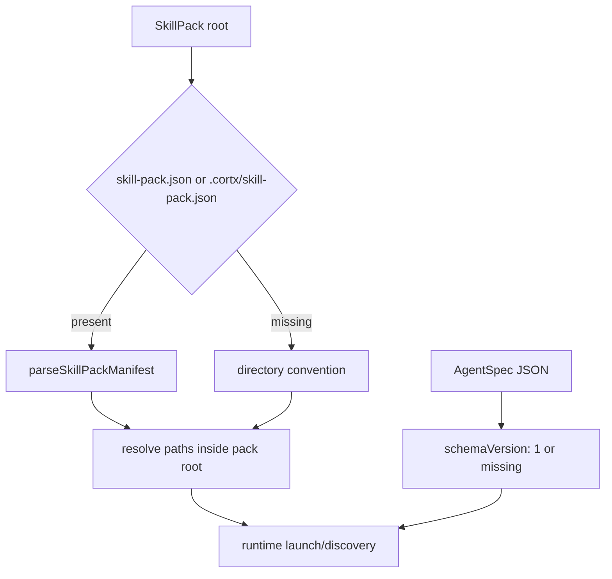

# Agent Asset Versioning

## Goal Capsule

| Field | Value |
|---|---|
| Objective | Give AgentSpec and SkillPack assets a minimal v1 manifest/version contract so prompt-only and skill-backed agents can be discovered, validated, and evolved without JavaScript plugin code. |
| Authority | Cortx keeps `@cortx/core` as a minimal kernel; runtime owns product assets such as AgentSpec and SkillPack. |
| Scope | Add AgentSpec `schemaVersion`, optional SkillPack manifest parsing, typed exports, examples, tests, and progress docs. |
| Stop conditions | Do not build marketplace/install flows, do not add UI, do not move asset logic into core, and do not clean local `link:@synax-ai/*` dependencies. |

## Product Contract

### Summary

AgentSpec and SkillPack are now real product assets, but their wire shape is still implicit.
This slice makes v1 explicit while preserving existing file-only packs and current examples.

### Requirements

- R1. AgentSpec JSON may declare `schemaVersion: 1`; missing `schemaVersion` is treated as v1 for existing local assets.
- R2. Unsupported AgentSpec versions fail with a clear validation error in load/strict discovery paths.
- R3. SkillPack directories may contain a manifest at `skill-pack.json` or `.cortx/skill-pack.json`.
- R4. Missing SkillPack manifest remains valid and falls back to directory conventions: `skills/`, `.cortx/skills/`, and `agents/`.
- R5. SkillPack manifest can define name, version, description, relative skill paths, relative agent spec paths, and metadata.
- R6. Manifest paths stay inside the pack root and preserve runtime discovery behavior.

### Scope Boundaries

- This is a schema/manifest contract, not an installer or marketplace.
- Version migration is limited to current v1 plus missing-version compatibility.
- Server, TUI, and Web should benefit through existing runtime discovery APIs without new surface-specific code.

## Planning Contract

### Key Technical Decisions

- KTD1. Keep schemas hand-validated in runtime assets.
  The package already uses direct validation helpers and has no schema dependency.
- KTD2. Treat missing versions as v1.
  Current examples and local user assets should not break before Cortx has shipped a formal installer.
- KTD3. Prefer `skill-pack.json`, with `.cortx/skill-pack.json` as a hidden alternative.
  Top-level manifest is friendly to pack authors; hidden manifest supports future installed packs.
- KTD4. Make manifest paths relative to the pack root and reject path escape.
  SkillPack assets should remain a self-contained bundle.

### High-Level Design

## Implementation Units

### U1. AgentSpec Version Contract

- **Goal:** Add explicit AgentSpec schema versioning without breaking existing specs.
- **Requirements:** R1, R2.
- **Files:** `packages/runtime/src/assets/agent-spec.ts`, `packages/runtime/tests/agent-spec.test.ts`, `packages/runtime/src/index.ts`.
- **Approach:** Export a current version constant, accept missing or `1`, reject any other version, and include schemaVersion in discovered metadata.
- **Verification:** AgentSpec tests cover missing version, explicit v1, unsupported versions, file load, and strict discovery errors.

### U2. SkillPack Manifest Contract

- **Goal:** Let file-only skill packs declare stable metadata and asset roots.
- **Requirements:** R3, R4, R5, R6.
- **Files:** `packages/runtime/src/assets/skill-pack.ts`, `packages/runtime/tests/skill-pack.test.ts`, `packages/runtime/src/index.ts`.
- **Approach:** Add manifest detection, parser, path validation, and exported version constants/types. Keep default directory scanning when no manifest exists.
- **Verification:** SkillPack tests cover default directory conventions, top-level manifest, hidden manifest, invalid schemaVersion, and path escape rejection.

### U3. Examples And Progress Docs

- **Goal:** Make the v1 asset contract visible for future official pack development.
- **Requirements:** R1-R5.
- **Files:** `examples/skill-packs/basic/skill-pack.json`, `examples/skill-packs/basic/agents/reviewer.json`, `examples/skill-packs/basic/README.md`, `docs/progress/2026-07-05-cortx-remaining-work.md`.
- **Approach:** Add explicit versions to the example, explain manifest fields briefly, and update remaining-work from "缺 manifest 规范和版本策略" to "v1 exists; install/marketplace and richer conventions remain."
- **Verification:** Example pack resolves through runtime tests and docs reflect the current state.

## Verification Contract

| Gate | Covers | Done signal |
|---|---|---|
| `bun test packages/runtime/tests/agent-spec.test.ts packages/runtime/tests/skill-pack.test.ts` | U1-U2 | Asset schema and manifest behavior pass. |
| `bun run lint` | U1-U3 | Workspace lint passes. |
| `bun run build` | U1-U3 | Packages build. |
| `bun test` | U1-U3 | Full suite remains green. |

## Definition of Done

- AgentSpec has an explicit v1 version contract.
- SkillPack can use an optional manifest without requiring JavaScript plugin code.
- Existing file-only packs still work.
- Manifest paths are constrained to the pack root.
- Runtime public exports include the version constants and manifest types.
- Tests, examples, and progress docs reflect the new productized asset contract.
