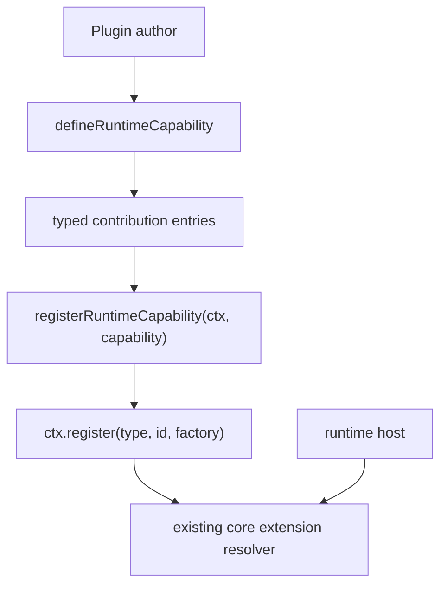

## Goal Capsule

| Field | Value |
|---|---|
| Objective | Improve Cortx SDK plugin authoring so official and third-party capabilities can be declared, type-checked, documented, and registered without understanding core loop internals. |
| Authority | Current Cortx direction keeps `@cortx/core` minimal; SDK exposes stable contracts while runtime/server/TUI/Web host product behavior. |
| Scope | Add a higher-level runtime capability helper, compile-time type contract tests, and an official plugin authoring guide. |
| Stop conditions | Do not move runtime mounting into SDK, do not clean `@synax-ai/* link:` dependencies, and do not add marketplace/install flows in this slice. |

---

## Product Contract

### Summary

SDK helper factories exist, but plugin authors still need to manually repeat `ctx.register(type, id, factory)` and understand each low-level contribution type.
This slice adds a small capability declaration layer over the existing contribution factories.
The helper remains SDK-only and does not change core/runtime execution semantics.

### Problem Frame

Cortx is close to a clean agent core/runtime split, but the ecosystem entry still feels too raw for official plugins.
An author should be able to declare a capability as a list of typed contributions, register it in plugin setup, and get compile-time feedback when a contribution factory does not match its extension point.

### Requirements

- R1. Plugin authors can declare a named runtime capability that groups multiple Cortx contribution factories.
- R2. The declaration preserves the narrow factory type for each extension type.
- R3. The capability can be registered into the existing `PluginContext` without introducing a second registry path.
- R4. Type-level examples prove incorrect contribution factories fail at compile time.
- R5. Documentation shows minimal tool, policy, observer, and grouped capability examples with clear runtime/core boundaries.

### Scope Boundaries

- Runtime capability here means "a typed SDK bundle of core-loop contributions"; session-scoped mounting decisions remain in `@cortx/runtime`.
- Plugin installation, marketplace publishing, compatibility negotiation, and schema migrations remain follow-up work.
- This plan does not introduce new extension point names.

---

## Planning Contract

### Key Technical Decisions

- KTD1. Build on `ctx.register()` rather than replacing it.
  The plugin registry already owns activation, instance context, and contribution resolution; the SDK helper should only reduce authoring friction.
- KTD2. Represent a capability as ordered contribution entries.
  This keeps registration deterministic and avoids inventing bucket-level semantics that would duplicate `AgentRuntimeExtensions`.
- KTD3. Use `tsc --noEmit` type tests instead of adding a new test framework dependency.
  The repo already depends on TypeScript and package lint scripts; a small SDK type-test project gives stronger proof without introducing `tsd`.
- KTD4. Keep docs in `docs/architecture/sdk-and-core-extension-guide.md`.
  There is already one canonical extension guide; adding a new guide would fragment the onboarding path.

### High-Level Technical Design

### Assumptions

- Capability metadata can be minimal for this slice: `id`, optional `displayName`, optional `description`, and ordered contributions.
- Runtime/session feature flags are still runtime-owned and are documented as a boundary rather than modeled in the SDK helper.

---

## Implementation Units

### U1. Runtime Capability SDK Helper

- **Goal:** Add SDK-level helpers for declaring and registering grouped contribution factories.
- **Requirements:** R1, R2, R3.
- **Dependencies:** None.
- **Files:** `packages/sdk/src/extensions.ts`, `packages/sdk/src/index.ts`, `packages/sdk/tests/exports.test.ts`.
- **Approach:** Add typed contribution entry and capability types, `defineRuntimeCapability()`, `defineCapabilityContribution()`, and `registerRuntimeCapability()`. The registration helper should call the existing plugin context `register()` for each entry and preserve optional extension options.
- **Patterns to follow:** Existing `defineContributionFactory()`, `defineToolFactory()`, `defineSessionPolicyFactory()`, and registry usage in `packages/core/tests/core-extensions.test.ts`.
- **Test scenarios:** A capability containing a tool, session policy, and observer registers all entries into a fake plugin context; factories remain callable with the same `CortxFactoryContext`; extension options are forwarded; existing low-level helper tests remain valid.
- **Verification:** Runtime tests in `packages/sdk/tests/exports.test.ts` pass and no core/runtime package imports are introduced into SDK.

### U2. Compile-Time Type Contract Tests

- **Goal:** Prove helper misuse fails at compile time without adding a new dependency.
- **Requirements:** R2, R4.
- **Dependencies:** U1.
- **Files:** `packages/sdk/type-tests/capability.types.ts`, `packages/sdk/tsconfig.type-test.json`, `packages/sdk/package.json`.
- **Approach:** Add a dedicated `type-test` script using `tsc --noEmit`. Include positive examples and `@ts-expect-error` negative examples for mismatched extension type/factory pairs and invalid contribution values.
- **Patterns to follow:** Existing SDK export tests for narrow helper inference.
- **Test scenarios:** Valid tool factory compiles; valid policy factory compiles; a session policy factory passed to `AGENT_TOOL` is rejected; a tool contribution missing required fields is rejected; `registerRuntimeCapability()` accepts only Cortx plugin context shapes.
- **Verification:** `bun run --cwd packages/sdk type-test` fails if any expected type error disappears or any valid example stops compiling.

### U3. Official Plugin Author Guide

- **Goal:** Document the recommended plugin authoring path for official and third-party capabilities.
- **Requirements:** R3, R5.
- **Dependencies:** U1.
- **Files:** `docs/architecture/sdk-and-core-extension-guide.md`, `docs/progress/2026-07-05-cortx-remaining-work.md`.
- **Approach:** Add a concise "Plugin Authoring" section showing minimal tool, policy, observer, and grouped capability registration. Update progress docs to state that helper and type-test coverage now exist, while marketplace/version migration remains future work.
- **Patterns to follow:** Existing Chinese architecture guide style.
- **Test scenarios:** Test expectation: none -- documentation-only update, covered by lint/build and linked runtime/type tests.
- **Verification:** Docs clearly distinguish SDK contribution grouping from runtime mounting decisions.

---

## Verification Contract

| Gate | Covers | Done signal |
|---|---|---|
| `bun test packages/sdk/tests/exports.test.ts` | U1 | Runtime helper behavior and existing SDK exports pass. |
| `bun run --cwd packages/sdk type-test` | U2 | Compile-time examples and expected errors are enforced. |
| `bun run lint` | U1-U3 | Workspace type checks pass. |
| `bun run build` | U1-U3 | All packages build. |
| `bun test` | U1-U3 | Full test suite remains green. |

---

## Definition of Done

- `@cortx/sdk` exports `defineRuntimeCapability()`, `defineCapabilityContribution()`, and `registerRuntimeCapability()`.
- Grouped capabilities still register through the existing plugin registry.
- Type tests prove helper misuse is caught by TypeScript.
- Official docs show the recommended plugin authoring path and boundary with runtime mounting.
- Progress docs reflect that SDK authoring helpers and compile-time tests are no longer open P1 gaps.
- No `@synax-ai/* link:` dependency cleanup is attempted in this slice.
