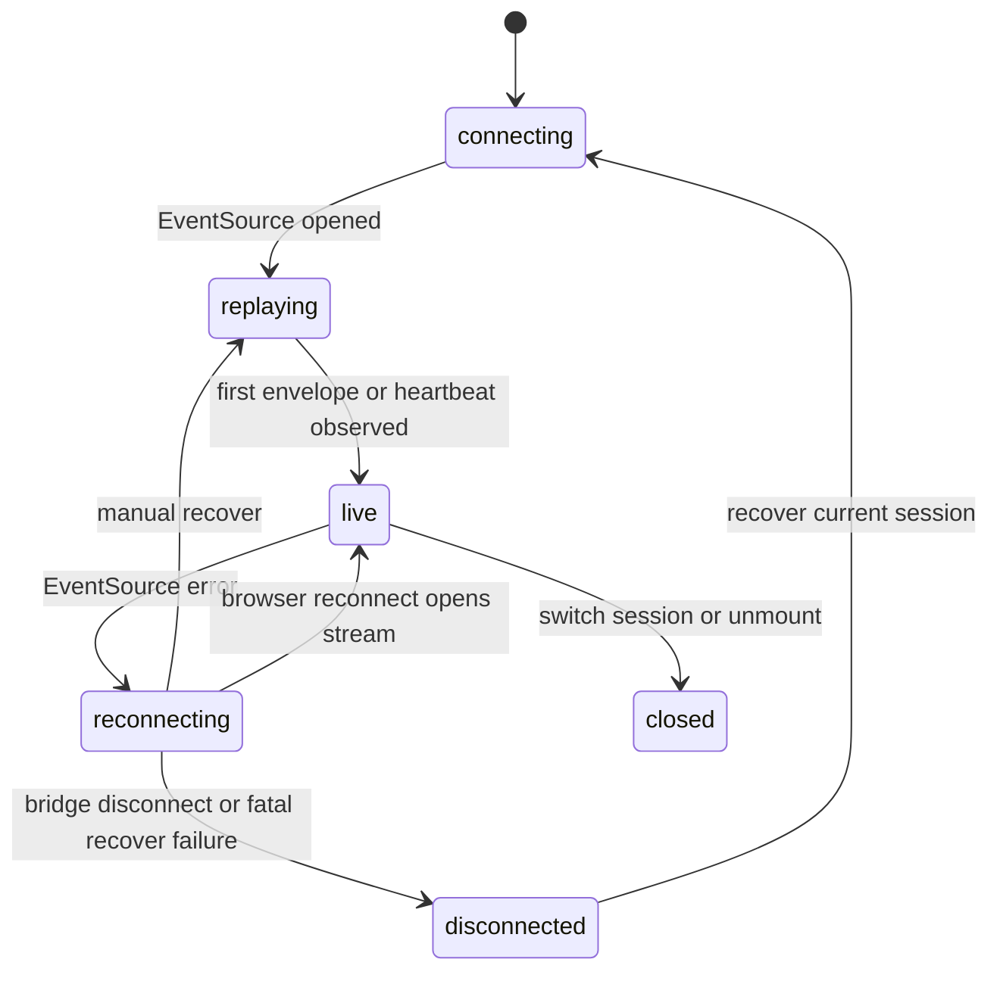

## Goal Capsule

| Field | Value |
|---|---|
| Objective | Make the Web frontend clearly recover runtime session history and connection state so long-running sessions can be resumed, reconnected, and trusted from the browser. |
| Authority | Cortx direction keeps `@cortx/core` minimal; Web is a thin remote frontend over server/runtime session and event contracts. |
| Scope | Add Web-side connection lifecycle state, replay/live/disconnected UI, manual recovery action, and tests around the existing envelope SSE stream. |
| Stop conditions | Do not change `@cortx/core`, do not clean `@synax-ai/* link:` dependencies, and do not redesign session persistence in this slice. |

---

## Product Contract

### Summary

Server/runtime already expose envelope SSE history replay and bounded event history.
The Web frontend consumes that stream but treats it as fire-and-forget: it resets local state, opens `EventSource`, ignores errors, and gives users no visible distinction between restoring history, live connection, reconnecting, or disconnected recovery.
This slice makes that lifecycle explicit without changing the backend contract.

### Problem Frame

For Cortx to feel like a long-running Codex-style workspace, users need confidence that a selected session has replayed its prior events and is still connected.
When a browser tab loses the stream, the UI should show the degraded state and provide a recovery action instead of silently relying on implicit `EventSource` behavior.

### Requirements

- R1. Web event bridge exposes a typed connection lifecycle covering connecting, replaying, live, reconnecting, disconnected, and closed states.
- R2. Replayed envelope events still restore the local store in order and preserve event timestamps.
- R3. Web UI shows compact session connection facts in the workspace shell, including replay/live/disconnected state and the last event sequence when available.
- R4. Users can manually recover the current session stream without re-entering API keys or workspace directories.
- R5. Switching sessions resets old local state, connects to the selected session, and surfaces recovery state without duplicating visible events.

### Scope Boundaries

- This does not add a new server replay endpoint; it uses the existing `/sessions/:id/events?format=envelope` stream.
- This does not implement full offline caching in the browser.
- This does not solve durable process restart recovery; file/sqlite durable stores remain separate P0 work.

---

## Planning Contract

### Key Technical Decisions

- KTD1. Keep replay/recovery state in `packages/web/src/bridge/event-bridge.ts`.
  The bridge already owns auth token negotiation and `EventSource`; it is the right boundary for translating browser stream callbacks into product state.
- KTD2. Keep the UI status compact in the workspace header.
  Connection state is session-level operational context, so it belongs near the session/model/path facts rather than inside the chat transcript.
- KTD3. Treat `EventSource.onerror` as reconnecting while the stream object is still active.
  Browser `EventSource` auto-reconnects, but the UI should still show the user that events may be delayed and offer an explicit recover action.
- KTD4. Add focused unit/render tests instead of screenshot-only proof.
  The current Web package already tests static rendering and bridge behavior; extending those tests gives durable coverage for this product state.

### High-Level Technical Design

### Assumptions

- Browser `EventSource` implementations may not expose rich error details, so UI copy should avoid claiming a precise network cause.
- A heartbeat can move the UI from replaying to live when no historical events exist.
- Last sequence is best-effort metadata from envelope SSE; legacy non-envelope payloads may leave it absent.

---

## Implementation Units

### U1. Event Bridge Connection Lifecycle

- **Goal:** Add typed connection status callbacks to the Web bridge while preserving existing session API methods.
- **Requirements:** R1, R2, R5.
- **Dependencies:** None.
- **Files:** `packages/web/src/bridge/event-bridge.ts`, `packages/web/tests/event-bridge.test.ts`.
- **Approach:** Introduce a small `WebEventConnectionState` shape and optional observer callbacks. Update `connect()` to emit connecting/replaying/live transitions, track last event sequence/timestamp from envelopes, mark errors as reconnecting, and make `disconnect()` emit closed for the active session.
- **Patterns to follow:** Existing `EventBridgeError` typed error handling and current envelope parsing in `event-bridge.ts`.
- **Test scenarios:** Connecting emits initial lifecycle state; envelope replay dispatches normalized events and updates last sequence; heartbeat without envelope moves to live; `onerror` marks reconnecting; disconnect closes the active stream and emits closed; switching sessions closes the prior stream and resets the store for the next session.
- **Verification:** Focused bridge tests prove connection lifecycle callbacks and existing API calls still work.

### U2. Web Workspace Recovery UI

- **Goal:** Surface connection/replay/recovery state in the desktop shell and provide a one-click recover action for the active session.
- **Requirements:** R3, R4, R5.
- **Dependencies:** U1.
- **Files:** `packages/web/src/App.tsx`, `packages/web/src/components/DesktopWorkspace.tsx`, `packages/web/src/components/WorkspaceHeader.tsx`, `packages/web/tests/web-ui.test.tsx`.
- **Approach:** Store the latest bridge connection state in `App`, pass it to `DesktopWorkspace`, and render a compact status pill in `WorkspaceHeader`. Add a recover action that reconnects the existing session through the bridge, refreshes session metadata, and leaves API key/workspace selection hidden from the user.
- **Patterns to follow:** Current auto-connect behavior in `App.tsx`, header metric styling in `WorkspaceHeader.tsx`, and render-to-static-markup assertions in `web-ui.test.tsx`.
- **Test scenarios:** Header renders replaying/live/reconnecting/disconnected labels; recover button appears for degraded states and not for live states; existing DesktopWorkspace shell still renders session/project facts; ConnectionStatus still has no API key or workspace directory inputs.
- **Verification:** Web UI tests prove the recovery state is visible and the user-facing connection startup remains auto-configured.

### U3. Progress Documentation and Full Verification

- **Goal:** Record that Web replay/recovery UI is no longer an open P1 gap and verify the workspace stays green.
- **Requirements:** R1-R5.
- **Dependencies:** U1, U2.
- **Files:** `docs/progress/2026-07-05-cortx-remaining-work.md`.
- **Approach:** Update the remaining-work document to distinguish completed Web replay/recovery UI from still-open dogfood and long-flow polish.
- **Test scenarios:** Test expectation: none -- documentation-only update, covered by U1/U2 tests and workspace verification.
- **Verification:** Focused Web tests, build, lint, and full test suite pass.

---

## Verification Contract

| Gate | Covers | Done signal |
|---|---|---|
| `bun test packages/web/tests/event-bridge.test.ts packages/web/tests/web-ui.test.tsx` | U1-U2 | Bridge lifecycle and Web recovery rendering pass. |
| `bun run build` | U1-U3 | Workspace packages compile with the new Web types. |
| `bun run lint` | U1-U3 | Type checks and lint gates pass after build artifacts exist. |
| `bun test` | U1-U3 | Full suite remains green. |

---

## Definition of Done

- EventBridge exposes typed connection lifecycle state without changing server/runtime contracts.
- Web workspace header shows replay/live/reconnecting/disconnected state for the active session.
- Users can recover the active Web session stream without typing credentials or workspace paths.
- Session switching still resets and replays the selected session cleanly.
- Progress docs reflect the completed Web replay/recovery slice and keep remaining productization gaps honest.
- No `@synax-ai/* link:` dependency cleanup is attempted in this slice.
