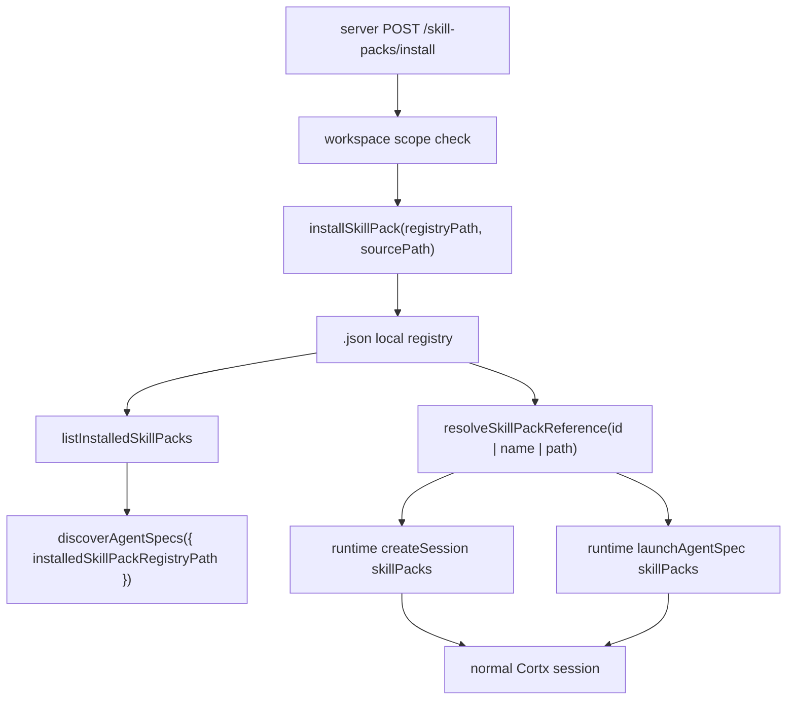

## Goal Capsule

| Field | Value |
|---|---|
| Objective | Add a local SkillPack install/enable entry so Cortx can persist trusted packs and use them from runtime sessions, AgentSpecs, and server clients without changing core. |
| Authority | `@cortx/core` remains a minimal agent kernel; `@cortx/runtime` owns product assets and server/TUI/Web consume runtime-owned contracts. |
| Scope | Add a file-backed local SkillPack registry, support installed pack references in runtime session/AgentSpec launch, expose server list/install endpoints, and update tests/docs. |
| Stop conditions | Do not build marketplace, remote download, signing, lockfiles, package publishing, UI redesign, or clean `@synax-ai/* link:` dependencies in this slice. |

---

## Product Contract

### Summary

AgentSpec and SkillPack v1 can already launch sessions when callers know a local path.
The missing product step is a durable local install/enable entry: users and host surfaces need a way to register a pack once, list installed packs, and refer to that pack by a stable id or name.
This slice adds that local registry while preserving the existing one-runner runtime session path.

### Problem Frame

Without an install registry, SkillPack remains a developer-only file path feature.
Server, TUI, Web, and future desktop hosts need a common runtime-owned asset catalog so they can expose pack installation and pack enablement without importing core internals or inventing separate front-end state.

### Requirements

- R1. Runtime can install a local SkillPack into a file-backed registry by reference to an existing local pack directory.
- R2. Runtime can list installed packs with stable id, metadata, source path, resolved asset paths, and install timestamp.
- R3. Runtime sessions can enable packs through `skillPacks` in `createSession()`, resolving either local paths or installed ids/names.
- R4. AgentSpecs can reference installed pack ids/names in `skillPacks` and still launch as normal runtime sessions.
- R5. AgentSpec discovery can include installed packs without requiring callers to manually pass every pack path.
- R6. Server exposes authenticated endpoints to list and install local SkillPacks under the current principal workspace scope.

### Scope Boundaries

- Installation is a local registry record, not a copy, package manager, or remote downloader.
- Installed pack ids are local host identifiers and are not a global marketplace namespace.
- Pack signing, lockfiles, migration between registry schema versions, and official distribution are deferred follow-up work.
- TUI/Web UI controls for installing packs are follow-up work; this slice provides the shared runtime/server contract they will use.

---

## Planning Contract

### Key Technical Decisions

- KTD1. Store installation records in runtime assets, not core.
  SkillPack is a product asset, and core should not know about install locations or file registries.
- KTD2. Install by reference in v1.
  Referencing the local pack path keeps this slice small, avoids unsafe recursive copy semantics, and still gives hosts a durable catalog.
- KTD3. Resolve `skillPacks` through a single helper that accepts paths or installed ids/names.
  Runtime sessions and AgentSpecs should not have two different enablement paths.
- KTD4. Server install endpoint authorizes the source path before writing the registry.
  A scoped API key must not register packs outside its allowed workspace roots.

### High-Level Technical Design

### Assumptions

- The registry path is configured by the runtime/server host. When absent, installed id/name references are unavailable but direct pack paths still work.
- Duplicate ids should replace the prior local record only when the caller intentionally installs the same id again.
- Installed names are convenience aliases; ids remain the stable machine reference.

---

## Implementation Units

### U1. Runtime SkillPack Registry

- **Goal:** Add runtime asset helpers to install, list, and resolve locally registered SkillPacks.
- **Requirements:** R1, R2, R3, R4.
- **Dependencies:** None.
- **Files:** `packages/runtime/src/assets/skill-pack-registry.ts`, `packages/runtime/src/assets/skill-pack.ts`, `packages/runtime/src/index.ts`, `packages/runtime/tests/skill-pack.test.ts`.
- **Approach:** Add a versioned registry file format with `installSkillPack()`, `listInstalledSkillPacks()`, and `resolveSkillPackReference()`. The install helper resolves the pack through existing `resolveSkillPack()` validation, persists a stable record, and keeps resolved asset paths derived from the current pack content at list/resolve time.
- **Patterns to follow:** Existing manual schema validation in `skill-pack.ts` and durable file migration style in `packages/runtime/src/durable/migrations.ts`.
- **Test scenarios:** Install a manifest-backed pack and list it; install without explicit id and derive a stable id from the pack name/path; reinstall the same id updates the record; resolving by id, name, and direct path returns the same pack; missing id produces a clear error; invalid registry JSON fails safely as an empty registry or typed parse error according to helper boundary.
- **Verification:** Runtime SkillPack tests cover registry behavior without touching core.

### U2. Runtime Session and AgentSpec Enablement

- **Goal:** Let sessions and AgentSpecs enable installed packs through the same `skillPacks` field.
- **Requirements:** R3, R4, R5.
- **Dependencies:** U1.
- **Files:** `packages/runtime/src/runtime.ts`, `packages/runtime/src/session.ts`, `packages/runtime/src/assets/agent-spec.ts`, `packages/runtime/tests/agent-spec.test.ts`, `packages/runtime/tests/skill-pack.test.ts`.
- **Approach:** Add optional `skillPackRegistryPath` to runtime options and `skillPacks` to session create request/info. Resolve session and AgentSpec pack references through the registry-aware helper before building official skill extensions. Add discovery support for installed packs by registry path.
- **Patterns to follow:** Existing `skillPaths` session plumbing and existing `AgentSpec.skillPacks` expansion.
- **Test scenarios:** `createSession({ skillPacks: ['pack-id'] })` enables a pack skill through installed id; `launchAgentSpec({ skillPacks: ['pack-id'] })` expands slash skill invocations; `discoverAgentSpecs({ installedSkillPackRegistryPath })` returns specs from installed packs; direct pack paths continue to work when no registry exists.
- **Verification:** Runtime AgentSpec/SkillPack focused tests pass and existing direct path behavior is unchanged.

### U3. Server SkillPack Endpoints

- **Goal:** Expose the local install registry through authenticated server APIs for future Web/TUI/Desktop surfaces.
- **Requirements:** R2, R6.
- **Dependencies:** U1, U2.
- **Files:** `packages/server/src/types.ts`, `packages/server/src/server.ts`, `packages/server/tests/server.test.ts`.
- **Approach:** Add optional `skillPackRegistryPath` server config, pass it into runtime, expose `GET /skill-packs` and `POST /skill-packs/install`. The install endpoint accepts `{ path, id? }`, resolves relative paths against `defaultWorkingDirectory`, checks principal workspace scope, and records the pack through runtime asset helpers.
- **Patterns to follow:** Existing AgentSpec path authorization and `errorResponse()` RuntimeError mapping.
- **Test scenarios:** Valid API key installs a pack inside its workspace and then lists it; install outside principal roots is rejected; installed pack AgentSpecs appear in `/agent-specs`; session creation can pass an installed pack id to enable skills; unauthenticated requests remain rejected by middleware.
- **Verification:** Server tests cover route behavior and workspace scoping.

### U4. Progress Documentation

- **Goal:** Record the new local install/enable contract and keep deferred marketplace work explicit.
- **Requirements:** R1-R6.
- **Dependencies:** U1-U3.
- **Files:** `docs/progress/2026-07-05-cortx-remaining-work.md`.
- **Approach:** Update AgentSpec/SkillPack productization text from "缺安装、启用入口" to "local registry install/enable exists; marketplace/signing/lockfile/UI polish remain."
- **Test scenarios:** Test expectation: none -- documentation-only update, covered by U1-U3 tests.
- **Verification:** Progress doc matches the implemented API and does not claim marketplace/signing completion.

---

## Verification Contract

| Gate | Covers | Done signal |
|---|---|---|
| `bun test packages/runtime/tests/skill-pack.test.ts packages/runtime/tests/agent-spec.test.ts` | U1-U2 | Registry install/resolve, session enablement, AgentSpec launch, and discovery pass. |
| `bun test packages/server/tests/server.test.ts` | U3 | Server install/list/scoping and AgentSpec discovery integration pass. |
| `bun run build` | U1-U4 | Workspace packages compile with new runtime/server contracts. |
| `bun run lint` | U1-U4 | Type checks and lint gates pass. |
| `bun test` | U1-U4 | Full suite remains green. |

---

## Definition of Done

- Runtime exports local SkillPack install/list/resolve helpers.
- Runtime sessions and AgentSpecs can enable installed packs by id/name as well as direct path.
- AgentSpec discovery can include installed packs from a configured registry.
- Server exposes authenticated local SkillPack list/install endpoints with workspace scoping.
- Progress docs reflect that local install/enable exists while marketplace, signing, lockfile, and UI install controls remain future work.
- No `@synax-ai/* link:` dependency cleanup is attempted in this slice.
