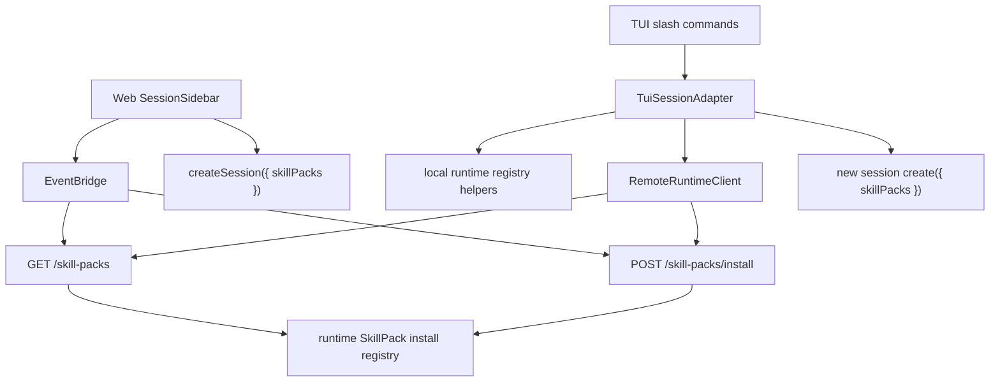

## Goal Capsule

| Field | Value |
|---|---|
| Objective | Add Web and TUI product entry points for listing, installing, and enabling local SkillPacks through the runtime/server asset contract. |
| Authority | `@cortx/core` remains a minimal agent kernel; SkillPack installation and enablement stay in `@cortx/runtime`, `@cortx/server`, and thin frontend adapters. |
| Scope | Extend Web and TUI clients to consume the existing `GET /skill-packs` and `POST /skill-packs/install` server contract, show installed packs, install a local pack by path, and create sessions with selected pack ids. |
| Stop conditions | Do not clean local `@synax-ai/* link:` dependencies, do not build marketplace/download/signing/lockfile flows, and do not move SkillPack product logic into core. |

---

## Product Contract

### Summary

Cortx already has a runtime-owned local SkillPack install registry and scoped server endpoints.
The remaining product gap is that users still need to call those endpoints by hand.
This plan adds first-class Web and TUI entries so local packs can be installed once, listed, and enabled for new sessions without changing the agent core.

### Problem Frame

AgentSpec and SkillPack are meant to make tiny prompt or skill-backed agents reusable without JavaScript plugin code.
Without frontend entry points, that promise is only true for developers who know the server API or runtime helper names.
Web, remote TUI, and local TUI should expose the same asset model while preserving the existing thin-frontend boundary.

### Requirements

- R1. Web can list installed SkillPacks from the server and display their id, name, source path, version, and available asset counts.
- R2. Web can install a local SkillPack by entering a server-visible path, then refresh installed packs and AgentSpecs.
- R3. Web can enable one or more installed SkillPacks when creating a new project session or a new session for the selected project.
- R4. TUI local mode can list installed local SkillPacks and install a local pack through runtime asset helpers.
- R5. TUI remote mode can list and install SkillPacks through the server client.
- R6. TUI can create a new session with selected installed SkillPack ids without forcing users to edit JSON manually.
- R7. The change preserves the product boundary: Web stays remote-only, TUI uses local/remote adapters, and core remains untouched.

### Scope Boundaries

- Deferred to follow-up work: marketplace browsing, remote download, signatures, lockfiles, version migration UI, pack uninstall, and rich pack detail pages.
- Deferred to dogfood: polished keyboard overlays for selecting packs in TUI and a fuller Web asset manager.
- Outside this slice: cleaning `@synax-ai/* link:` dependencies, because the current environment is intentionally local-test oriented.

---

## Planning Contract

### Key Technical Decisions

- KTD1. Reuse the server SkillPack endpoints for Web and remote TUI.
  Web is remote-only, and remote TUI should not inspect local filesystem state for server-owned assets.
- KTD2. Add TUI adapter methods rather than teaching commands about runtime internals.
  This keeps `/skill-packs` and `/skill-pack install` using the same local/remote abstraction as `/agents` and `/agent`.
- KTD3. Treat installed pack ids as session create inputs.
  Session enablement already exists in `RuntimeSessionCreateRequest.skillPacks`, so frontends should pass ids into normal session creation instead of inventing a second activation path.
- KTD4. Keep UI small and explicit.
  The first entry should be reliable and testable: list installed packs, install by path, select ids for new sessions, and refresh related AgentSpec discovery.

### High-Level Technical Design

### Assumptions

- Installed pack ids are the stable frontend selection value.
- Local TUI can store its registry under the current working directory's `.cortx/skill-packs/registry.json`, matching the server default location.
- Enabling packs for a session means starting a new session; existing sessions are not mutated.

---

## Implementation Units

### U1. Web Bridge SkillPack Contract

- **Goal:** Add typed Web methods for listing and installing SkillPacks through the existing server routes.
- **Requirements:** R1, R2, R7.
- **Dependencies:** None.
- **Files:** `packages/web/src/bridge/event-bridge.ts`, `packages/web/tests/event-bridge.test.ts`.
- **Approach:** Add a `WebSkillPackInfo` type matching the server response shape, plus `listSkillPacks()` and `installSkillPack({ path, id? })`. Keep error handling on the existing `EventBridgeError` path.
- **Patterns to follow:** Existing `listAgentSpecs()` and `launchAgentSpec()` bridge methods.
- **Test scenarios:** Bridge calls `/skill-packs` with a bearer short token; bridge calls `/skill-packs/install` with `{ path, id }`; server error bodies remain typed `EventBridgeError`.
- **Verification:** Focused Web bridge tests prove the API shape without adding runtime dependencies to the Web package.

### U2. Web Sidebar Installed Pack UI

- **Goal:** Surface installed packs and allow pack-aware session creation from the Web workspace.
- **Requirements:** R1, R2, R3, R7.
- **Dependencies:** U1.
- **Files:** `packages/web/src/App.tsx`, `packages/web/src/components/DesktopWorkspace.tsx`, `packages/web/src/components/SessionSidebar.tsx`, `packages/web/tests/web-ui.test.tsx`.
- **Approach:** Load installed packs on connect and refresh after install, AgentSpec launch, and session creation. Add a compact "Skill Packs" sidebar section with install path/id inputs, pack count, and checkboxes for session enablement. Pass selected ids into project session creation and current-project session creation.
- **Patterns to follow:** Existing AgentSpec sidebar launch flow and project/session grouping.
- **Test scenarios:** Sidebar renders installed pack metadata; install form calls the provided handler and shows error state; selected packs appear as enabled controls; creating a session includes selected pack ids.
- **Verification:** Web UI tests render the pack list and session creation props stay type-correct.

### U3. TUI SkillPack Adapter And Remote Client

- **Goal:** Add TUI local/remote adapter capabilities for listing, installing, and creating sessions with SkillPacks.
- **Requirements:** R4, R5, R6, R7.
- **Dependencies:** None.
- **Files:** `packages/tui/src/runtime-session.ts`, `packages/tui/src/remote-client.ts`, `packages/tui/src/__tests__/runtime-session.test.ts`, `packages/tui/src/__tests__/remote-client.test.ts`.
- **Approach:** Export a TUI-facing installed pack type. Local adapter uses runtime asset helpers and a workspace-local registry path. Remote client adds `listSkillPacks()` and `installSkillPack()`. Add an adapter method to create a sibling session for the current workspace with selected pack ids.
- **Patterns to follow:** Existing local/remote `listAgentSpecs()` and `launchAgentSpec()` adapter methods.
- **Test scenarios:** Local adapter installs and lists a pack from a fixture path; remote client hits `/skill-packs` and `/skill-packs/install`; remote adapter creates a new session with `skillPacks: ['pack-id']`.
- **Verification:** Focused TUI runtime-session and remote-client tests pass.

### U4. TUI Slash Commands For SkillPacks

- **Goal:** Give terminal users a minimal command path to list packs, install by path, and start sessions with installed pack ids.
- **Requirements:** R4, R5, R6.
- **Dependencies:** U3.
- **Files:** `packages/tui/src/plugins/command-plugin.ts`, `packages/tui/src/app.tsx`, `packages/tui/src/__tests__/command-palette.test.ts`.
- **Approach:** Add `/skill-packs`, `/skill-pack install <path> [id]`, and `/skill-pack session <id[,id...]>`. Keep commands small and notice-driven; richer selection overlays remain follow-up polish.
- **Patterns to follow:** Existing `/agents` and `/agent` dependency injection and notice/error handling.
- **Test scenarios:** `/skill-packs` formats installed packs; install command calls injected installer; session command calls injected session creator with parsed ids; missing dependencies produce clear errors.
- **Verification:** Command plugin tests cover successful commands and failure messages.

### U5. Progress Documentation

- **Goal:** Record that local install/enable has Web and TUI entry points while keeping marketplace-level work deferred.
- **Requirements:** R1-R7.
- **Dependencies:** U1-U4.
- **Files:** `docs/progress/2026-07-05-cortx-remaining-work.md`.
- **Approach:** Update the AgentSpec/SkillPack and TUI/Web sections to say API-only installation is now surfaced in the thin frontends. Keep real provider dogfood and marketplace/signing/lockfile work listed as remaining.
- **Patterns to follow:** Existing progress document style.
- **Test scenarios:** Test expectation: none -- documentation-only update.
- **Verification:** Documentation matches implemented routes and does not claim marketplace or signing support.

---

## Verification Contract

| Gate | Covers | Done signal |
|---|---|---|
| `bun test packages/web/tests/event-bridge.test.ts packages/web/tests/web-ui.test.tsx` | U1-U2 | Web bridge and sidebar behavior pass. |
| `bun test packages/tui/src/__tests__/remote-client.test.ts packages/tui/src/__tests__/runtime-session.test.ts packages/tui/src/__tests__/command-palette.test.ts` | U3-U4 | TUI remote/local adapter and commands pass. |
| `bun run build` | U1-U5 | All workspace packages compile with new contracts. |
| `bun run lint` | U1-U5 | Type and lint gates pass. |
| `bun test` | U1-U5 | Full suite remains green. |

---

## Definition of Done

- Web can list installed SkillPacks, install a local pack by path, and pass selected installed pack ids into new sessions.
- TUI local and remote modes expose list/install/session creation commands for installed SkillPacks.
- Core source and Web package dependencies remain free of runtime/local execution imports.
- Progress documentation reflects the new UI entry while leaving marketplace, signing, lockfiles, and richer selectors as future work.
- Focused tests, build, lint, and the full test suite pass.
- Dead-end implementation code and temporary test fixtures are removed from the final diff.
