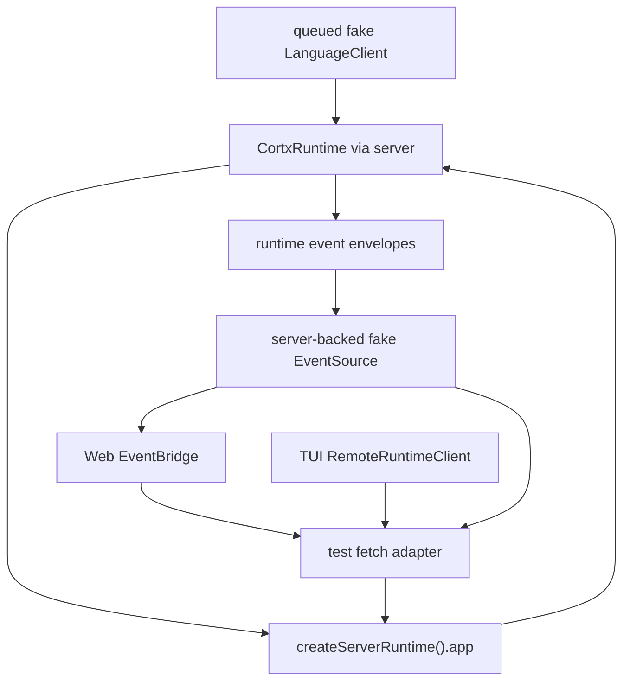

# Product Dogfood Smoke - Plan

## Goal Capsule

| Field | Value |
|---|---|
| Objective | Add a repeatable product smoke test that exercises Cortx through runtime, server, Web bridge, and TUI remote client contracts before manual provider dogfood. |
| Authority | Keep `@cortx/core` minimal; verify host/frontend behavior through runtime/server/client layers; do not clean `@synax-ai/* link:` dependencies in this slice. |
| Scope | Cover multi-session/multi-directory isolation, server-scoped auth, Web event replay, TUI remote actions, approval answer flow, abort/resume route behavior, sub-agent lifecycle attribution, and SkillPack/AgentSpec asset discovery through one local fake-provider harness. |
| Stop conditions | Do not launch real providers, do not require real network ports, do not add marketplace/signing/lockfile work, and do not claim this replaces manual TUI/Web dogfood. |

---

## Product Contract

### Summary

Cortx has strong unit and conformance coverage, but the remaining productization report still depends on manual dogfood for long-flow confidence.
This plan adds a local smoke harness that runs through the same server and frontend client contracts a user-facing app uses, while keeping provider behavior deterministic.
The result is a fast regression guard for the workflows most likely to break when runtime, server, Web, and TUI evolve independently.

### Problem Frame

Current tests prove many individual contracts: runtime sessions, server routes, Web bridge calls, TUI remote client calls, approval, SkillPacks, and sub-agent behavior.
They do not prove that a thin frontend client can drive a server-hosted runtime through a realistic cross-surface flow.
Without that guard, regressions in token exchange, SSE replay, session scoping, approval request propagation, or sub-agent event attribution can survive until manual dogfood.

### Requirements

- R1. A product smoke test can run without external provider credentials by using a deterministic fake language client.
- R2. The smoke flow drives the real `createServerRuntime()` Hono app through HTTP-style fetch calls, not direct runtime method shortcuts.
- R3. The smoke flow uses `EventBridge` for Web-style connect, replay, prompt, answer, abort, resume, and session listing behavior.
- R4. The smoke flow uses `RemoteRuntimeClient` for TUI remote-style session creation and action routing.
- R5. The smoke flow creates at least two sessions in different workspaces and proves scoped API keys cannot see or operate on each other's sessions.
- R6. The smoke flow verifies approval prompts can be answered through the frontend/server path before a write tool succeeds.
- R7. The smoke flow verifies sub-agent lifecycle events include enough parent attribution to render one child run in Web/TUI.
- R8. The smoke flow verifies SkillPack install/list and AgentSpec discovery use the server asset routes inside workspace scope.
- R9. The smoke test remains fast, deterministic, and isolated from manual `.context/` or local user state.

### Scope Boundaries

- Deferred to follow-up work: real Anthropic/OpenAI provider dogfood, browser-rendered visual assertions, real terminal copy/scroll validation, long-duration memory pressure tests, database durable stores, marketplace publishing, signatures, and pack lockfiles.
- Outside this slice: changing core loop architecture or cleaning local `@synax-ai/* link:` dependencies.

### Acceptance Examples

- AE1. Given two API keys scoped to two temporary workspaces, when Web creates a session in workspace A and TUI creates a session in workspace B, then each key lists only its own session and cross-session prompt/action calls return permission denial.
- AE2. Given an interactive approval session, when the fake model requests a write tool, then the Web bridge receives a user request/question event, answers it, and the run reaches `done` with a successful tool result.
- AE3. Given a session with sub-agents enabled, when the fake model calls the `agent` tool, then Web replay contains `agent_started` and `agent_completed` envelopes with parent session/run/toolCall attribution.
- AE4. Given a local SkillPack under an allowed workspace, when Web installs it through the server and TUI lists assets through the remote client, then both clients observe the installed pack and related AgentSpec discovery.

---

## Planning Contract

### Key Technical Decisions

- KTD1. Put the smoke harness under a test path rather than a CLI script.
  `bun test` is already the repo's green gate, so the smoke should run as part of the normal full suite and focused test command.
- KTD2. Route HTTP calls through `createServerRuntime().app.request()`.
  This avoids port allocation flake while still exercising Hono middleware, auth, JSON parsing, server route validation, runtime delegation, and server-scoped authorization.
- KTD3. Use a fake EventSource backed by the server SSE response.
  Web bridge coverage should include token exchange and envelope replay instead of manually injecting events into the store.
- KTD4. Keep provider behavior deterministic with queued stream parts.
  The goal is product contract coverage, not model quality; fake responses should request tools, answer text, and finish predictably.
- KTD5. Keep the smoke at the product boundary.
  Assertions should describe user-visible contracts: sessions, events, approvals, assets, permission denials, and frontend client state.

### High-Level Technical Design

### Assumptions

- Fake provider stream parts are sufficient for product contract verification because all routes and clients above the provider boundary are real.
- One focused smoke file is easier to maintain than scattering the same cross-surface flow across package-specific tests.
- Root-level tests may import workspace package source files; package build outputs remain unaffected because the smoke is test-only.

---

## Implementation Units

### U1. Product Smoke Harness

- **Goal:** Create reusable test helpers that run server routes in-process and expose a fetch/EventSource pair suitable for Web and TUI remote clients.
- **Requirements:** R1, R2, R3, R4, R9.
- **Dependencies:** None.
- **Files:** `tests/product-dogfood-smoke.test.ts`.
- **Approach:** Build temporary workspaces, a queued fake language client, an app-backed fetch adapter, and a minimal SSE parser that turns `/sessions/:id/events` responses into EventSource-style callbacks. Restore global `fetch` and `EventSource` after each test.
- **Patterns to follow:** Existing fake language helpers in `packages/runtime/tests/*`, server route tests in `packages/server/tests/server.test.ts`, and Web bridge fake EventSource tests in `packages/web/tests/event-bridge.test.ts`.
- **Test scenarios:** Creating a server runtime with temporary roots succeeds; the fetch adapter sends auth headers and JSON bodies through Hono; the fake EventSource replays envelope SSE messages into `EventBridge`; teardown disposes runtime and removes temp directories.
- **Verification:** Focused smoke test runs without opening a network port and leaves no durable files outside temporary directories.

### U2. Cross-Surface Session And Auth Smoke

- **Goal:** Prove Web bridge and TUI remote client can drive separate scoped sessions through the same server host.
- **Requirements:** R2, R3, R4, R5.
- **Dependencies:** U1.
- **Files:** `tests/product-dogfood-smoke.test.ts`.
- **Approach:** Configure two API keys with different workspace roots and modes. Use `EventBridge` with key A and `RemoteRuntimeClient` with key B. Create sessions in both roots, list sessions through each client, and assert cross-session get/prompt attempts return typed permission errors.
- **Patterns to follow:** Server scoped API key tests and existing bridge/client typed error assertions.
- **Test scenarios:** Key A sees only workspace A sessions; key B sees only workspace B sessions; key A cannot operate on key B's session; invalid workspace creation remains rejected.
- **Verification:** Smoke assertions prove session scope is enforced through frontend client contracts rather than direct runtime calls.

### U3. Approval, Resume, Abort, And Event Replay Smoke

- **Goal:** Exercise a realistic frontend-controlled run with approval, answer, abort/resume actions, and replayed event state.
- **Requirements:** R3, R6.
- **Dependencies:** U1, U2.
- **Files:** `tests/product-dogfood-smoke.test.ts`.
- **Approach:** Queue a fake model response that requests a write tool, then text completion after approval. Connect `EventBridge` before prompting, wait for the user request/question event in the Web store, answer through the bridge, and assert the resulting file write and `done` event. Call abort/resume endpoints on a completed or idle session to verify route stability and typed state refresh.
- **Patterns to follow:** Runtime approval tests and Web bridge event lifecycle tests.
- **Test scenarios:** Approval request appears in the Web store; answering `yes` executes the write tool inside the workspace; replaying the event stream into a fresh Web bridge restores completed text/tool state; abort and resume routes return without corrupting session metadata.
- **Verification:** The smoke observes frontend state changes and workspace side effects from server-routed actions.

### U4. Sub-Agent And Asset Smoke

- **Goal:** Prove sub-agent lifecycle attribution and server asset routes survive the full server/client path.
- **Requirements:** R7, R8.
- **Dependencies:** U1, U2.
- **Files:** `tests/product-dogfood-smoke.test.ts`.
- **Approach:** Queue a fake model response that calls the runtime-mounted `agent` tool, then child text, then parent text. Assert replayed envelopes include `agent_started` and `agent_completed` with parent attribution. Create a local SkillPack with one skill and one AgentSpec under the allowed workspace, install it through Web, list it through TUI, and verify AgentSpec discovery sees the pack agent.
- **Patterns to follow:** Runtime sub-agent tests, server SkillPack tests, and TUI remote client SkillPack tests.
- **Test scenarios:** Sub-agent lifecycle events appear once per toolCallId; lifecycle envelopes include parent `sessionId`, `runId`, and `toolCallId`; installed pack is visible through both Web and TUI client paths; AgentSpec discovery returns the pack agent.
- **Verification:** The smoke locks the event and asset semantics needed by Web/TUI renderers.

### U5. Progress Documentation

- **Goal:** Update remaining-work to reflect that a repeatable product smoke now covers part of the previous manual dogfood gap.
- **Requirements:** R9.
- **Dependencies:** U1-U4.
- **Files:** `docs/progress/2026-07-05-cortx-remaining-work.md`.
- **Approach:** Record the new smoke as automated coverage, while still listing real provider, browser, terminal copy/scroll, long-session, and visual dogfood as remaining.
- **Patterns to follow:** Existing latest audit update bullets.
- **Test scenarios:** Test expectation: none -- documentation-only update.
- **Verification:** The progress doc does not overclaim that manual dogfood is complete.

---

## Verification Contract

| Gate | Covers | Done signal |
|---|---|---|
| `bun test tests/product-dogfood-smoke.test.ts` | U1-U4 | The cross-surface smoke passes deterministically. |
| `bun test packages/server/tests/server.test.ts packages/web/tests/event-bridge.test.ts packages/tui/src/__tests__/remote-client.test.ts` | U2-U4 | Existing server, Web bridge, and TUI remote client contracts still pass. |
| `bun run build` | U1-U5 | Workspace packages still compile. |
| `bun run lint` | U1-U5 | Package lint gates remain clean. |
| `bun test` | U1-U5 | Full suite remains green with the new smoke included. |

---

## Definition of Done

- A deterministic product smoke test exists and runs through real server routes plus Web/TUI client adapters.
- The smoke covers scoped multi-session behavior, approval answer flow, replayed events, sub-agent lifecycle attribution, SkillPack install/list, and AgentSpec discovery.
- The smoke does not require real provider credentials, a listening port, user-local `.context/`, or cleanup of local `@synax-ai/* link:` dependencies.
- Remaining-work documentation distinguishes automated smoke coverage from still-needed manual provider/browser/terminal dogfood.
- Focused smoke tests, related focused tests, build, lint, and the full test suite pass.
- Temporary fixtures are created under OS temp directories and removed after tests.
