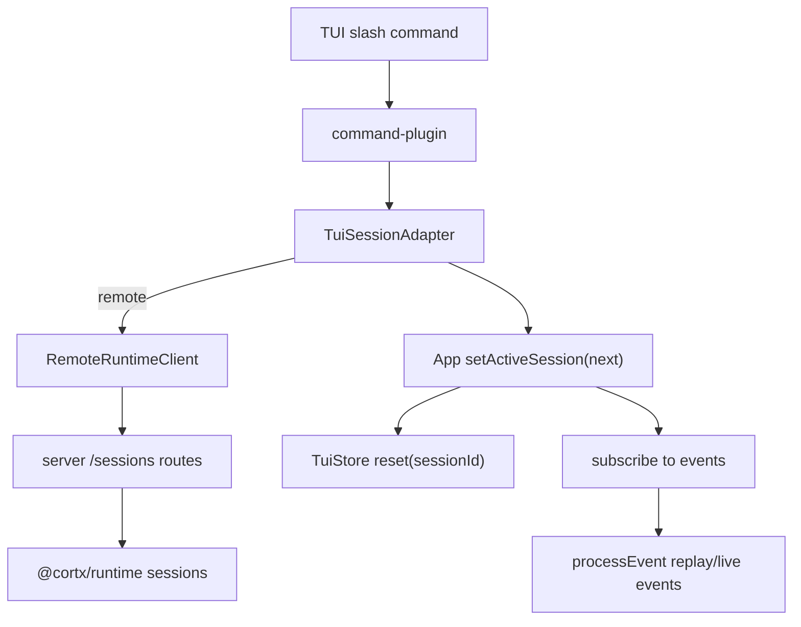

# TUI Remote Session Switcher - Plan

## Goal Capsule

| Field | Value |
|---|---|
| Objective | Make the TUI remote mode operate as a thin server session client: list server-owned sessions, switch between them, replay history, and create sessions for another workspace without local transcript restore assumptions. |
| Authority | Keep `@cortx/core` minimal; put product behavior in TUI client/adapter and server/runtime contracts; do not clean `@synax-ai/* link:` dependencies in this slice. |
| Scope | Add remote session list/switch/create commands and adapter methods, reuse existing server `/sessions` and SSE replay, and keep local TUI `/resume` behavior intact. |
| Stop conditions | Do not add a database backend, do not alter core loop semantics, do not redesign Web UI, do not claim real provider dogfood is complete. |

---

## Product Contract

### Summary

The current TUI can connect to a remote server session, but its session picker is still shaped around local transcript restore.
In remote mode, a user should be able to see server sessions, switch to any authorized session, and create a new server session for a workspace from the same TUI surface.
This closes part of the remaining product gap around remote TUI dogfood and multi-session/multi-directory use.

### Problem Frame

Server/runtime now own durable sessions, replay, auth scope, AgentSpec, SkillPack, and multi-workspace hosting.
TUI remote mode should therefore behave like a control surface over those server sessions.
Today `RemoteRuntimeClient` lacks `listSessions()`, `TuiSessionAdapter` lacks a session listing/switching abstraction, and `/resume` in remote mode only says local transcript restore is unavailable.
That leaves remote TUI users with no first-class way to switch projects/sessions after connecting.

### Requirements

- R1. Remote TUI can list authorized server sessions through the same scoped server route used by Web.
- R2. Remote TUI can switch to an existing server session and replay its event history through SSE without relying on local transcript files.
- R3. Remote TUI can create a new server session for a requested workspace directory, inheriting the active session's model/tool/control defaults unless overridden by the command.
- R4. Local TUI session restore remains unchanged: local `/resume` continues to show saved local transcripts and restore model messages.
- R5. Remote session commands surface typed errors as visible TUI notices/errors instead of silently failing.
- R6. The implementation preserves the thin frontend boundary: TUI uses `RemoteRuntimeClient` and `TuiSessionAdapter`, not runtime internals, for remote behavior.

### Acceptance Examples

- AE1. Given a remote TUI connected to session A, when the user runs `/sessions`, then the output lists authorized server sessions with workspace, mode, running state, and compact ids.
- AE2. Given two authorized server sessions, when the user runs `/session <id>`, then the TUI resets to that session id and SSE replay restores prior assistant/tool output.
- AE3. Given a remote TUI connected to workspace A, when the user runs `/session new /path/to/workspace-b`, then a new server session is created for workspace B and becomes active.
- AE4. Given a local TUI, when the user runs `/resume`, then existing local transcript restore still uses the local session picker.

---

## Planning Contract

### Key Technical Decisions

- KTD1. Reuse the existing command plugin instead of adding a new remote-only plugin.
  The command palette is already the TUI command extension point; adding `/sessions` and `/session` there keeps the UX discoverable and testable.
- KTD2. Extend `TuiSessionAdapter` with optional remote-capable session operations.
  App code can stay mode-agnostic while local adapters can still provide useful same-runtime session listing where cheap.
- KTD3. Switch sessions by replacing the active adapter.
  Existing `App` state already resets the store when `activeSession` changes and re-subscribes to events; remote SSE replay should therefore hydrate display history through the current rendering pipeline.
- KTD4. Keep `/resume` local-transcript oriented.
  `/resume` is a local persistence feature. Remote server-owned session switching should use explicit `/sessions` and `/session` commands so users are not confused about where history lives.

### High-Level Technical Design

### Assumptions

- Server-side auth scope and workspace validation already protect `listSessions`, `getSession`, and `createSession`.
- The server's SSE history replay is sufficient to restore remote TUI visual state after switching sessions.
- Existing local session restore tests are the guard for R4.

---

## Implementation Units

### U1. Remote Client And Adapter Session Operations

- **Goal:** Add session listing, switching, and workspace creation primitives to remote TUI without reaching into runtime internals.
- **Requirements:** R1, R2, R3, R6.
- **Files:** `packages/tui/src/remote-client.ts`, `packages/tui/src/runtime-session.ts`, `packages/tui/src/__tests__/remote-client.test.ts`, `packages/tui/src/__tests__/runtime-session.test.ts`.
- **Approach:** Add `RemoteRuntimeClient.listSessions()`. Add `TuiSessionAdapter.listSessions()`, `switchSession(sessionId)`, and `createSessionForWorkspace(workingDirectory)`. Local adapter can implement these through its `CortxRuntime`; remote adapter uses the client and returns a fresh adapter for selected/created sessions.
- **Test Scenarios:** Remote client requests `GET /sessions`; remote adapter lists sessions; remote adapter switches by `GET /sessions/:id`; remote adapter creates a workspace session by `POST /sessions` with inherited defaults and `metadata.tuiMode = remote`.
- **Verification:** Focused TUI remote-client/runtime-session tests pass.

### U2. TUI Slash Commands For Server Sessions

- **Goal:** Expose remote session operations through command palette/slash commands.
- **Requirements:** R1, R2, R3, R5.
- **Files:** `packages/tui/src/plugins/command-plugin.ts`, `packages/tui/src/app.tsx`, `packages/tui/src/__tests__/command-palette.test.ts`, `packages/tui/src/__tests__/input.test.ts`.
- **Approach:** Add `/sessions` to list sessions and `/session <id>` / `/session new <workspace>` to switch/create. Inject `listSessions`, `switchSession`, and `createWorkspaceSession` deps from `App`; command errors call `showError`, success paths call `showNotice`.
- **Test Scenarios:** Formatting covers empty and populated session lists; `/sessions` calls injected list and notice; `/session <id>` calls switch; `/session new <workspace>` calls create; missing args and missing dependencies produce visible errors; slash commands are consumed and not sent as model prompts.
- **Verification:** Command plugin and input tests pass.

### U3. Remote Switching Replay Safety

- **Goal:** Ensure switching an active remote session resets local UI state and lets server replay rebuild output.
- **Requirements:** R2, R5.
- **Files:** `packages/tui/src/app.tsx`, `tests/product-dogfood-smoke.test.ts`.
- **Approach:** Rely on existing `activeSession` effect to reset state and resubscribe; add or extend the product smoke to switch a TUI remote client from one server session to another and assert session isolation still holds at the client contract level.
- **Test Scenarios:** Product smoke lists server sessions via TUI client; switching target session returns the requested id; replay remains scoped to the selected session.
- **Verification:** Product smoke and full suite pass.

### U4. Progress Documentation

- **Goal:** Keep remaining-work aligned with the new remote TUI capability without overclaiming full real-provider dogfood.
- **Requirements:** R1-R6.
- **Files:** `docs/progress/2026-07-05-cortx-remaining-work.md`.
- **Approach:** Mark TUI remote multi-session switching as automated/product-code covered, while keeping real terminal long-session dogfood as remaining.
- **Test Scenarios:** Documentation-only; verify wording does not claim visual/manual dogfood is complete.
- **Verification:** Markdown diff is scoped and accurate.

---

## Verification Contract

| Gate | Covers | Done signal |
|---|---|---|
| `bun test packages/tui/src/__tests__/remote-client.test.ts packages/tui/src/__tests__/runtime-session.test.ts packages/tui/src/__tests__/command-palette.test.ts packages/tui/src/__tests__/input.test.ts` | U1, U2 | TUI client/adapter/command contracts pass. |
| `bun test tests/product-dogfood-smoke.test.ts` | U3 | Cross-surface smoke remains green with session-list/switch coverage. |
| `bun run build` | U1-U4 | Workspace packages compile. |
| `bun run lint` | U1-U4 | Type/lint gates pass after build artifacts exist. |
| `bun test` | U1-U4 | Full suite stays green. |

---

## Definition of Done

- Remote TUI has command-level access to server session listing, switching, and new workspace session creation.
- Local `/resume` transcript restore behavior is unchanged.
- Remote switching goes through server/client contracts and does not import runtime internals into frontend code.
- Tests cover client, adapter, command, and product smoke behavior.
- Remaining-work documentation distinguishes this automated/product-code improvement from still-needed real terminal/provider dogfood.
