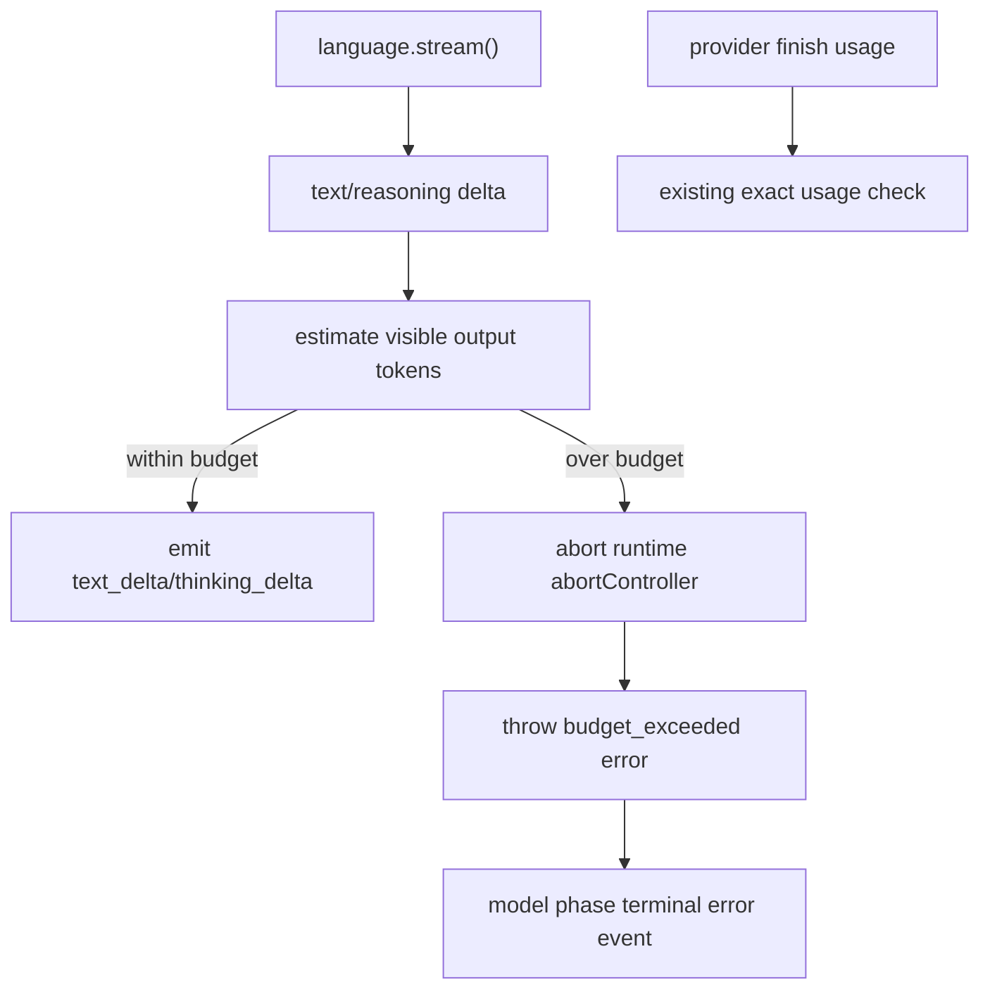

# Streaming Token Budget Preemption - Plan

## Goal Capsule

| Field | Value |
|---|---|
| Objective | Stop model streaming earlier when a configured token budget is visibly exceeded, instead of waiting for provider usage at the end of the stream. |
| Authority | Preserve `@cortx/core` as the reusable agent kernel; keep the change small and cooperative; do not clean `@synax-ai/* link:` dependencies in this slice. |
| Scope | Add an estimated streaming budget guard for text/reasoning deltas, abort the active provider signal on overflow, and keep exact provider usage enforcement unchanged when usage arrives. |
| Stop conditions | Do not introduce tokenizer dependencies, provider-specific token accounting, billing claims, or runtime/server API changes. |

---

## Product Contract

### Summary

`limits.tokenBudget` is currently enforced after the provider finishes and reports usage.
That protects the terminal event semantics, but it allows long streamed responses to emit substantial text before Cortx knows the budget was exceeded.
This plan adds a cooperative streaming-time guard that estimates visible output tokens and aborts the provider stream once the estimate crosses the configured budget.

### Problem Frame

Long-running agent products need budget controls that feel responsive.
Exact token usage remains provider-owned, but a product can still use a conservative visible-output estimate to stop runaway streams early.
The fix should improve runtime behavior without adding tokenizer packages or binding core to a specific model family.

### Requirements

- R1. When `limits.tokenBudget` is configured, model streaming checks budget while text/reasoning deltas arrive.
- R2. Streaming preemption emits a terminal `error` event with `code: "budget_exceeded"`.
- R3. Streaming preemption aborts the active provider request through the same abort signal already passed to `language.stream()`.
- R4. The existing exact usage check after finish remains in place, so provider-reported usage still wins when available.
- R5. Without `limits.tokenBudget`, streaming behavior remains unchanged.
- R6. The estimate is intentionally generic and dependency-free; it must be documented/testable as an approximate guard, not a billing-grade tokenizer.

### Acceptance Examples

- AE1. Given a tiny token budget and a model stream that emits many text deltas, when the estimate crosses the budget, then Cortx yields `budget_exceeded` and the stream stops before all deltas are emitted.
- AE2. Given a provider stream that observes the abort signal, when streaming budget preemption fires, then the provider sees `signal.aborted === true`.
- AE3. Given no budget, when the same stream runs, then all deltas and final `done` are emitted as before.
- AE4. Given provider finish usage above budget but no large streamed text, when finish arrives, then the existing post-usage budget error still fires.

---

## Planning Contract

### Key Technical Decisions

- KTD1. Use a dependency-free rough estimate.
  Core should not gain tokenizer or provider-specific dependencies. A simple character-based estimate is enough to stop pathological streams early and can be replaced later by provider-aware accounting.
- KTD2. Treat streaming preemption as a terminal model-phase error.
  The existing loop already understands terminal model errors; keeping the event path there avoids special runtime/server handling.
- KTD3. Abort cooperatively through `runtime.abortController`.
  The language provider already receives this signal, so preemption should use the same cancellation path as user abort and turn timeout.
- KTD4. Keep exact usage enforcement.
  The stream estimate is a guardrail. The existing provider usage check remains the source of exact terminal budget validation.

### High-Level Technical Design

### Assumptions

- Approximate output estimation should be based on emitted text and thinking only; input tokens are unknown until provider usage arrives unless the caller precomputes them in a future enhancement.
- A conservative one-token-per-four-characters heuristic is acceptable for early guardrails because exact validation still happens after finish.
- Streaming preemption should not try to trim already emitted text; it only stops further output.

---

## Implementation Units

### U1. Streaming Budget Guard

- **Goal:** Add a small reusable budget guard to `streamModel()` for text and reasoning deltas.
- **Requirements:** R1, R2, R3, R5, R6.
- **Files:** `packages/core/src/loop/stream.ts`, `packages/core/src/loop/errors.ts`, `packages/core/tests/conformance/session-events.test.ts`.
- **Approach:** Add a helper that estimates output tokens from `textBuffer + thinkingBuffer`, compares it with `runtime.limits?.tokenBudget`, aborts `runtime.abortController` with a typed `budget_exceeded` error, and throws that error before emitting the delta that would exceed the budget.
- **Test Scenarios:** Tiny budget stops a long stream early; no budget does not stop; provider signal sees abort.
- **Verification:** Focused conformance tests pass.

### U2. Preserve Exact Usage Enforcement

- **Goal:** Ensure existing provider-usage budget enforcement remains unchanged and coexists with streaming preemption.
- **Requirements:** R4.
- **Files:** `packages/core/src/loop.ts`, `packages/core/tests/conformance/session-events.test.ts`.
- **Approach:** Keep `exceedsTokenBudget()` after `runModelPhase()` intact. Add a regression assertion if needed so low streamed text plus high finish usage still produces `budget_exceeded`.
- **Test Scenarios:** Existing "token budget emits a typed terminal error after provider usage is known" still passes.
- **Verification:** Existing conformance test remains green.

### U3. Progress Documentation

- **Goal:** Update remaining-work so streaming-time preemption is no longer listed as a missing P2 item, while noting it is approximate.
- **Requirements:** R6.
- **Files:** `docs/progress/2026-07-05-cortx-remaining-work.md`.
- **Approach:** Add a latest-audit bullet for streaming preemption and adjust P2 wording to say exact provider usage remains exact while streaming guard is estimate-based.
- **Test Scenarios:** Documentation-only.
- **Verification:** Markdown diff does not overclaim billing-grade token accounting.

---

## Verification Contract

| Gate | Covers | Done signal |
|---|---|---|
| `bun test packages/core/tests/conformance/session-events.test.ts` | U1, U2 | Streaming preemption and exact usage budget tests pass. |
| `bun test` | U1-U3 | Full suite remains green. |
| `bun run build` | U1-U3 | Workspace packages compile. |
| `bun run lint` | U1-U3 | Type/lint gates pass. |
| `git diff --check` | U1-U3 | No whitespace errors. |

---

## Definition of Done

- A configured `limits.tokenBudget` can stop long visible model streams before provider finish.
- The provider abort signal is tripped when streaming preemption fires.
- Exact provider-reported usage enforcement still works after finish.
- The change is covered by conformance tests and documented as an approximate guard.
- No core dependency, runtime API, server API, or link dependency cleanup is introduced.
