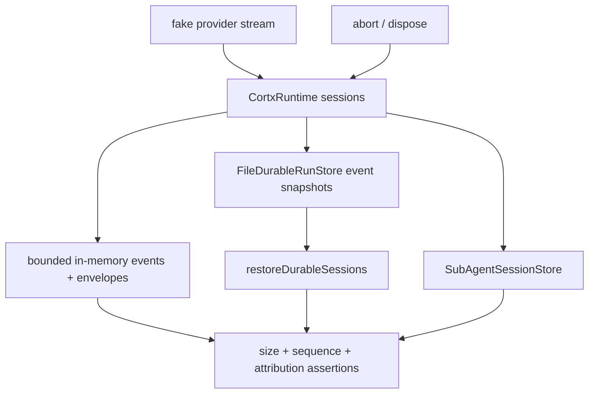

# test: Runtime resource pressure guardrails

## Goal Capsule

| Field | Value |
|---|---|
| Objective | Turn the remaining P2 long-session resource concerns into automated runtime/server regression coverage, with minimal hardening where tests expose a real leak or unbounded-growth path. |
| Authority | Keep `@cortx/core` stable and product-neutral; fix this in `@cortx/runtime`/server-facing coverage. Do not clean `@synax-ai/* link:` dependencies in this slice because local testing is the current target. |
| Scope | Long event streams, many sessions, durable event retention, abort/dispose cleanup, and sub-agent store cleanup semantics. |
| Stop conditions | Do not add sqlite/database storage, SaaS account systems, UI redesign, real provider dogfood, or new public APIs unless the tests prove the existing internal seam cannot express the requirement. |

---

## Product Contract

### Summary

Cortx already has bounded in-memory event history, file-backed event replay retention, parent-child sub-agent attribution, and abort/destroy cleanup paths.
The remaining productization gap is confidence: long-running local products need automated proof that these paths stay bounded under many turns, many sessions, durable replay, and abort/dispose flows.

### Problem Frame

The current remaining-work document still lists long-session memory/timer/pending-request pressure as an open P2 concern.
Because this is a product reliability issue rather than a new user feature, the right next move is not a large architecture change.
The right move is a focused stress/regression suite that fails if runtime history grows unbounded, event replay exceeds configured retention, sub-agent stores retain completed children forever, or abort/dispose leaves sessions busy.

### Requirements

- R1. Runtime in-memory `events` and `eventEnvelopes` remain bounded by `maxEventsPerSession` during long streamed output and many turns.
- R2. Runtime event envelope `sequence`, `runId`, and `sessionId` remain monotonic and attributable after event history pruning.
- R3. File durable event replay remains bounded by the configured retention window after many persisted envelopes and after runtime restore.
- R4. Multiple sessions under one runtime retain separate bounded histories and do not bleed events or sequence state across session ids.
- R5. Abort and dispose clear running gates, reject pending questions, cancel live sub-agents, and leave no runtime-owned session usable after destroy.
- R6. Sub-agent session storage evicts completed children under pressure while preserving running children and clearing abort handlers for terminal children.

### Scope Boundaries

- Deferred to follow-up: database durable stores, compression/archival policy, full SaaS multi-user auth, and real provider/browser/terminal dogfood.
- Outside this slice: dependency publishing cleanup for `@synax-ai/* link:` packages.

---

## Planning Contract

### Key Technical Decisions

- KTD1. Prefer characterization and pressure tests before implementation changes.
  The current code already contains bounded arrays, durable event pruning, and sub-agent completed-session eviction; tests should first lock those contracts down.
- KTD2. Keep the pressure suite deterministic and local.
  Use fake language streams and temp directories instead of real provider calls, timers measured in seconds, or browser automation.
- KTD3. Verify both memory-facing and durable-facing boundaries.
  In-memory `getEventEnvelopeHistory()` and file-backed `listEventEnvelopes()` are separate surfaces and both need coverage because Web/TUI replay depends on their agreement.
- KTD4. Treat resource cleanup as behavior, not implementation detail.
  Tests should assert public or stable internal outcomes such as `isRunning`, deleted sessions, replay size, child status, and abort signal observation, instead of reaching into private timer fields.

### High-Level Technical Design

### Assumptions

- Existing `maxEventsPerSession` and FileDurableRunStore retention are the intended product-stage limits for local long sessions.
- The slice can close the automated pressure-test gap even though true memory profiling and real terminal/browser dogfood remain separate follow-up work.

---

## Implementation Units

### U1. Runtime long-session bounded history tests

- **Goal:** Add deterministic runtime pressure coverage for long streamed output, repeated turns, and multiple sessions.
- **Requirements:** R1, R2, R4.
- **Dependencies:** none.
- **Files:** `packages/runtime/tests/resource-pressure.test.ts`, `docs/progress/2026-07-05-cortx-remaining-work.md`.
- **Approach:** Create a focused test file with fake language clients that emit many deltas and many turns. Configure small `maxEventsPerSession` values so pruning is exercised quickly. Assert history length, envelope history length, monotonic sequence order, preserved `sessionId`, and distinct per-session histories.
- **Execution note:** Start with failing or characterization tests before changing runtime code; only harden runtime if current behavior fails the stated contract.
- **Patterns to follow:** Existing helper style in `packages/runtime/tests/runtime.test.ts` and `packages/runtime/tests/durable-store.test.ts`.
- **Test scenarios:**
  - Given one session with `maxEventsPerSession: 12`, when a fake stream emits substantially more than 12 events, then `getEventHistory()` and `getEventEnvelopeHistory()` both contain at most 12 records.
  - Given pruned envelope history, when reading sequences, then they remain strictly increasing and every envelope still carries the original session id.
  - Given two sessions with interleaved prompts, when both complete, then each session has its own bounded history and no envelope from session A appears under session B.
- **Verification:** Focused runtime pressure tests pass and no production code changes are needed unless the tests expose a contract failure.

### U2. Durable replay retention and restore tests

- **Goal:** Prove file-backed durable event retention stays bounded and restored sessions replay only the retained envelope window.
- **Requirements:** R3.
- **Dependencies:** U1.
- **Files:** `packages/runtime/tests/resource-pressure.test.ts`, `packages/runtime/src/durable/file-store.ts` if hardening is required.
- **Approach:** Use `FileDurableRunStore` with a small `maxEventEnvelopesPerSession`, run a session that emits more envelopes than the durable limit, wait for asynchronous persistence to settle through observable store reads, then restore into a fresh runtime and verify replay size and sequence continuity.
- **Patterns to follow:** Durable restore setup in `packages/runtime/tests/durable-resume.test.ts` and FileDurableRunStore retention checks in `packages/runtime/tests/durable-store.test.ts`.
- **Test scenarios:**
  - Given durable retention of 5, when a session emits more than 5 envelopes, then `listEventEnvelopes(sessionId)` returns only the newest 5 sequences.
  - Given a fresh runtime using the same durable store, when `restoreDurableSessions()` runs, then restored envelope history is bounded and starts at the retained sequence rather than sequence 1.
  - Given `maxEventsPerSession` is smaller than durable retention, when restoring, then runtime applies the smaller in-memory bound.
- **Verification:** Durable pressure coverage passes without relying on sleeps longer than the test's polling timeout.

### U3. Abort/dispose and sub-agent cleanup pressure tests

- **Goal:** Lock down cleanup behavior for busy sessions, pending questions, live child controllers, and completed child eviction.
- **Requirements:** R5, R6.
- **Dependencies:** none.
- **Files:** `packages/runtime/tests/resource-pressure.test.ts`, `packages/runtime/tests/sub-agent-session.test.ts`, `packages/runtime/src/capabilities/sub-agent/session-store.ts` if hardening is required.
- **Approach:** Extend sub-agent store coverage for abort handler cleanup and completed-child pressure. Add runtime cleanup tests that use abort-aware fake providers and the existing public runtime actions (`abort`, `deleteSession`, `dispose`) to assert sessions stop being busy and cannot be used after deletion.
- **Patterns to follow:** Abort tests in `packages/runtime/tests/runtime.test.ts` and sub-agent lifecycle tests in `packages/runtime/tests/sub-agent.test.ts`.
- **Test scenarios:**
  - Given a running session, when `abort()` is called, then `isRunning` becomes false and a new prompt is accepted.
  - Given a deleted session, when a subscriber or prompt attempts to use it, then a typed `session_not_found` error is raised.
  - Given many completed sub-agent sessions with a small `maxCompleted`, when each completes, then only the newest completed sessions remain while running sessions are preserved.
  - Given a child reaches terminal status, when `abortRunning()` is called later, then its registered abort callback is not invoked.
- **Verification:** Cleanup tests pass and no private runtime fields are exposed solely for testing.

### U4. Progress documentation update

- **Goal:** Record that automated pressure coverage now exists while leaving true real-provider dogfood and high-end ops work open.
- **Requirements:** R1-R6.
- **Dependencies:** U1, U2, U3.
- **Files:** `docs/progress/2026-07-05-cortx-remaining-work.md`.
- **Approach:** Update P2 wording to say long-session bounded-history/resource cleanup now has automated regression coverage, while memory profiling, database stores, compression/archive, and real provider UI dogfood remain follow-up work.
- **Test scenarios:** Test expectation: none -- documentation-only status update.
- **Verification:** The doc does not overclaim that real memory profiling or production-grade database retention is complete.

---

## Verification Contract

| Gate | Covers | Done signal |
|---|---|---|
| `bun test packages/runtime/tests/resource-pressure.test.ts packages/runtime/tests/sub-agent-session.test.ts` | U1-U3 | New resource pressure and cleanup tests pass. |
| `bun test packages/runtime/tests/runtime.test.ts packages/runtime/tests/durable-store.test.ts packages/runtime/tests/durable-resume.test.ts packages/runtime/tests/sub-agent.test.ts` | U1-U3 regressions | Existing runtime, durable, and sub-agent behavior remains green. |
| `bun run build` | U1-U4 | Workspace packages compile. |
| `bun run lint` | U1-U4 | Type and lint gates pass. |
| `bun test` | U1-U4 | Full suite remains green. |
| `git diff --check` | U1-U4 | No whitespace errors. |

---

## Definition of Done

- Runtime pressure tests prove in-memory event histories stay bounded under long streams, repeated turns, and multiple sessions.
- Durable pressure tests prove file-backed event envelope retention and restored replay stay bounded.
- Cleanup tests prove abort/delete/dispose and sub-agent terminal cleanup do not leave observable busy sessions or reusable destroyed sessions.
- Progress documentation distinguishes automated pressure coverage from still-open real provider UI dogfood and production-grade storage/ops.
- Abandoned experimental code is removed; the final diff stays scoped to runtime/server reliability coverage and any minimal hardening those tests require.
