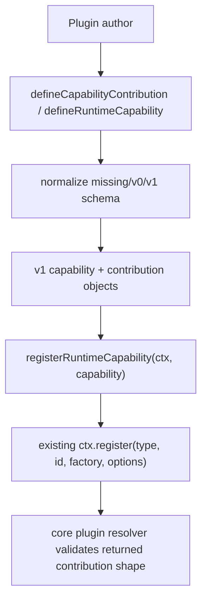

## Goal Capsule

| Field | Value |
|---|---|
| Objective | Give Cortx SDK extension/capability declarations a small, explicit schema-version boundary so plugin authoring can evolve without breaking existing official plugins. |
| Authority | Current Cortx direction keeps `@cortx/core` minimal and puts plugin author ergonomics in `@cortx/sdk`; `@synax-ai/* link:` dependencies are intentionally left alone for local testing. |
| Scope | Add schemaVersion constants, normalizers/migration helpers for SDK capability/contribution definitions, resolver support for normalized contribution entries, focused runtime/type tests, and docs. |
| Stop conditions | Do not redesign extension point names, do not introduce a marketplace/installer, do not move runtime mounting decisions into SDK, and do not clean `@synax-ai/* link:` dependencies in this slice. |

---

## Product Contract

### Summary

SDK helper factories and runtime capability grouping already exist, but the declaration shape has no version boundary.
This makes future extension metadata changes risky: plugin authors can only infer compatibility from TypeScript types, and hosts have no explicit migration surface for older capability declarations.
This slice adds a conservative v1 schema contract and migration path around SDK-declared capabilities while preserving the current direct `ctx.register()` path.

### Problem Frame

Cortx wants to support official and third-party plugins over time without repeatedly changing core.
The SDK is the correct place to define author-facing compatibility boundaries.
The runtime asset layer already has a pattern: accept missing/v0 forms, normalize to current v1, and reject unsupported future versions clearly.
SDK extension/capability declarations should follow the same principle, but remain lightweight enough that simple plugin code still feels direct.

### Requirements

- R1. SDK exports a current schemaVersion constant for Cortx extension/capability declarations.
- R2. `defineCapabilityContribution()` and `defineRuntimeCapability()` normalize missing or legacy v0 declarations to the current v1 shape.
- R3. Unsupported future schema versions fail at the SDK boundary with clear errors.
- R4. `registerRuntimeCapability()` registers normalized v1 contribution entries through the existing plugin context and forwards options unchanged.
- R5. Existing low-level `defineContributionFactory()` and direct `ctx.register()` authoring remain valid.
- R6. Runtime tests and type tests prove schema normalization preserves type safety and rejects mismatched factory/type pairs.
- R7. The official extension guide and remaining-work document describe the versioning boundary and what remains out of scope.

### Scope Boundaries

- In scope: SDK helper declaration shape, normalized contribution/capability metadata, tests, docs, and core resolver compatibility if normalized entries require it.
- Out of scope: package manifest versioning from `@nerax-ai/plugin`, remote plugin distribution, marketplace metadata, lockfiles, signing, runtime asset manager UX, and dependency cleanup.
- Direct registry usage remains intentionally supported; schema migration applies to SDK-authored capability objects, not to every third-party plugin registry internals.

---

## Planning Contract

### Key Technical Decisions

- KTD1. Keep the current public schema version at `1`.
  This mirrors AgentSpec/SkillPack asset versioning without inventing a parallel compatibility model.
- KTD2. Normalize at helper boundaries instead of adding a second registry path.
  `defineCapabilityContribution()` and `defineRuntimeCapability()` are where authors opt into SDK-managed declaration ergonomics; direct `ctx.register()` stays as-is.
- KTD3. Treat missing schemaVersion and explicit `0` as legacy-compatible.
  This preserves all currently authored capability definitions while giving future migrations a real parser surface.
- KTD4. Reject unsupported future versions synchronously.
  Failing early in SDK helpers gives plugin authors a clearer error than waiting for a core resolver shape failure.
- KTD5. Keep migration code dependency-free and local to `packages/sdk/src/extensions.ts`.
  The compatibility boundary is tiny today; a separate migration module would be premature unless more versions appear.

### High-Level Technical Design

### Assumptions

- Existing capability objects have no schemaVersion field and should be treated as legacy-compatible v1 inputs.
- Current contribution `options` are still `@nerax-ai/plugin` `ExtensionOptions`; this slice only version-tags Cortx SDK declaration objects.
- Runtime mounting policies remain host-owned and are not encoded into the capability schema.

---

## Implementation Units

### U1. Versioned SDK Capability Declarations

**Goal:** Add current schema constants and normalize SDK capability/contribution declarations at the helper boundary.

**Requirements:** R1, R2, R3, R4, R5.

**Dependencies:** None.

**Files:** `packages/sdk/src/extensions.ts`, `packages/sdk/src/index.ts`, `packages/sdk/tests/exports.test.ts`.

**Approach:** Add a `CORTX_EXTENSION_SCHEMA_VERSION` constant and schemaVersion fields to `CortxCapabilityContribution` and `RuntimeCapabilityDefinition`. Update `defineCapabilityContribution()` and `defineRuntimeCapability()` to accept missing/v0/current inputs, return current v1 objects, and throw clear errors on unsupported versions. Keep `registerRuntimeCapability()` reading the normalized entries and calling `ctx.register()` exactly as before.

**Patterns to follow:** `packages/runtime/src/assets/agent-spec.ts`, `packages/runtime/src/assets/skill-pack.ts`, and existing SDK helper tests in `packages/sdk/tests/exports.test.ts`.

**Test scenarios:**

- Missing schemaVersion contribution/capability inputs normalize to current v1.
- Explicit `schemaVersion: 0` contribution/capability inputs normalize to current v1.
- Current `schemaVersion: 1` inputs stay valid.
- Future versions throw errors that mention schemaVersion.
- Registration still forwards `type`, `id`, `factory`, and `options` unchanged.

**Verification:** Focused SDK export tests pass and existing core/runtime extension tests remain unchanged.

### U2. Compile-Time Contract Coverage

**Goal:** Extend SDK type tests so versioned declarations keep narrow factory/type alignment.

**Requirements:** R2, R6.

**Dependencies:** U1.

**Files:** `packages/sdk/type-tests/capability.types.ts`.

**Approach:** Add positive examples for missing/current schemaVersion declaration inputs and negative `@ts-expect-error` examples for mismatched factory/type pairs under the versioned contribution shape. Do not require authors to manually specify schemaVersion for ordinary capability declarations.

**Patterns to follow:** Existing `packages/sdk/type-tests/capability.types.ts` positive/negative examples.

**Test scenarios:**

- A normal schemaVersion-less capability compiles.
- A current v1 capability declaration compiles.
- A tool contribution with a policy factory remains a compile-time error.
- A direct object contribution with mismatched type/factory remains a compile-time error even when schemaVersion is present.

**Verification:** `bun run --cwd packages/sdk type-test` passes.

### U3. Documentation and Progress Update

**Goal:** Document the new SDK versioning boundary and update the current completion record.

**Requirements:** R7.

**Dependencies:** U1, U2.

**Files:** `docs/architecture/sdk-and-core-extension-guide.md`, `docs/progress/2026-07-05-cortx-remaining-work.md`, `docs/plans/2026-07-05-017-feat-sdk-extension-schema-migration-plan.md`.

**Approach:** Add a concise SDK schemaVersion section to the extension guide: current version, legacy compatibility, future-version failure, and direct `ctx.register()` boundary. Update remaining-work to mark extension schemaVersion/migration first pass as landed while leaving official examples, scaffolding, marketplace, and release policy work open.

**Patterns to follow:** Chinese architecture guide style and the previous AgentSpec/SkillPack migration progress wording.

**Test scenarios:** Test expectation: none -- documentation-only update; behavior is covered by U1/U2 tests.

**Verification:** Docs state the boundary clearly and do not imply runtime mounting moved into SDK.

---

## Verification Contract

| Gate | Covers | Done signal |
|---|---|---|
| `bun test packages/sdk/tests/exports.test.ts` | U1 | Runtime helper normalization and registration behavior pass. |
| `bun run --cwd packages/sdk type-test` | U2 | Compile-time type contract still catches invalid factories. |
| `bun run build` | U1-U3 | All packages build with exported schema types/constants. |
| `bun run lint` | U1-U3 | Workspace lint/type checks pass. |
| `bun test` | U1-U3 | Full suite remains green. |
| `git diff --check` | U1-U3 | No whitespace or patch hygiene issues remain. |

---

## Definition of Done

- `@cortx/sdk` exports the current extension schemaVersion constant and versioned capability/contribution types.
- SDK capability/contribution helpers normalize missing/v0/current declarations to v1 and reject unsupported future versions.
- `registerRuntimeCapability()` continues to use the existing plugin registry path.
- Runtime tests and type tests cover versioned declaration behavior.
- Docs explain the SDK version boundary and remaining future work.
- `@synax-ai/* link:` dependencies remain untouched.
