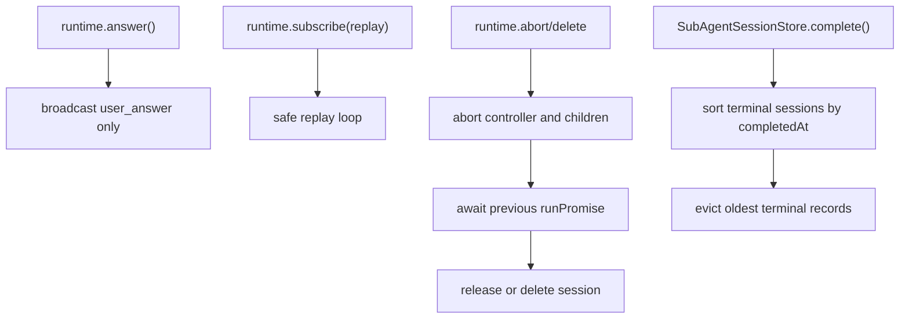

# Runtime Host Edge Cases - Plan

## Goal Capsule

- **Objective:** Fix verified runtime host edge cases and clean low-value complexity without changing the core architecture or clearing local `link:` dependencies.
- **Authority:** Current code evidence wins over prior reports; `@synax-ai/* link:` dependencies remain in place for local testing.
- **Execution profile:** Small, focused runtime cleanup with regression tests before shipping.
- **Stop condition:** `bun run lint`, `bun test`, and focused runtime checks pass with no `.context/` changes committed.

---

## Product Contract

### Summary

Cortx should keep the current minimal-core/runtime-host architecture while removing the remaining verified defects around runtime session lifecycle, event replay, completed sub-agent eviction, duplicate event contracts, and workspace tool cleanup.

### Problem Frame

The recent reports mix real issues with one stale sub-agent approval claim. The real work is to make the runtime host more predictable under abort/delete/replay pressure and reduce misleading code paths that make future reviews harder.

### Requirements

- R1. Runtime replay callbacks must be isolated the same way live subscribers are isolated, so one throwing replay listener cannot break subscription setup.
- R2. Completed sub-agent sessions must evict by terminal completion time rather than Map insertion order.
- R3. Aborting or deleting a session must wait for the tracked run promise to settle before releasing or deleting session ownership when that wait is part of the public lifecycle.
- R4. The event contract should expose one user-answer event instead of two overlapping answer events.
- R5. Workspace tool mode typing should have a single source of truth and keep `none` out of workspace pack internals.
- R6. Bash workspace tooling should remove unused helper code and runtime console output while preserving current command behavior.
- R7. The existing sub-agent approval bridge must stay covered; do not add a duplicate `askUser` path that double-prompts child approvals.

### Scope Boundaries

- `@synax-ai/* link:` dependencies stay untouched.
- Core agent loop architecture stays untouched unless a compile error proves a narrow type cleanup is required.
- UI product polish and provider dogfood are outside this fix pass.

---

## Planning Contract

### Key Technical Decisions

- KTD1. Treat the sub-agent approval issue as a regression-test-preserved non-fix. `packages/core/src/loop.ts` already falls back to `AgentLoopController.registerQuestion`, and `packages/runtime/tests/sub-agent.test.ts` covers bridged child tool approval.
- KTD2. Make public destructive lifecycle calls await tracked work. `abort()` and `deleteSession()` should become async, while `dispose()` can remain fire-and-forget cleanup for process shutdown.
- KTD3. Keep replay and live subscriber semantics aligned. Replay should catch subscriber errors and continue, matching `broadcast()`.
- KTD4. Prefer deletion over compatibility for the duplicate user answer event because the project is not formally released and the store already consumes `user_answer`.

### High-Level Technical Design

---

## Implementation Units

### U1. Runtime Lifecycle And Replay Hardening

- **Goal:** Make abort/delete lifecycle and replay subscription behavior deterministic.
- **Requirements:** R1, R3.
- **Dependencies:** None.
- **Files:** `packages/runtime/src/runtime.ts`, `packages/runtime/tests/runtime.test.ts`, `packages/server/src/server.ts`, `packages/tui/src/runtime-session.ts`, `packages/tui/src/app.tsx`, `packages/web/src/bridge/event-bridge.ts` if call sites require async handling.
- **Approach:** Convert `abort()` and `deleteSession()` to async public methods, add an internal helper to wait for the previous `runPromise` after aborting, and wrap replay callbacks in the same try/catch policy used for live broadcast.
- **Patterns to follow:** Existing `broadcast()` subscriber isolation and `runPromise` ownership tests.
- **Test scenarios:** A replay callback that throws does not stop later replay callbacks or live subscription; abort waits for the tracked run promise before allowing the next prompt when the provider honors abort; delete removes a session only after abort wait completes.
- **Verification:** Focused runtime tests prove replay isolation and lifecycle sequencing, and full suite remains green.

### U2. Sub-Agent Session Eviction Semantics

- **Goal:** Evict terminal child sessions by completion time instead of creation/insertion order.
- **Requirements:** R2.
- **Dependencies:** None.
- **Files:** `packages/runtime/src/capabilities/sub-agent/session-store.ts`, `packages/runtime/tests/sub-agent-session.test.ts`.
- **Approach:** Sort completed/error sessions by `completedAt` with a stable fallback to `startedAt` before deleting excess terminal sessions.
- **Patterns to follow:** Existing bounded-history tests in `sub-agent-session.test.ts`.
- **Test scenarios:** A session created first but completed last survives when older completed sessions are evicted; running sessions still never count toward terminal eviction.
- **Verification:** Focused sub-agent session tests pass.

### U3. Runtime Event Contract Cleanup

- **Goal:** Remove the duplicate `user_response` event and keep `user_answer` as the single answer event.
- **Requirements:** R4.
- **Dependencies:** U1.
- **Files:** `packages/sdk/src/events.ts`, `packages/runtime/src/runtime.ts`, `packages/runtime/tests/runtime.test.ts`, `packages/tui/src/__tests__/runtime-session.test.ts`, any consumer tests that reference user answers.
- **Approach:** Delete `user_response` from the SDK event union and stop broadcasting it from `runtime.answer()`.
- **Patterns to follow:** Store reducer already handles `user_answer` as the canonical answer event.
- **Test scenarios:** Answering a pending request emits exactly one answer event and clears pending state through `user_answer`.
- **Verification:** Runtime, store, TUI, and server tests compile and pass.

### U4. Workspace Tool Type And Bash Cleanup

- **Goal:** Remove misleading dead code and duplicate workspace tool mode definitions.
- **Requirements:** R5, R6.
- **Dependencies:** None.
- **Files:** `packages/runtime/src/tool-mount.ts`, `packages/runtime/src/workspace-tools/index.ts`, `packages/runtime/src/workspace-tools/bash.ts`, `packages/runtime/tests/workspace.test.ts` if behavior coverage needs adjustment.
- **Approach:** Move workspace mode types to one small shared module or otherwise import one canonical type, remove unused WSL/escape helpers and unused imports, and replace runtime `console.*` with silent best-effort handling or existing logger-free behavior.
- **Patterns to follow:** Current workspace tool pack factories and command validation tests.
- **Test scenarios:** `toolMode: none` still mounts no tools; read-only/coding/all packs still mount the expected tool names; unbounded `find /` remains rejected.
- **Verification:** Runtime workspace tests and no-unused compile checks pass.

---

## Verification Contract

| Gate | Scope | Done signal |
|---|---|---|
| Focused runtime tests | U1, U3 | `packages/runtime/tests/runtime.test.ts` passes |
| Focused sub-agent session tests | U2 | `packages/runtime/tests/sub-agent-session.test.ts` passes |
| Workspace tests | U4 | `packages/runtime/tests/workspace.test.ts` passes |
| Repo lint | All units | `bun run lint` passes |
| Full test suite | All units | `bun test` passes |
| No-unused sweep | Cleanup confidence | TypeScript no-unused checks show no newly introduced dead code |

---

## Definition of Done

- U1-U4 are implemented with focused regression coverage.
- The stale sub-agent approval claim remains protected by the existing bridged approval test.
- No `@synax-ai/* link:` dependency is changed.
- `.context/` remains untracked and uncommitted.
- Lint and tests are green before commit.
