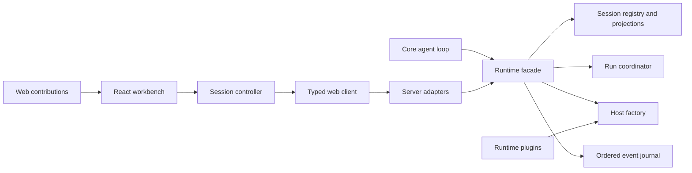
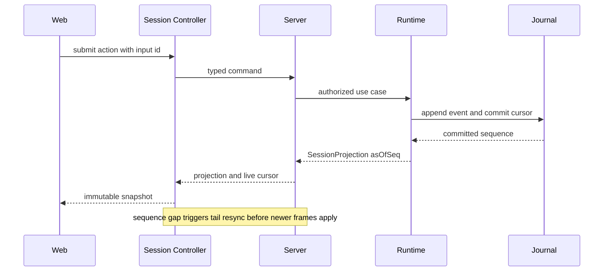
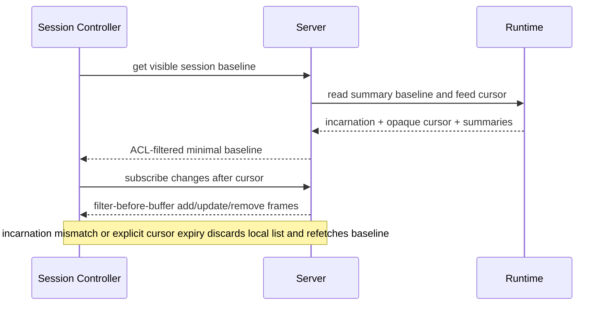
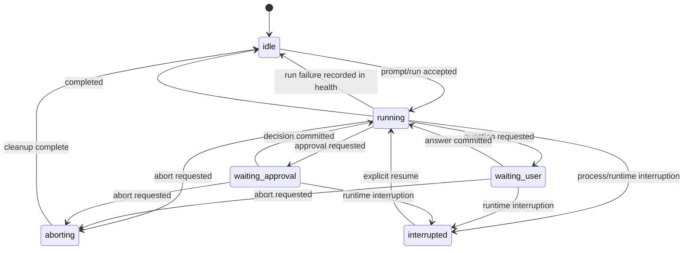
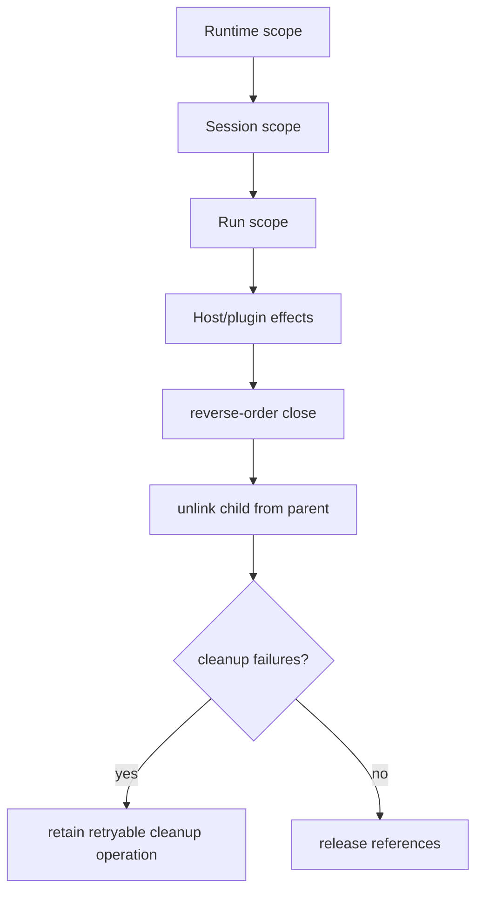
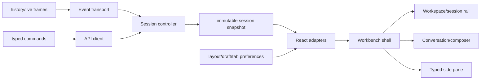
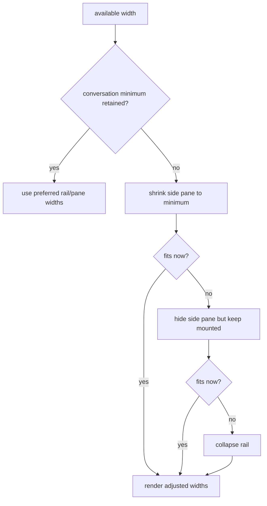

# Cortx Web Runtime Workbench Refactor - Plan

## Goal Capsule

| Field | Value |
|---|---|
| Objective | 将 Cortx Web 从多状态源聊天页收敛为 Runtime 驱动的三栏工作台，并把 Runtime/Server 的会话、运行、事件和传输职责拆成可独立测试的核心组件。 |
| Authority | 以当前 `core → runtime → server → web` 权威边界为准；参考 ZCode 的工作台布局与服务隔离、DeepSeek Harness 的事件水位和 React-free client runtime，但不复制其产品专属或微包架构。 |
| Scope | Runtime 会话投影、顺序事件日志、运行控制、Server 路由拆分、Web typed client/session controller、Runtime 权威 follow-up、Workbench Shell、类型化侧栏和精简贡献注册。 |
| Stop conditions | 不重写 SQLite 持久层，不新增 Workspace 领域实体或跨会话 mutation lease，不迁移 TUI，不加载第三方浏览器代码，不恢复旧 `packages/code` 或前端本地 agent runtime。 |

---

## Product Contract

### Summary

Cortx 已具备可工作的 Core、Runtime、Server 和 Web 链路，但 Runtime、Server 和 Web 的职责重新聚集成大文件，Web 还用多个状态源校正同一会话。此次重构在不改变 Core 作为最小执行内核的前提下，把会话事实、运行控制、远程传输和界面状态重新分层，使 Web 能可靠恢复、显示后台状态并承载后续插件化项目。

### Problem Frame

- `CortxRuntime` 同时拥有会话注册、run 调度、Host 创建、插件装配、事件日志、持久化、恢复和清理，任何协议变化都会触碰同一对象。
- `server.ts` 同时处理安全、授权、DTO、catalog、session commands、历史和 SSE，adapter 与用例边界不清晰。
- Web 的 `App`、`AgentStore` 和 `EventBridge` 分别保存会话/事件/连接状态；刷新、断线或切换会话后依赖手工 refresh 修正。
- 运行中 prompt 队列只存在浏览器内存，页面刷新或多客户端使用会丢失；Runtime 已有 follow-up 能力却未成为远程协议的权威入口。
- SSE 仅去重旧 sequence，不识别缺口；Runtime 的并发 fire-and-forget snapshot 写入可能让较旧状态覆盖较新状态。
- 当前布局、巨型 props 和硬编码颜色限制了工作台扩展，也让之前 UnoCSS 迁移出现明显样式回归。

### Requirements

#### Runtime ownership and recovery

- R1. `@cortx/core` 保持最小单 agent 执行内核，Runtime 重构不得把会话持久化、HTTP、React 或产品插件职责下沉到 Core。
- R2. Runtime 是 Session、Run、Host、事件 sequence、运行中输入和能力装配的唯一 owner；Server 和 Web 不推断或复制领域状态机。
- R3. Runtime 公开统一 `SessionProjection`，至少包含会话标识、`runId`、序列水位、运行状态、当前操作、最后活动时间、可恢复标志、usage、pending interaction、queued inputs、tool profile 和插件 generation。
- R4. 运行状态至少区分 `idle`、`running`、`waiting_user`、`waiting_approval`、`aborting`、`failed` 和 `interrupted`，并从 Runtime 生命周期事实投影。
- R5. 每个会话的 durable event 与 snapshot/cursor 更新必须按 sequence 串行提交；close/delete/restore 必须等待写队列静止，永久失败进入可见错误并拒绝新 prompt，旧 snapshot 或迟到写不得覆盖/复活新状态。
- R6. Runtime event API 保留分页历史和 live tail，并提供显式 generation、cursor、oldest-available 和 replay-complete 语义；客户端发现 generation 变化、sequence gap 或 retention 截断时必须重新同步或显示明确边界。
- R7. Run scope 和 child scope 关闭后立即从父 scope 解除，同时保留逆序 disposer、超时和失败重试语义。
- R8. `CortxRuntime` 拆成 Session Registry/Aggregate、Run Coordinator、Host Factory 和 Event Journal；门面只编排公开用例和保持现有调用入口可迁移。

#### Server and client protocol

- R9. Server 按 session commands、events、catalog/assets 和 plugin admin 拆路由；安全与授权先执行，路由只做协议转换并调用 Runtime。
- R10. Web 使用 React-free typed API client、event transport 和 session controller；React 仅通过稳定 snapshot/subscribe 读取业务状态。
- R11. 运行中输入通过 Runtime 的 `follow-up` 权威队列提交、取消和展示；Web 删除本地自动发送队列。
- R12. tool profile 请求只提交 canonical `use`；短 `id` 与名称仅用于展示，避免自定义 profile 无法解析。

#### Workbench and extension surface

- R13. Web 采用稳定三栏 Workbench Shell：左侧 workspace/session rail，中央 conversation/composer，右侧类型化 side pane；窄屏优先收起辅助面板，主会话保持可用。
- R14. Side Pane 使用可测试的类型化 tab state 和稳定 key，支持打开、激活、关闭和复用；隐藏面板不销毁已挂载内容。
- R15. Web 样式继续使用 UnoCSS `presetWind3` 与 `@unocss/reset`，用精简 CSS variables/tokens 统一 surface、border、text、spacing 和 status，不引入 Tailwind CDN。
- R16. Web 扩展只通过有限区域的 contribution registry 注册、排序和卸载；registration 返回 disposer，单贡献失败不破坏 Shell，不向插件暴露 React 内部对象。
- R17. 现有 session create/resume/send/abort、question/approval、插件管理、历史分页和官方工具加载行为必须保持，破坏性修改仅针对内部模块和明确替换的 Web 本地队列。

#### Reliability, authorization, and migration

- R18. Runtime/Server 提供经过 principal 授权过滤的全局 session projection baseline + change feed，使后台会话的 add/update/remove、运行和等待状态实时可见且 baseline 与订阅之间无丢失窗口。
- R19. Runtime generation 改变后，旧 pending approval/question 仅保留为历史，session 投影为可恢复的 `interrupted`；旧 request id 的回答必须 conflict，只有显式 resume 可重新产生交互。
- R20. model、tool profile、approval 和 skill reconfigure 仅允许 idle session；running/waiting 状态返回 `session_busy`，不保留 UI 与有效 Host 分叉的 pending 配置。
- R21. abort 取消当前 run 和尚未消费的 follow-up；resume 只对 resumable interrupted session 开放，网络失败时 Web 保留 draft 而不伪造已排队状态。
- R22. 所有 session mutation 携带客户端生成的稳定 command/input id 与预期 Runtime incarnation；Runtime 在 per-session command boundary 内串行决定 prompt/follow-up、run completion、abort、resume、answer 和 reconfigure，相同 id 重试返回原结果，不同 payload 返回 conflict。
- R23. 现有 file-store snapshot、event 和 checkpoint 必须通过显式 schema migration 或兼容默认值无损读取；若 fixture 无法迁移则启动 fail loud 并保留原文件，不允许静默丢弃或自动清空。
- R24. Workbench 必须实现键盘、焦点恢复、ARIA landmarks/tabs、状态播报和最小触控目标；responsive navigation、waiting interaction 和错误状态都必须有明确状态机与 owner component。
- R25. 全局 feed 只传输最小 `SessionSummaryProjection`，每端点执行表驱动 ACL；订阅、缓冲和 replay 都有逐 principal 与全局上限，过滤发生在缓冲和序列化之前。
- R26. Durable domain event 与 transient streaming frame 分离：前者使用连续 session event sequence，后者使用 run-local offset 并在完成时提交可恢复的最终消息事实。
- R27. File store 明确只支持单 Runtime writer，并对 durable root 使用独占 owner lock；第二个实例、重叠重启或无法确认所有权时启动失败。

### Acceptance Examples

- AE1. 给定一个正在运行的会话，用户再次提交 prompt 时，Runtime 返回含稳定 input 标识的 queued projection；刷新页面后同一输入仍可见并按顺序交付。
- AE2. 给定历史水位 10，客户端 live stream 首帧为 sequence 13 时，session controller 保留当前画面、触发 tail resync，并在补齐 11–12 后只应用一次 13。
- AE3. 给定两个会话快速切换，旧连接代的迟到响应不能覆盖当前会话；返回原会话时无需由 React 重建事件投影。
- AE4. 给定连续事件和并发持久化延迟，重启 Runtime 后 `nextEventSequence`、usage、运行状态和 history cursor 不回退。
- AE5. 给定 run scope 主动结束，其 disposer 从父 scope 解除；父 Runtime 最终关闭时不会再次积累执行已结束 run 的清理。
- AE6. 给定自定义 tool profile，其展示 `id` 与 canonical `use` 不同，Web 提交 `use` 后 Runtime 能挂载正确 profile。
- AE7. 给定窄视口，Side Pane 自动收起而 Conversation/Composer 仍可操作；视口恢复后用户偏好宽度和已打开 tab 保留。
- AE8. 给定一个 contribution 渲染失败，其他 rail、conversation 和 side-pane contributions 仍可使用，卸载插件后 contribution 立即消失。
- AE9. 给定 A 为当前会话而 B 在后台从 running 进入 waiting_user 再到 idle，左侧栏实时更新；普通 API key 永远收不到其他 principal 的 B。
- AE10. 给定 Runtime 重启，旧 pending approval 不再显示成可回答 dialog，迟到 answer 返回 conflict；显式 resume 后使用新 request id 继续。
- AE11. 给定持久化永久失败，projection 进入 failed/error，Web 明确提示且新 prompt 被拒绝；删除会话后迟到写不能将其复活。
- AE12. 给定 390px 视口，session rail、conversation 和 details 都有稳定入口与返回路径，切换 pane 不丢 draft、scroll anchor 或 active tab。
- AE13. 给定 mutation 已提交但 HTTP 响应丢失，客户端用同一 id 重试只得到原 admission，不产生第二次 prompt、follow-up、answer 或 approval decision。
- AE14. 给定旧版本 file-store fixtures，升级后 history、checkpoint、usage 和 sequence 可读取；不兼容 fixture 触发可恢复错误且原文件不被修改。
- AE15. 给定慢 reader 或连接洪泛，全局 feed 的缓冲和连接数保持有界，溢出连接收到 resync 信号并释放 Runtime subscription。
- AE16. 给定流式输出中途崩溃，恢复只重放已提交的 durable facts；transient token frame 不制造 sequence gap，也不会伪造完整 assistant message。

---

## Planning Contract

### Key Technical Decisions

- KTD1. 保持 UnoCSS `presetWind3`，不引入 Tailwind CDN。  
  `(session-settled: user-directed — chosen over Tailwind/CDN replacement: 现有 UnoCSS 语法本来有效，替换曾直接造成组件样式回归。)`
- KTD2. 允许破坏性精简，以权威状态和核心边界取代兼容层。  
  `(session-settled: user-directed — chosen over compatibility-first incremental patches: 用户明确允许重构所有使用点，目标是降低长期复杂度。)`
- KTD3. 采用少量独立完整模块，不复制 DSH 的微包和 Client Cordis 双树。  
  `(session-settled: user-directed — chosen over package-per-feature/browser plugin runtime: 用户要求组件独立、精简、通用，并质疑不必要的包数量。)`
- KTD4. 事件日志是事实顺序，`SessionProjection` 是跨边界读模型，Web 不再折叠领域事件。
- KTD5. React-free session controller 合并连接、generation、历史窗口和 projection；React store 只保留草稿、选中 tab 和布局偏好。
- KTD6. 本轮保留现有 file/memory durable store，通过 per-session writer 保证顺序；SQLite/事务数据库作为后续持久层替换，不扩大本 PR。
- KTD7. Workbench 只提供固定少量贡献区域和 disposer，不实现动态远程客户端代码加载。

### Protocol Vocabulary

| Term | Owner | Semantics |
|---|---|---|
| `runtimeIncarnation` | Runtime | 每次 Runtime 进程启动生成的 opaque identity；所有 mutation 提交 expected value，不匹配即 conflict。 |
| `pluginGeneration` | Host factory | 当前有效插件/能力装配版本；只说明 Host capability，不作为会话事件恢复代。 |
| `eventSequence` | Session Event Journal | 单会话 durable domain events 的连续序号；客户端只能按 `next = last + 1` 应用。 |
| `projectionAsOfSequence` | Session Registry | `SessionProjection` 已折叠到的最后 durable event sequence。 |
| `historyCursor` | Event Journal | 历史分页的 opaque cursor；响应同时给出 oldest/last available sequence，cursor 自身不参与加法。 |
| `sessionFeedCursor` | Runtime Registry | 全局 session change log 的 opaque、单调 cursor；过滤后的客户端不要求数值连续，只在 Server 明确返回 expired/reset 时重拉 baseline。 |
| `streamOffset` | Run Coordinator | 单次 run 的 transient frame offset；不占用 durable event sequence，完成或失败时由 durable event 封口。 |

### Session State Contract

`runPhase` 与 `sessionHealth` 正交，避免普通 run failure 和 durable store failure 共用一个可误解状态。

| Field | Values | Command rule |
|---|---|---|
| `runPhase` | `idle`, `running`, `waiting_user`, `waiting_approval`, `aborting`, `interrupted` | 只有 `idle` 接受新 prompt/reconfigure；running/waiting 接受 follow-up；只有 resumable `interrupted` 接受 resume。 |
| `sessionHealth` | `healthy`, `run_failed`, `durability_failed` | `run_failed` 允许从 idle 发起新 prompt；`durability_failed` 拒绝所有 mutation，仅允许导出/诊断/显式 repair。 |
| `pendingInteraction` | none, question, approval | 仅当前 `runtimeIncarnation` 和 request id 可回答；重启后降为只读历史并进入 interrupted。 |
| `acceptsPrompt` | derived boolean | 由 phase、health 和 current operation 计算，Web 不自行猜测。 |

### High-Level Technical Design

下列图描述职责和协议方向，不规定具体类名或复制参考项目实现。

#### 组件与所有权



#### 命令、投影与事件恢复



#### 全局会话列表同步



#### 会话运行状态



#### 生命周期与 disposer



#### Web 数据流和界面状态



#### 布局折让决策



### Output Structure

```text
packages/runtime/src/
  event-journal/
  host/
  runs/
  sessions/
  runtime.ts                 # thin facade
packages/server/src/
  routes/
  server.ts                  # composition and shared middleware
packages/web/src/
  client/
  session/
  workbench/
  components/
```

目录名可按现有命名微调，但职责边界和单向依赖必须保持。

### Web State Ownership Matrix

| State | Owner surface | Preserved content | Primary action |
|---|---|---|---|
| Initial loading / no visible session | Workbench center | Draft only | Wait; create blank session only when baseline confirms empty。 |
| Offline / reconnecting | Global connection banner | Current conversation, draft, session list | Retry automatically; manual reconnect remains available。 |
| Gap resync | Conversation timeline status | Current projection and scroll anchor | Background repair; bounded fallback to full baseline。 |
| History truncated | Timeline boundary marker | Available newer history | Explain retention boundary; continue from oldest available。 |
| Pending question / approval | Conversation interaction surface | Composer and queued follow-up remain available | Answer/allow/deny current request, or abort run。 |
| Durability failure | Session-level blocking banner + rail badge | Read-only history and export/diagnostic data | Repair/retry durable store; prompt controls disabled。 |
| Command conflict / stale incarnation | Composer or interaction inline error | Draft and current projection | Refresh projection, clear stale request, retry with a new valid command。 |
| Contribution render failure | Affected pane error boundary | Shell and other panes | Retry pane or close it; unregister removes it immediately。 |

### Assumptions

- 本次是 LFG 的一次可合并重构，不承诺一步完成 Workspace 实体、数据库迁移、TUI parity 或完整 SaaS 运维模型。
- 当前 HTTP + SSE carrier 可继续使用；协议和 controller 边界应允许未来替换为 WebSocket 或 Desktop MessagePort。
- 现有 `@cortx/store` 若只剩 Web 事件投影用途，可内联到 React-free session 层或收窄；不为包兼容保留重复状态源。
- 现有 API 可在同一分支内同步迁移 Web/Server 调用点，不新增长期 legacy endpoint。
- 首次连接仅在没有任何可见 session 时创建 blank session；断线或 generation 变化不得自动创建第二个 session。
- 左侧 rail 本轮只表示授权 project directory 与 session 的导航投影，不创建持久 Workspace identity、设置或生命周期承诺。
- 当前部署模型是单 Server/Runtime writer；若 durable root 已被另一存活实例持有，启动必须失败而不是降级到不安全共享写。

---

## Implementation Units

### U1. Runtime Session Projection、命令串行化与权威输入状态

- **Goal:** 建立统一 session/run/input/interaction 投影，替代 Web 和 Server 对 `isRunning`、队列及 pending 状态的拼装。
- **Requirements:** R1-R4, R11, R17, R19-R22; KTD2, KTD4.
- **Files:** `packages/runtime/src/session.ts`, `packages/runtime/src/runtime.ts`, `packages/runtime/src/durable/types.ts`, `packages/runtime/src/index.ts`, `packages/core/src/types.ts`, `packages/core/src/loop/completion-phase.ts`, 对应 Core/Runtime tests，以及共享协议类型所在的 `packages/sdk` 或现有公共出口。
- **Approach:** 定义明确的 run phase、session health、queued input 和 pending interaction；每个 session 使用同一 command serializer 决定 run lifecycle 与 mutation 的先后，再把 durable facts 交给 Journal。客户端首次提交即生成 command/input id 和 expected Runtime incarnation，Runtime 持久化去重结果；Core 控制契约改为从 Runtime-owned input source 拉取可消费消息，不再持有第二个无标识 follow-up 队列。idle 输入启动 run，running/waiting 输入进入 FIFO follow-up，idle follow-up 返回 conflict；abort 清除未消费输入，重启把无法恢复的交互降为 interrupted 历史。
- **Execution note:** 先为当前 create/resume/run/follow-up/approval/question 行为补 characterization tests，再替换内部状态表示。
- **Test Scenarios:** idle prompt 启动 run；running prompt 成为有稳定标识和 sequence 的 queued follow-up；请求成功但响应丢失后同 id 重试只返回原 admission，不同 payload conflict；prompt-vs-completion、follow-up-vs-abort、resume-vs-new-input 竞态确定收敛；idle follow-up、取消不存在或已交付输入返回确定 conflict；approval/question 切换到对应 waiting 状态并在同 incarnation 回答后恢复；等待态 abort 清除 pending interaction 和 follow-up；重启后旧 request 不可答且 session 为 resumable interrupted；abort 后 follow-up 不会在未来 resume 幽灵执行；running reconfigure 返回 `session_busy` 且 projection 不显示候选配置。
- **Verification:** Runtime focused tests 覆盖状态转换、投影字段和现有公开入口兼容迁移。

### U2. 顺序 Event Journal、恢复水位与 Scope 生命周期

- **Goal:** 消除事件/snapshot 乱序写入和 SSE 缺口静默问题，并清理结束 run 的 scope 引用。
- **Requirements:** R5-R7, R23, R26, R27; KTD4, KTD6.
- **Dependencies:** U1.
- **Files:** `packages/runtime/src/durable/file-store.ts`, `packages/runtime/src/durable/memory-store.ts`, `packages/runtime/src/durable/migrations.ts`, `packages/runtime/src/host-scope.ts`, 新的 `packages/runtime/src/event-journal/**`, `packages/runtime/tests/**`.
- **Approach:** 使用 per-session FIFO writer 串行化 durable event append、cursor/snapshot commit 和有限频率 prune；snapshot cursor 不超前于已落盘 event，close/delete/restore 经过 quiescence barrier。Transient token frames 使用 run-local offset，完成/失败时写 durable finalization。File store 获取 durable-root owner lock并迁移旧 schema；迁移失败保持原文件。投影携带 Runtime incarnation、`projectionAsOfSequence` 和 retention metadata；child close 时执行幂等 unlink；持久化失败进入 `durability_failed` 而非仅 warning。
- **Test Scenarios:** 人为延迟旧写时最新 snapshot 仍胜出；并发 append 得到连续唯一 sequence 且 cursor 不越过缺失 event；stream frame 不占 durable sequence，中途 crash 不伪造完整消息；store 失败不会确认未持久化 action并拒绝后续 mutation；旧 schema fixtures 无损迁移，坏 fixture fail loud 且文件不变；第二个 writer 无法获取 lock 时启动失败；delete 后迟到写不复活 session；close 等待 drain；已关闭 child 不在父 effects 中再次清理；父子并发 close 幂等；数千次 run churn 后 owned child 数量保持有界。
- **Verification:** file/memory store、event journal、host scope 测试通过，并用临时目录完成重启恢复测试。

### U3. Runtime 门面拆分与 Host/Run 责任隔离

- **Goal:** 把 1700 行 Runtime 组合体拆为可独立测试的 Session Registry、Run Coordinator、Host Factory 和 Event Journal。
- **Requirements:** R1, R2, R8, R17, R18, R25; KTD2, KTD3.
- **Dependencies:** U1, U2.
- **Files:** `packages/runtime/src/runtime.ts`, `packages/runtime/src/session.ts`, `packages/runtime/src/tool-mount.ts`, `packages/runtime/src/default-capabilities.ts`, 新的 `packages/runtime/src/sessions/**`, `runs/**`, `host/**`, `packages/runtime/src/index.ts`.
- **Approach:** Runtime facade 保留产品用例入口；registry 只拥有 aggregate/projection、最小 session summaries 和 opaque global change log，原子提供 baseline + feed cursor；coordinator 只拥有 run/control/cleanup，factory 只解析 capability/profile/plugin generation 并创建 Host，journal 只提交和读取序列事件。删除仅为旧内部形态服务的重复 helper。
- **Test Scenarios:** facade create/run/abort/resume 行为不变；同 session 不产生并行主 run；registry baseline 后的 add/update/remove 可从同一 opaque cursor 无窗口续订；summary 不包含 queued input/pending 参数等 detail；Host 创建失败不污染 registry；run 完成一定释放 scope；custom tool profile 使用 canonical `use` 正确挂载。
- **Verification:** Runtime 全套测试与 plugin foundation/admin 测试通过；新增模块可在不启动 Server/Web 的情况下单测。

### U4. Server 路由与流协议拆分

- **Goal:** 将 Server 收敛为安全边界和 transport adapter，显式化 replay-complete/gap 恢复契约。
- **Requirements:** R6, R9, R12, R17-R20, R22, R25; KTD4.
- **Dependencies:** U1-U3.
- **Files:** `packages/server/src/server.ts`, `packages/server/src/types.ts`, `packages/server/src/plugin-admin-http.ts`, 新的 `packages/server/src/routes/**`, `packages/server/tests/**`, `docs/server-api.md`.
- **Approach:** 提取 sessions、events、catalog/assets、plugin admin 路由；共享 middleware 统一 auth/workspace authorization/error mapping；每个 session endpoint 使用表驱动 ACL。Global feed 维护每订阅者 visible set，对 add/update 在 buffer/serialize 前检查 immutable creator 和当前 workspace scope，remove 只发给曾可见订阅者；cursor 保持 opaque，不按数值连续判断。限制逐 principal/全局连接和有界 catch-up/live buffer，溢出发 reset-required 并释放 subscription。历史与 live frame 携带 Runtime incarnation、cursor/watermark/oldest-available/replay-complete；mutation 传 command id 与 expected incarnation；profile DTO 只接受 canonical reference。
- **Test Scenarios:** creator/admin/其他 principal/workspace 越界矩阵在访问 history、SSE、follow-up、answer、abort、delete 前正确拒绝；baseline/feed 不泄漏他人 session 或 detail 字段；权限收窄后 remove/filter 正确；baseline 与订阅交错期间的 add/remove 不丢；后台 waiting 状态实时更新；慢 reader、连接洪泛、buffer overflow 和 cancel cleanup 有界；历史分页稳定；after cursor 正确回放且发出 replay-complete；incarnation mismatch、expired cursor、非法 profile 返回 typed error；retention 缺口返回 truncated metadata；插件、asset 和 session API 现有 happy path 保持。
- **Verification:** Server security/U8/API tests 通过，`docs/server-api.md` 与实现一致。

### U5. Typed Web Client 与 React-free Session Controller

- **Goal:** 用单一 controller 取代 `App`、`EventBridge` 和 Store 的会话业务状态三角校正。
- **Requirements:** R6, R10-R12, R17-R22, R25, R26; KTD3-KTD5.
- **Dependencies:** U4.
- **Files:** `packages/web/src/bridge/event-bridge.ts`, `packages/web/src/App.tsx`, `packages/web/src/hooks/use-store.ts`, `packages/store/**`, 新的 `packages/web/src/client/**`, `packages/web/src/session/**`, `packages/web/tests/**`.
- **Approach:** 拆出 typed API client、可中断 event transport 和 session controller；controller 原子发布 active id、authorized session summaries、active projection/conversation、connection/history 和 catalog，拥有 operation generation fence、history window、有界 live buffer、连续 durable sequence 检查、resync 和 immutable snapshot。现有 `AgentStore` reducer 迁入 controller 作为唯一 conversation projection；旧 package/API 若无其他消费者则删除，禁止两套 reducer 并存。React adapter 使用 subscribe/getSnapshot；删除组件级 refresh/rollback 和本地 queued prompt effect。
- **Test Scenarios:** baseline 后接 global feed 无窗口丢失；filtered opaque cursor 跳跃不误触 gap；首次加载 history 后无重复接 live；8→10 自动补 9，补不到显示 history-truncated；持续 live 期间 replay 能收敛，超过帧数/字节/时间阈值后重取 baseline且内存有界；断线期间保留当前 snapshot；Runtime incarnation 变化重拉列表和 active tail；旧 response/frame 被丢弃；A→B→A 不污染 snapshot 或销毁缓存；刷新后 Runtime queue 和 waiting state 恢复；旧 pending dialog 被清除；网络失败保留 draft且同 id 重试；canonical profile 提交正确。
- **Verification:** Web unit tests 覆盖 controller/transport，现有 event bridge 行为测试迁移后保持或被更精确测试替代。

### U6. Workbench Shell、类型化 Side Pane 与贡献边界

- **Goal:** 用 ZCode/DSH 风格的稳定工作台结构替换巨型 props 页面，同时保持 Cortx 自己的 remote-only 产品边界。
- **Requirements:** R13-R16, R24; KTD1, KTD3, KTD7.
- **Dependencies:** U5.
- **Files:** `packages/web/src/App.tsx`, `packages/web/src/components/DesktopWorkspace.tsx`, `SessionSidebar.tsx`, `PromptInput.tsx`, `InspectorPanel.tsx`, 新的 `packages/web/src/workbench/**`, `packages/web/src/design.ts`, `packages/web/uno.config.ts`, `packages/web/tests/**`.
- **Approach:** 建立 WorkbenchFrame、ProjectSessionRail、ConversationColumn、Composer 和 SidePane；布局求解器分离用户 preferred width 与当前 render width。响应式状态明确为 `wide`、`drawer`、`single-pane`，窄屏当前 view 只取 rail/conversation/details，选择 session 回 conversation，关闭/details 返回 conversation，Escape/浏览器返回遵循同一转换并恢复焦点。SidePane 初版只保留真实的 Activity 与 Context 内置 pane，删除 Review/Browser 空占位；两者作为 compile-time contribution registry 的首批消费者，验证稳定 key、数据边界、disposer 和 error boundary。Registry 本轮是 Web 内部组合 API，不承诺远程插件 ABI。通过窄 context/hooks 取代三十余项 props，并实现 landmarks、ARIA Tabs、aria-live 和触控尺寸。
- **Test Scenarios:** 1440/1024/768/390 宽度下 rail、conversation、details 均可达且折叠顺序正确；中屏 drawer 与窄屏 single-pane 的 open/select/close/Escape/back 转换确定；切换保留 draft、scroll anchor、active tab 并恢复触发焦点；Activity/Context 两个真实 contribution 正确注册、排序、卸载和错误隔离；未知持久化 pane 回退 activity；纯键盘可选择 session、切换 tab 和返回 conversation；自动 accessibility 检查无严重违规。
- **Verification:** React tests、布局纯函数 tests 和 contribution lifecycle tests 通过。

### U7. 设计 Token、组件收敛与端到端回归

- **Goal:** 恢复并稳定 UnoCSS 视觉基础，拆分超大组件，验证真实工作台的核心用户路径。
- **Requirements:** R13-R17, R19-R21, R24; KTD1-KTD3.
- **Dependencies:** U5, U6.
- **Files:** `packages/web/src/design.ts`, `packages/web/src/components/ChatView.tsx`, `MessageBubble.tsx`, `ToolCard.tsx`, `PromptInput.tsx`, `packages/web/src/**/*.css`（若需要）, `packages/web/tests/**`, `docs/progress/2026-07-05-cortx-remaining-work.md`.
- **Approach:** 扩充精简 CSS variable/token 层并把重复 zinc/status class 收敛为语义 token；拆分 Composer controls、queue、editor 和 tool presenter；保持 `presetWind3`/reset。Waiting question/approval 使用 conversation 内的明确 interaction surface，不把普通 follow-up 当回答：Answer/Allow/Deny 调 interaction command，Composer 仍可提交 follow-up，abort 终止 run，stale conflict 清除交互并恢复焦点。为 initial loading、无 session、offline、resync、history truncated、durability failure、command conflict 和 contribution failure 定义 owner、保留内容、动作和恢复路径。更新进度文档，只声明本轮实际完成范围。
- **Test Scenarios:** session create/select/send/stream/abort；运行中 follow-up 与刷新恢复；question/approval 与 Composer 同时可区分操作；双击/迟到 answer 幂等或 conflict 后清除；Inspector/Side Pane 打开关闭；插件 profile 选择；SSE 断线重连；loading/empty/offline/resync/truncated/durability failure/conflict 都显示在指定 owner 且提供正确动作；浅色/深色主要 surface 对比与响应式布局无明显回归。
- **Verification:** 真实浏览器运行 Web + Server 完成关键路径截图/交互检查；静态 SSR 字符串测试不作为唯一 UI 证据。

---

## Verification Contract

| Gate | Covers | Done signal |
|---|---|---|
| `bun test packages/runtime/tests` | U1-U3 | 投影、幂等输入、command races、schema migration、single-writer lock、顺序持久化、scope、host/run/feed 拆分测试全部通过。 |
| `bun test packages/server/tests` | U4 | endpoint ACL matrix、principal feed isolation、resource limits、路由、session/event/plugin/catalog API 测试通过。 |
| `bun test packages/web/tests` | U5-U7 | typed client、bounded resync、controller、responsive state、accessibility、contribution 和组件测试通过。 |
| `bun test packages/core/tests` | R1, U1, U3 | Core 执行内核与 Runtime-owned input source 控制契约无回归。 |
| `bun run test:plugin` | U3-U5 | 官方插件加载、管理与远程协议保持可用。 |
| `bun run test:product-dogfood` | U1-U7 | 产品 smoke 路径通过。 |
| `bun run lint` | U1-U7 | 所有 workspace 类型和 lint gate 通过。 |
| `bun run build` | U1-U7 | Runtime、Server、Web 及其他 Cortx 包均可构建。 |
| `bun run test:package` | U1-U7 | 冻结 lockfile、构建和包边界检查通过。 |
| Browser pipeline | U5-U7 | Web 可启动，核心会话路径、follow-up、waiting interaction、重连、Side Pane、纯键盘、390px 响应式和样式通过真实浏览器验证。 |
| `git diff --check` | U1-U7 | 无空白和 patch 格式问题。 |

### Manual Evidence

- 保存宽屏和窄屏 Workbench 截图，确认主会话宽度、rail/pane 折叠和 UnoCSS 样式。
- 记录一次运行中 follow-up 后刷新页面的结果，确认队列由 Runtime 恢复。
- 记录一次人为断开 SSE 后的 gap/resync，确认消息不重复、不丢失。
- 记录后台 session 进入 waiting 状态、Runtime 重启和 390px pane 切换，确认全局 feed、interaction fence 与可达性。
- 使用旧 schema fixture 和第二 writer 启动，确认数据迁移不丢失且 owner lock fail loud。
- 模拟慢 reader 和 mutation 响应丢失，确认 feed 资源有界且同 id 重试不重复执行。

---

## Scope Boundaries

### Deferred to Follow-Up Work

- SQLite/事务数据库实现和现有 file-store 数据迁移。
- 稳定 Workspace 实体、realpath identity、trust 管理和跨 session mutation lease。
- TUI 迁移到共享 typed client、Web/TUI 完整 action parity。
- 独立 worker/process execution host、崩溃点 destructive tool 人工恢复协议。
- Goal、Jobs、Automation 的完整产品级 subsystem 重建。

### Outside This Change

- 任意第三方浏览器插件 bundle 的远程下载和执行。
- 浏览器端 Cordis 双树、DSH 级 Slot 类型系统和 package-per-feature 拆分。
- Electron 主进程/renderer 隔离、账号、套餐、远程控制等 ZCode 产品专属能力。
- 恢复旧 `packages/code`，或让 Web/TUI 直接创建并拥有 agent runtime。

---

## Risks and Mitigations

- **协议与实现同时重构可能扩大回归面。** 先用 characterization tests 固定现有核心行为，再按 Runtime → Server → Client → UI 顺序迁移。
- **顺序 writer 可能降低高频 token event 吞吐。** durable commit 只序列化需要落盘的事实，UI token 批处理和 prune 可合并，不在事件顺序上妥协。
- **破坏性删旧状态源可能暴露隐含依赖。** 每完成一个 controller/route 迁移即删除旧入口，并用 `rg` 和 package tests 确认无双写/双读残留。
- **Workbench 重排可能再次造成视觉回归。** 保持 UnoCSS foundation，先建立 token 和布局测试，再做组件移动；真实浏览器检查是发布门槛。
- **单 PR 较大。** Implementation Units 严格依赖排序并形成可独立提交的阶段，review 时按模块边界审查而非只看最终 diff。
- **File store 仍是单写者模型。** Durable-root owner lock 把误配置和重叠重启变成明确启动错误；多 writer 直到事务 store/lease follow-up 前都不是支持场景。

---

## PR and Landing Strategy

- 在当前 `refactor/plugin-runtime-foundation` 分支实现并提交，不新建并行兼容分支。
- 按 Runtime foundation、Server/client protocol、Workbench UI、review fixes 分阶段提交，最终通过一个 PR 合并；每个阶段必须保持可构建和可测试。
- U4 完成后运行 Runtime/Server contract gate；U5 完成后用最小现有 Web adapter 做 prompt、follow-up、gap、restart、background feed 的纵向验证。该 gate 未通过时不得继续 U6/U7，避免把错误协议扩散到新 Shell。
- U6/U7 独立成 UI commits；出现工作台回归时可在同一 PR 中回退 UI commits，而不回退已验证的 Runtime/Server 可靠性修复。
- 不提交 `.context/`、`.cortx/project-domain.json`、`.cortx/runtime/`、`hello.txt` 或 `welcome.txt`。
- PR 描述列出破坏性内部变化、保留的公开行为、验证命令和明确延期项。

---

## Definition of Done

- Runtime 对 session、run、queued input、pending interaction、event sequence 和 Host 生命周期拥有单一权威状态。
- Mutation 具备 command idempotency、expected Runtime incarnation 和 per-session command ordering；响应丢失、abort 与 run completion 竞态不会重复或幽灵执行。
- Durable event/snapshot 写入有顺序保证，旧 file-store 数据可迁移，单 writer lock 生效；客户端能检测 sequence gap 并完成有界 resync。
- `CortxRuntime` 与 Server 大文件按单一职责拆分，现有 Core 和官方插件边界保持。
- Server 对每个 session endpoint 和全局 feed 做授权过滤与资源限制，不向 rail 推送 detail-only prompt/interaction 内容。
- Web 通过 React-free controller 读取 immutable projection，不再维护浏览器本地自动 prompt 队列、重复 reducer 或三套会话事实。
- Web 呈现可响应且可键盘操作的三栏 Workbench、Activity/Context 类型化 Side Pane 和经真实内置消费者验证的内部 contribution registry。
- UnoCSS `presetWind3` 与 reset 保持，主要组件视觉和响应式路径通过真实浏览器验证。
- Runtime、Server、Web、Core、plugin、dogfood、lint、build、package gates 全部通过。
- 所有变更已提交、推送并进入开放 PR，CI 达到可合并状态或按 LFG 规则留下明确可执行残余记录。
